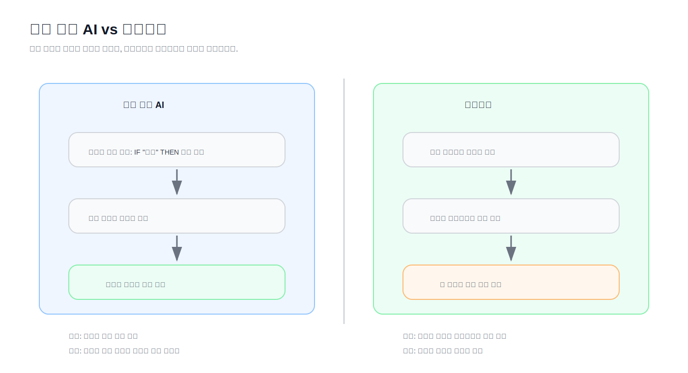

# 머신러닝과 딥러닝

> **Chapter 1. 인공지능과 자연어처리의 이해**  
> 문서: `03_Machine_Learning.md`

---

## 시작 질문

앞 문서에서는 인공지능이 어떻게 발전해 왔는지 살펴보았습니다.

초기의 AI는 사람이 직접 규칙을 작성하는 방식이었습니다.

```text
IF 조건
THEN 행동
```

이 방식은 단순하고 명확한 문제에는 효과적입니다.

하지만 현실 세계의 문제는 대부분 단순하지 않습니다.

예를 들어 스팸 메일을 분류한다고 생각해 봅시다.

```text
제목에 "무료"가 있으면 스팸
본문에 "당첨"이 있으면 스팸
링크가 많으면 스팸
```

처음에는 괜찮아 보입니다.

하지만 스팸 메일 작성자는 금방 표현을 바꿉니다.

```text
무료 → 무 료
당첨 → 특별 혜택
이벤트 → 한정 안내
```

규칙을 계속 추가해야 합니다.

규칙이 늘어나면 프로그램은 점점 복잡해지고, 유지보수도 어려워집니다.

그래서 중요한 질문이 등장합니다.

> **사람이 규칙을 직접 만들지 않고, 컴퓨터가 데이터에서 규칙을 찾게 할 수는 없을까?**

이 질문에서 머신러닝이 시작됩니다.

---

## 머신러닝이란 무엇인가?

머신러닝(Machine Learning)은 말 그대로 **기계가 학습하는 방법**입니다.

조금 더 정확하게 말하면 다음과 같습니다.

> **데이터를 이용해 패턴을 학습하고,  
> 새로운 데이터에 대해 예측하거나 판단하는 기술**

여기서 중요한 단어는 세 가지입니다.

| 핵심 단어 | 의미 |
|---|---|
| 데이터 | 학습의 재료 |
| 패턴 | 데이터 속에 숨어 있는 규칙 |
| 예측 | 새 입력에 대한 판단 결과 |

머신러닝은 사람이 모든 규칙을 직접 작성하지 않습니다.

대신 데이터를 보여주고, 모델이 그 안에서 패턴을 찾도록 합니다.

---

## 규칙 기반 방식과 머신러닝 방식

스팸 메일 분류를 다시 생각해 봅시다.

### 규칙 기반 방식

```text
사람이 규칙을 작성한다.
    ↓
메일이 규칙에 맞는지 검사한다.
    ↓
스팸 또는 정상으로 판단한다.
```

예시는 다음과 같습니다.

```text
IF 제목에 "무료"가 포함되어 있다
THEN 스팸 가능성이 높다
```

### 머신러닝 방식

```text
스팸 메일과 정상 메일 데이터를 준비한다.
    ↓
모델이 데이터에서 패턴을 학습한다.
    ↓
새로운 메일이 들어오면 스팸 여부를 예측한다.
```

머신러닝에서는 사람이 규칙을 하나하나 만들지 않습니다.

대신 모델이 데이터를 보고 규칙에 가까운 패턴을 스스로 찾습니다.

---

## 쉬운 비유: 요리 레시피와 맛보기

규칙 기반 AI는 요리 레시피와 비슷합니다.

```text
소금 1스푼
설탕 2스푼
중불에서 5분
```

정해진 순서를 따르면 결과가 나옵니다.

반면 머신러닝은 많은 음식을 맛보고 감을 익히는 과정과 비슷합니다.

```text
이 음식은 짜다.
이 음식은 달다.
이 음식은 맵다.
이 조합은 맛있다.
```

많은 사례를 경험하면서 어떤 조합이 어떤 결과를 만드는지 배우는 것입니다.

물론 비유에는 한계가 있습니다.

하지만 처음에는 이렇게 이해하면 충분합니다.

> 규칙 기반 AI는 사람이 방법을 알려준다.  
> 머신러닝은 데이터에서 방법을 배우게 한다.

---

## 머신러닝의 기본 구조

머신러닝의 기본 흐름은 다음과 같습니다.

```text
데이터 준비
    ↓
모델 선택
    ↓
학습
    ↓
평가
    ↓
예측
```

각 단계는 다음 의미를 가집니다.

| 단계 | 설명 |
|---|---|
| 데이터 준비 | 학습에 사용할 데이터를 모은다 |
| 모델 선택 | 문제에 맞는 알고리즘을 선택한다 |
| 학습 | 모델이 데이터에서 패턴을 찾는다 |
| 평가 | 모델이 얼마나 잘 맞추는지 확인한다 |
| 예측 | 새로운 데이터에 대해 결과를 출력한다 |

이 흐름은 자연어처리에서도 그대로 사용됩니다.

예를 들어 영화 리뷰 감성 분석을 한다면 다음과 같습니다.

```text
영화 리뷰 데이터 수집
    ↓
리뷰를 숫자로 변환
    ↓
분류 모델 학습
    ↓
정확도 평가
    ↓
새 리뷰가 긍정인지 부정인지 예측
```

---

## 머신러닝에서 데이터가 중요한 이유

머신러닝은 데이터에서 패턴을 학습합니다.

따라서 데이터가 좋지 않으면 모델도 좋은 결과를 내기 어렵습니다.

예를 들어 고양이와 강아지를 구분하는 모델을 만든다고 해봅시다.

학습 데이터가 대부분 고양이 사진이라면 모델은 강아지를 잘 구분하지 못할 수 있습니다.

또는 사진이 모두 밝은 곳에서 찍힌 것이라면 어두운 사진에서는 성능이 떨어질 수 있습니다.

자연어처리에서도 마찬가지입니다.

뉴스 기사로만 학습한 모델은 채팅 문장을 잘 이해하지 못할 수 있습니다.

법률 문서로 학습한 모델은 일상 대화와 다른 표현을 많이 보게 됩니다.

> **머신러닝 모델의 성능은 데이터의 품질과 매우 밀접합니다.**

---

## 지도학습

머신러닝에서 가장 많이 사용하는 방식 중 하나는 **지도학습(Supervised Learning)** 입니다.

지도학습은 정답이 있는 데이터를 이용해 학습하는 방식입니다.

예를 들어 다음과 같은 데이터가 있다고 해봅시다.

| 문장 | 정답 |
|---|---|
| 이 영화 정말 재미있다 | 긍정 |
| 다시는 보고 싶지 않다 | 부정 |
| 배우 연기가 훌륭했다 | 긍정 |
| 시간이 아까웠다 | 부정 |

모델은 문장과 정답을 함께 보면서 학습합니다.

그 후 새로운 문장이 들어오면 긍정인지 부정인지 예측합니다.

```text
입력: "스토리가 정말 좋았다"
출력: 긍정
```

지도학습은 자연어처리에서 매우 자주 사용됩니다.

대표적인 예시는 다음과 같습니다.

- 감성 분석
- 스팸 메일 분류
- 뉴스 카테고리 분류
- 악성 댓글 탐지
- 의도 분류

---

## 분류와 회귀

지도학습은 크게 **분류(Classification)** 와 **회귀(Regression)** 로 나눌 수 있습니다.

### 분류

분류는 정해진 카테고리 중 하나를 예측하는 문제입니다.

예를 들어 다음과 같습니다.

```text
리뷰 → 긍정 / 부정
메일 → 스팸 / 정상
기사 → 정치 / 경제 / 스포츠 / IT
```

자연어처리에서는 분류 문제가 매우 많이 등장합니다.

### 회귀

회귀는 숫자 값을 예측하는 문제입니다.

예를 들어 다음과 같습니다.

```text
집 정보 → 집값 예측
광고 정보 → 클릭률 예측
학습 시간 → 시험 점수 예측
```

자연어처리에서도 회귀를 사용할 수 있습니다.

예를 들어 문서의 난이도 점수나 리뷰 평점을 예측할 수 있습니다.

---

## 비지도학습

**비지도학습(Unsupervised Learning)** 은 정답이 없는 데이터를 이용하는 학습 방식입니다.

예를 들어 많은 뉴스 기사가 있지만, 각 기사의 카테고리 정답이 없다고 해봅시다.

모델은 기사들 사이의 유사성을 보고 비슷한 기사끼리 묶을 수 있습니다.

```text
뉴스 기사들
    ↓
비슷한 주제끼리 그룹화
    ↓
정치 / 경제 / 스포츠처럼 보이는 묶음 발견
```

비지도학습의 대표적인 예시는 다음과 같습니다.

- 군집화(Clustering)
- 차원 축소
- 토픽 모델링
- 문서 유사도 분석

자연어처리에서는 문서들을 주제별로 묶거나, 비슷한 문장을 찾을 때 자주 사용됩니다.

---

## 강화학습

**강화학습(Reinforcement Learning)** 은 행동에 대한 보상을 통해 학습하는 방식입니다.

게임을 생각하면 이해하기 쉽습니다.

```text
행동을 한다.
    ↓
결과를 본다.
    ↓
보상을 받는다.
    ↓
더 좋은 행동을 하도록 학습한다.
```

예를 들어 게임 AI가 있다고 해봅시다.

적을 피하면 보상을 받고, 장애물에 부딪히면 벌점을 받습니다.

이 과정을 반복하면서 더 좋은 행동을 학습합니다.

강화학습은 자연어처리에서도 사용됩니다.

특히 대규모 언어모델을 사람의 선호에 맞게 조정할 때 강화학습 아이디어가 활용됩니다.

다만 이 Chapter에서는 개념만 이해하면 충분합니다.

---

## 머신러닝의 세 가지 학습 방식 정리

| 학습 방식 | 정답 데이터 | 대표 문제 | NLP 예시 |
|---|---|---|---|
| 지도학습 | 있음 | 분류, 회귀 | 감성 분석, 스팸 분류 |
| 비지도학습 | 없음 | 군집화, 패턴 발견 | 문서 군집화, 토픽 분석 |
| 강화학습 | 보상 | 행동 최적화 | 사람 선호에 맞춘 응답 개선 |

처음에는 지도학습을 가장 중요하게 이해하면 됩니다.

이후 자연어처리 실습에서도 지도학습 기반 예제를 많이 다루게 됩니다.

---

## 모델은 무엇을 학습할까?

머신러닝 모델이 학습한다는 말은 무엇을 의미할까요?

모델은 데이터 속에서 입력과 출력 사이의 관계를 찾습니다.

예를 들어 다음 데이터를 봅시다.

| 입력 문장 | 출력 |
|---|---|
| 정말 재미있다 | 긍정 |
| 너무 지루하다 | 부정 |
| 최고였다 | 긍정 |
| 별로였다 | 부정 |

모델은 이런 패턴을 배웁니다.

```text
"재미있다", "최고" 같은 표현은 긍정과 관련이 많다.
"지루하다", "별로" 같은 표현은 부정과 관련이 많다.
```

하지만 실제 모델은 사람이 읽는 단어 그대로 이해하지 않습니다.

컴퓨터는 텍스트를 숫자로 바꿔서 처리합니다.

이 과정이 앞으로 배우게 될 **텍스트 수치화**와 **임베딩**으로 이어집니다.

---

## 아주 작은 머신러닝 예제

아래 코드는 머신러닝의 흐름을 보여주기 위한 아주 간단한 예제입니다.

실제 자연어처리 모델은 아니지만,  
"데이터로부터 규칙을 학습한다"는 느낌을 이해하는 데 도움이 됩니다.

```python
from sklearn.linear_model import LinearRegression
import numpy as np

# 공부 시간
x = np.array([[1], [2], [3], [4], [5]])

# 시험 점수
y = np.array([50, 60, 70, 80, 90])

model = LinearRegression()
model.fit(x, y)

pred = model.predict([[6]])

print(pred)
```

예상 결과는 다음과 비슷합니다.

```text
[100.]
```

이 모델은 사람이 직접 이런 규칙을 작성하지 않았습니다.

```text
점수 = 공부 시간 * 10 + 40
```

대신 데이터를 보고 관계를 학습했습니다.

이것이 머신러닝의 기본 아이디어입니다.

---

## 자연어처리에서는 무엇이 다를까?

자연어처리에서는 입력이 숫자가 아니라 텍스트입니다.

예를 들어 다음과 같은 문장이 입력됩니다.

```text
이 영화 정말 재미있다.
```

하지만 모델은 문장을 그대로 이해할 수 없습니다.

그래서 텍스트를 숫자로 바꾸어야 합니다.

```text
"이 영화 정말 재미있다"
    ↓
토큰화
    ↓
숫자 인덱스
    ↓
벡터
    ↓
모델 입력
```

이 과정은 앞으로 Chapter 3, Chapter 4, Chapter 5에서 자세히 배우게 됩니다.

지금은 다음 정도만 기억하면 됩니다.

> 자연어처리에서 머신러닝을 사용하려면  
> 문장을 모델이 처리할 수 있는 숫자 형태로 바꾸어야 한다.

---

## 딥러닝은 머신러닝과 무엇이 다를까?

딥러닝(Deep Learning)은 머신러닝의 한 분야입니다.

즉, 딥러닝은 머신러닝과 완전히 다른 것이 아닙니다.

관계는 다음과 같이 이해할 수 있습니다.

```text
인공지능
    └── 머신러닝
            └── 딥러닝
```

딥러닝은 인공신경망을 여러 층으로 쌓아 복잡한 패턴을 학습하는 방식입니다.

여기서 "Deep"은 층이 깊다는 의미입니다.

---

## 쉬운 비유: 여러 단계로 이해하기

사람이 사진을 보고 고양이를 알아본다고 생각해 봅시다.

처음에는 단순한 선이나 색을 봅니다.

그 다음에는 귀, 눈, 수염 같은 부분을 봅니다.

마지막에는 전체 모양을 보고 고양이라고 판단합니다.

딥러닝도 이와 비슷하게 여러 층을 거치며 점점 복잡한 특징을 학습합니다.

```text
입력 데이터
    ↓
단순한 특징
    ↓
조금 더 복잡한 특징
    ↓
의미 있는 패턴
    ↓
예측 결과
```

텍스트에서도 마찬가지입니다.

처음에는 단어 수준의 정보를 보고,  
그 다음에는 문장 구조와 문맥을 학습하며,  
마지막에는 전체 의미에 가까운 표현을 만들어냅니다.

---

## 전통적 머신러닝과 딥러닝 비교

| 구분 | 전통적 머신러닝 | 딥러닝 |
|---|---|---|
| 특징 설계 | 사람이 직접 설계하는 경우가 많음 | 모델이 스스로 학습 |
| 데이터 요구량 | 비교적 적은 데이터로도 가능 | 많은 데이터가 필요 |
| 계산 비용 | 상대적으로 낮음 | 상대적으로 높음 |
| 해석 가능성 | 비교적 높음 | 상대적으로 낮음 |
| 강점 | 작은 데이터, 명확한 문제 | 이미지, 음성, 자연어 같은 복잡한 문제 |
| NLP 예시 | TF-IDF + 분류기 | RNN, LSTM, Transformer |

딥러닝이 항상 정답은 아닙니다.

데이터가 적고 문제가 단순하다면 전통적인 머신러닝이 더 좋은 선택일 수도 있습니다.

---

## 실무에서는 어떤 기준으로 선택할까?

실무에서는 "최신 기술"보다 "문제에 맞는 기술"이 중요합니다.

예를 들어 다음과 같이 생각할 수 있습니다.

| 상황 | 적합한 접근 |
|---|---|
| 데이터가 적고 규칙이 명확함 | 규칙 기반 방식 |
| 데이터가 어느 정도 있고 설명 가능성이 중요함 | 전통적 머신러닝 |
| 데이터가 많고 패턴이 복잡함 | 딥러닝 |
| 문서 이해, 생성, 질의응답이 필요함 | Transformer, LLM |
| 내부 문서 기반 답변이 필요함 | RAG |

중요한 것은 도구 이름이 아닙니다.

문제를 보고 적절한 방식을 선택하는 능력입니다.

---

## 딥러닝이 자연어처리에 강력했던 이유

자연어는 복잡합니다.

단어 하나의 의미도 문맥에 따라 달라집니다.

예를 들어 "차"라는 단어를 생각해 봅시다.

```text
차를 마셨다.
차를 운전했다.
두 값의 차가 크다.
```

같은 단어지만 의미가 다릅니다.

전통적인 방식에서는 이런 차이를 처리하기가 쉽지 않았습니다.

딥러닝은 대량의 텍스트를 학습하면서 단어와 문맥의 관계를 더 잘 표현할 수 있게 되었습니다.

특히 Transformer 이후에는 문장 안에서 단어들이 서로 어떤 관계를 가지는지 학습하는 능력이 크게 향상되었습니다.

---

## 생성형 AI는 어디에 위치할까?

생성형 AI는 딥러닝과 Transformer 발전 위에서 등장했습니다.

관계를 단순화하면 다음과 같습니다.

```text
AI
    ↓
Machine Learning
    ↓
Deep Learning
    ↓
Transformer
    ↓
Large Language Model
    ↓
Generative AI Service
```

ChatGPT 같은 서비스는 이 흐름의 결과물입니다.

하지만 중요한 점은 하나입니다.

ChatGPT도 마법이 아닙니다.

많은 텍스트 데이터, 거대한 모델, 학습 알고리즘, 인프라, 사용자 인터페이스가 결합된 소프트웨어 시스템입니다.

---

## 머신러닝 프로젝트의 기본 흐름

실제 머신러닝 프로젝트는 보통 다음 흐름으로 진행됩니다.

```text
문제 정의
    ↓
데이터 수집
    ↓
데이터 전처리
    ↓
특징 추출 또는 임베딩
    ↓
모델 학습
    ↓
평가
    ↓
배포
    ↓
모니터링
```

자연어처리 프로젝트도 크게 다르지 않습니다.

예를 들어 악성 댓글 탐지 시스템을 만든다면 다음과 같습니다.

| 단계 | 예시 |
|---|---|
| 문제 정의 | 댓글이 악성인지 정상인지 분류 |
| 데이터 수집 | 댓글 데이터 수집 |
| 전처리 | 불필요한 문자 제거, 토큰화 |
| 특징 추출 | TF-IDF 또는 임베딩 |
| 모델 학습 | 분류 모델 학습 |
| 평가 | 정확도, 정밀도, 재현율 확인 |
| 배포 | API 또는 웹 서비스로 제공 |
| 모니터링 | 새로운 표현, 우회 표현 대응 |

실무에서는 학습보다 데이터 준비와 운영이 더 많은 시간을 차지하는 경우가 많습니다.

---

## 주의: 정확도만 보면 안 된다

머신러닝 모델을 평가할 때 정확도(Accuracy)를 많이 사용합니다.

하지만 정확도만 보면 위험할 수 있습니다.

예를 들어 전체 댓글 중 95%가 정상 댓글이고 5%만 악성 댓글이라고 해봅시다.

모델이 모든 댓글을 정상이라고 예측해도 정확도는 95%입니다.

하지만 이 모델은 악성 댓글을 하나도 잡지 못합니다.

그래서 분류 문제에서는 다음 지표도 함께 봐야 합니다.

- 정밀도(Precision)
- 재현율(Recall)
- F1-score
- Confusion Matrix

이 지표들은 이후 분류 모델 실습에서 자세히 다룹니다.

---

## 머신러닝이 잘못될 수 있는 이유

머신러닝은 강력하지만 완벽하지 않습니다.

대표적인 문제는 다음과 같습니다.

| 문제 | 설명 |
|---|---|
| 데이터 부족 | 학습할 사례가 부족하면 일반화가 어렵다 |
| 편향된 데이터 | 특정 패턴만 많이 보면 편향된 판단을 할 수 있다 |
| 과적합 | 학습 데이터에는 잘 맞지만 새로운 데이터에는 약하다 |
| 해석 어려움 | 모델이 왜 그런 판단을 했는지 설명하기 어려울 수 있다 |
| 운영 환경 변화 | 시간이 지나 데이터 분포가 바뀔 수 있다 |

AI 서비스를 만들 때는 모델을 학습시키는 것만큼 이런 위험을 이해하고 관리하는 것도 중요합니다.

---

## 자연어처리 학습에서 머신러닝을 먼저 이해해야 하는 이유

앞으로 우리는 토큰화, 임베딩, RNN, LSTM, Transformer, BERT, GPT, RAG를 배우게 됩니다.

이 기술들은 모두 머신러닝과 딥러닝의 흐름 위에 있습니다.

기초를 이해하지 못하면 뒤로 갈수록 용어만 외우게 됩니다.

반대로 머신러닝의 기본 구조를 이해하면 새로운 모델이 나와도 훨씬 쉽게 받아들일 수 있습니다.

다음 질문을 계속 기억하면 됩니다.

> 이 모델은 어떤 데이터를 보고,  
> 어떤 패턴을 학습하며,  
> 어떤 결과를 예측하는가?

이 질문은 앞으로 모든 Chapter에서 반복해서 등장할 것입니다.

---

## 이번 문서의 핵심 정리

이번 문서에서는 머신러닝과 딥러닝의 기본 개념을 살펴보았습니다.

핵심은 다음과 같습니다.

- 규칙 기반 AI는 사람이 규칙을 직접 만든다.
- 머신러닝은 데이터에서 패턴을 학습한다.
- 지도학습은 정답이 있는 데이터로 학습한다.
- 비지도학습은 정답 없이 데이터의 구조를 찾는다.
- 강화학습은 행동에 대한 보상을 통해 학습한다.
- 딥러닝은 머신러닝의 한 분야이며, 여러 층의 신경망을 사용한다.
- 딥러닝은 복잡한 데이터에서 특징을 스스로 학습하는 데 강하다.
- 자연어처리는 텍스트를 숫자로 바꾼 뒤 모델에 입력한다.
- 실무에서는 최신 기술보다 문제에 맞는 기술 선택이 중요하다.

---

## 잠깐 복습하기

다음 질문에 스스로 답해 봅시다.

1. 규칙 기반 AI와 머신러닝의 가장 큰 차이는 무엇인가?
2. 지도학습, 비지도학습, 강화학습은 각각 어떤 방식인가?
3. 분류와 회귀의 차이는 무엇인가?
4. 딥러닝은 머신러닝과 어떤 관계인가?
5. 자연어처리에서 텍스트를 숫자로 바꿔야 하는 이유는 무엇인가?
6. 딥러닝이 항상 전통적인 머신러닝보다 좋은 선택일까?
7. 실무에서 모델을 선택할 때 어떤 기준을 고려해야 할까?

---

## 강의 중 토론 질문

다음 질문을 조별로 토론해 봅시다.

> 데이터가 적은 프로젝트에서 무조건 딥러닝을 사용하는 것이 좋은 선택일까?

토론할 때 다음 관점을 함께 고려해 봅시다.

- 데이터 크기
- 구현 난이도
- 설명 가능성
- 운영 비용
- 유지보수

---

## 작은 실습 아이디어

이번 문서에서는 개념을 중심으로 학습했습니다.

강의 중 시간이 있다면 다음 작은 실습을 진행할 수 있습니다.

### 실습: 규칙 기반 분류기 만들기

```python
def classify_review(text):
    positive_words = ["좋다", "재미있다", "최고", "훌륭"]
    negative_words = ["별로", "지루", "최악", "싫다"]

    positive_score = sum(word in text for word in positive_words)
    negative_score = sum(word in text for word in negative_words)

    if positive_score > negative_score:
        return "긍정"
    elif negative_score > positive_score:
        return "부정"
    else:
        return "판단 어려움"


reviews = [
    "이 영화 정말 재미있다",
    "스토리가 지루하고 별로였다",
    "배우 연기는 훌륭했지만 결말은 별로였다"
]

for review in reviews:
    print(review, "→", classify_review(review))
```

이 실습의 목적은 좋은 모델을 만드는 것이 아닙니다.

규칙 기반 방식이 어떤 장점과 한계를 가지는지 직접 느껴보는 것입니다.

---

## 다음 문서

다음 문서에서는 자연어처리 자체에 집중합니다.

우리는 다음 질문을 다룹니다.

> 컴퓨터가 사람의 언어를 처리하려면  
> 문장을 어떤 단계로 나누어야 할까?

## AI / Machine Learning / Deep Learning 관계


> AI는 가장 큰 개념이고, Machine Learning과 Deep Learning은 그 안에 포함되는 하위 접근 방식입니다.

## 규칙 기반 AI와 머신러닝 비교



> 규칙 기반 AI는 사람이 규칙을 직접 작성하고, 머신러닝은 데이터에서 패턴을 학습합니다.

> 다음: `04_NLP.md`
