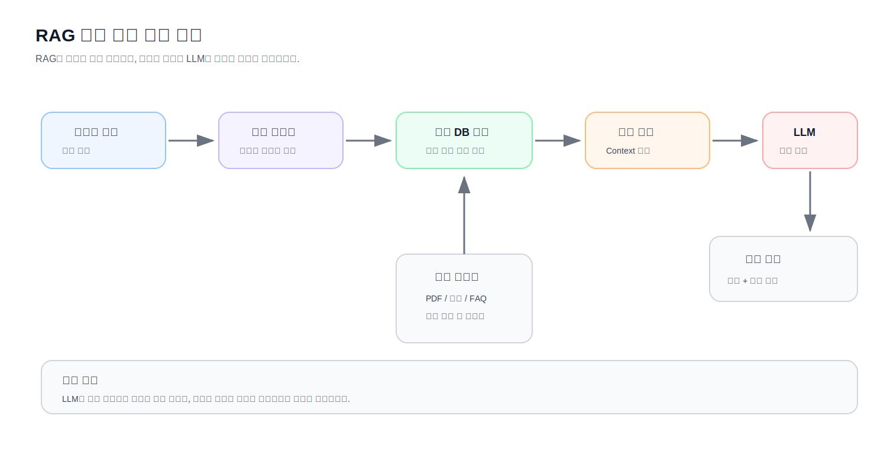

# Chapter 1 미니 프로젝트

> **Chapter 1. 인공지능과 자연어처리의 이해**  
> 문서: `11_Mini_Project.md`

---

## 미니 프로젝트 목표

이번 Chapter에서는 인공지능과 자연어처리의 큰 그림을 배웠습니다.

아직 머신러닝 모델을 직접 학습하지는 않았지만,  
간단한 규칙 기반 방식으로도 자연어처리 시스템의 형태를 만들어 볼 수 있습니다.

이번 미니 프로젝트의 목표는 다음과 같습니다.

> **간단한 FAQ 또는 고객 문의 응답 시스템을 직접 설계하고 구현해 본다.**

이번 프로젝트는 완벽한 챗봇을 만드는 것이 목적이 아닙니다.

중요한 것은 다음 흐름을 직접 경험하는 것입니다.

```text
사용자 문장 입력
    ↓
의도 파악
    ↓
적절한 응답 선택
    ↓
한계 확인
    ↓
머신러닝과 RAG가 왜 필요한지 이해
```

---

## 프로젝트 주제

이번 미니 프로젝트의 주제는 다음 중 하나를 선택합니다.

| 선택 | 주제 | 설명 |
|---|---|---|
| A | 고객센터 FAQ 챗봇 | 배송, 환불, 결제, 계정 문의에 답변 |
| B | 강의자료 안내 챗봇 | Chapter 1 내용에 대한 간단한 질문 답변 |
| C | 학교 행정 안내 챗봇 | 수강신청, 출석, 과제, 성적 문의 안내 |
| D | 사내 규정 안내 챗봇 | 휴가, 근무시간, 보안, 장비 신청 안내 |
| E | 자유 주제 | 관심 있는 업무나 서비스에 맞게 설계 |

처음에는 너무 큰 주제를 선택하지 않습니다.

좋은 주제는 범위가 작고, 질문 유형이 명확합니다.

```text
좋은 예:
배송/환불/결제 FAQ 챗봇

너무 큰 예:
모든 회사 업무를 처리하는 AI 비서
```

---

## 프로젝트 산출물

프로젝트 결과물은 다음 파일들로 구성합니다.

```text
projects/
└── chapter01_mini_project/
    ├── README.md
    ├── faq_chatbot.py
    ├── faq_data.py
    └── test_cases.md
```

Notebook으로 진행하는 경우에는 다음처럼 제출해도 됩니다.

```text
projects/
└── chapter01_mini_project/
    ├── README.md
    └── faq_chatbot.ipynb
```

권장 방식은 Python 파일 방식입니다.

이후 Chapter가 진행되면서 같은 프로젝트를 조금씩 발전시키기 좋기 때문입니다.

---

## 프로젝트 전체 구조

이번 미니 프로젝트의 기본 구조는 다음과 같습니다.

```text
FAQ 데이터
    ↓
사용자 질문 입력
    ↓
키워드 기반 의도 분류
    ↓
미리 준비한 답변 선택
    ↓
답변 출력
```

예를 들어 사용자가 다음과 같이 입력합니다.

```text
배송이 아직 안 왔어요.
```

시스템은 문장 안의 키워드를 확인합니다.

```text
배송
택배
도착
출고
```

그리고 가장 적절한 응답을 출력합니다.

```text
배송 문의로 확인됩니다. 주문번호를 확인한 뒤 배송 상태를 조회해 주세요.
```

---

# Step 1. 문제 정의하기

## 수행 내용

먼저 어떤 문제를 해결할지 정합니다.

다음 질문에 답해 봅니다.

```markdown
## 문제 정의

### 어떤 사용자를 위한 시스템인가?

### 사용자는 어떤 질문을 자주 하는가?

### 이 시스템은 어떤 답변을 제공해야 하는가?

### 잘못 답변하면 어떤 문제가 생길 수 있는가?
```

---

## 예시

```markdown
## 문제 정의

### 어떤 사용자를 위한 시스템인가?

온라인 쇼핑몰 고객

### 사용자는 어떤 질문을 자주 하는가?

배송, 환불, 결제, 계정, 상품 관련 질문

### 이 시스템은 어떤 답변을 제공해야 하는가?

문의 유형을 파악하고, 다음 행동을 안내해야 한다.

### 잘못 답변하면 어떤 문제가 생길 수 있는가?

고객이 잘못된 절차를 따라 불편을 겪을 수 있다.  
환불이나 결제 관련 답변은 특히 주의해야 한다.
```

이 내용은 `README.md`에 작성합니다.

---

# Step 2. FAQ 데이터 설계하기

## 수행 내용

챗봇이 답변할 수 있는 FAQ 데이터를 설계합니다.

처음에는 데이터베이스를 사용하지 않고 Python dictionary로 관리합니다.

파일명은 다음과 같이 만듭니다.

```text
faq_data.py
```

---

## 기본 FAQ 데이터 예시

```python
FAQ_RESPONSES = {
    "배송 문의": "배송 상태는 주문번호를 기준으로 확인할 수 있습니다. 마이페이지의 주문 내역을 확인해 주세요.",
    "환불 문의": "환불은 상품 수령 후 7일 이내에 신청할 수 있습니다. 단, 사용 흔적이 있는 상품은 제한될 수 있습니다.",
    "결제 문의": "결제 오류가 발생했다면 카드 승인 내역과 주문 내역을 먼저 확인해 주세요.",
    "계정 문의": "비밀번호를 잊으셨다면 로그인 화면의 비밀번호 찾기 기능을 이용해 주세요.",
    "상품 문의": "상품의 재고, 색상, 사이즈 정보는 상품 상세 페이지에서 확인할 수 있습니다.",
    "기타 문의": "문의 내용을 정확히 이해하지 못했습니다. 고객센터 상담원에게 연결해 주세요."
}
```

---

## 키워드 데이터 예시

```python
INTENT_KEYWORDS = {
    "배송 문의": ["배송", "택배", "도착", "출고", "운송장"],
    "환불 문의": ["환불", "반품", "취소", "교환"],
    "결제 문의": ["결제", "카드", "입금", "영수증", "승인"],
    "계정 문의": ["로그인", "비밀번호", "계정", "아이디"],
    "상품 문의": ["상품", "제품", "재고", "사이즈", "색상"]
}
```

이 구조는 단순하지만 중요한 개념을 담고 있습니다.

```text
사용자 표현
    ↓
의도 분류
    ↓
답변 선택
```

---

# Step 3. 의도 분류 함수 만들기

## 수행 내용

사용자 문장을 입력받아 어떤 의도인지 분류하는 함수를 작성합니다.

파일명은 다음과 같이 만듭니다.

```text
faq_chatbot.py
```

---

## 기본 코드

```python
from faq_data import FAQ_RESPONSES, INTENT_KEYWORDS


def detect_intent(text):
    scores = {}

    for intent, keywords in INTENT_KEYWORDS.items():
        score = 0

        for keyword in keywords:
            if keyword in text:
                score += 1

        scores[intent] = score

    best_intent = max(scores, key=scores.get)

    if scores[best_intent] == 0:
        return "기타 문의"

    return best_intent


def get_response(text):
    intent = detect_intent(text)
    response = FAQ_RESPONSES[intent]

    return intent, response


if __name__ == "__main__":
    test_sentences = [
        "배송이 아직 안 왔어요.",
        "환불은 어떻게 하나요?",
        "카드 결제가 실패했습니다.",
        "비밀번호를 잊어버렸어요.",
        "이 제품 다른 색상 있나요?",
        "상담원과 통화하고 싶어요."
    ]

    for sentence in test_sentences:
        intent, response = get_response(sentence)

        print("질문:", sentence)
        print("분류:", intent)
        print("답변:", response)
        print("-" * 50)
```

---

## 실행 방법

프로젝트 폴더에서 다음 명령어를 실행합니다.

```bash
python faq_chatbot.py
```

예상 출력은 다음과 비슷합니다.

```text
질문: 배송이 아직 안 왔어요.
분류: 배송 문의
답변: 배송 상태는 주문번호를 기준으로 확인할 수 있습니다. 마이페이지의 주문 내역을 확인해 주세요.
--------------------------------------------------
질문: 환불은 어떻게 하나요?
분류: 환불 문의
답변: 환불은 상품 수령 후 7일 이내에 신청할 수 있습니다. 단, 사용 흔적이 있는 상품은 제한될 수 있습니다.
--------------------------------------------------
```

---

# Step 4. 테스트 케이스 만들기

## 수행 내용

챗봇이 잘 동작하는지 확인하기 위해 테스트 문장을 만듭니다.

파일명은 다음과 같이 작성합니다.

```text
test_cases.md
```

---

## 테스트 케이스 작성 형식

```markdown
# 테스트 케이스

| 번호 | 사용자 질문 | 예상 분류 | 실제 분류 | 성공 여부 |
|---:|---|---|---|---|
| 1 | 배송이 아직 안 왔어요. | 배송 문의 |  |  |
| 2 | 환불하고 싶어요. | 환불 문의 |  |  |
| 3 | 로그인이 안 됩니다. | 계정 문의 |  |  |
```

---

## 필수 테스트 조건

다음 조건을 만족해야 합니다.

| 항목 | 조건 |
|---|---|
| 테스트 문장 수 | 최소 15개 |
| 문의 카테고리 | 최소 5개 |
| 실패 사례 | 최소 3개 포함 |
| 성공 여부 | 직접 실행 후 표시 |
| 실패 원인 | 간단히 분석 |

---

## 실패 사례 예시

규칙 기반 방식은 키워드가 없으면 잘못 분류될 수 있습니다.

예를 들어 다음 문장을 봅시다.

```text
물건을 돌려보내고 싶어요.
```

사람은 환불 또는 반품 문의로 이해할 수 있습니다.

하지만 키워드 목록에 "돌려보내다"가 없다면 `기타 문의`로 분류될 수 있습니다.

이런 실패 사례를 찾는 것이 중요합니다.

실패 사례는 시스템 개선의 출발점입니다.

---

# Step 5. 사용자 입력 기능 추가하기

## 수행 내용

고정된 테스트 문장만 실행하는 것이 아니라, 사용자가 직접 문장을 입력할 수 있도록 만듭니다.

---

## 예시 코드

```python
from faq_data import FAQ_RESPONSES, INTENT_KEYWORDS


def detect_intent(text):
    scores = {}

    for intent, keywords in INTENT_KEYWORDS.items():
        score = 0

        for keyword in keywords:
            if keyword in text:
                score += 1

        scores[intent] = score

    best_intent = max(scores, key=scores.get)

    if scores[best_intent] == 0:
        return "기타 문의"

    return best_intent


def get_response(text):
    intent = detect_intent(text)
    response = FAQ_RESPONSES[intent]

    return intent, response


def run_chatbot():
    print("FAQ 챗봇입니다.")
    print("종료하려면 q를 입력하세요.")
    print("-" * 50)

    while True:
        user_input = input("질문을 입력하세요: ")

        if user_input.lower() == "q":
            print("챗봇을 종료합니다.")
            break

        intent, response = get_response(user_input)

        print("분류:", intent)
        print("답변:", response)
        print("-" * 50)


if __name__ == "__main__":
    run_chatbot()
```

---

## 실행 예시

```text
FAQ 챗봇입니다.
종료하려면 q를 입력하세요.
--------------------------------------------------
질문을 입력하세요: 배송이 언제 오나요?
분류: 배송 문의
답변: 배송 상태는 주문번호를 기준으로 확인할 수 있습니다. 마이페이지의 주문 내역을 확인해 주세요.
--------------------------------------------------
질문을 입력하세요: q
챗봇을 종료합니다.
```

---

# Step 6. 프로젝트 회고 작성하기

## 수행 내용

프로젝트를 완료한 뒤 `README.md`에 회고를 작성합니다.

다음 질문에 답합니다.

```markdown
## 프로젝트 회고

### 이번 프로젝트에서 구현한 기능은 무엇인가?

### 규칙 기반 방식의 장점은 무엇인가?

### 규칙 기반 방식의 한계는 무엇인가?

### 머신러닝을 사용하면 어떤 점을 개선할 수 있을까?

### LLM을 사용하면 어떤 점을 개선할 수 있을까?

### RAG를 사용하면 어떤 점을 개선할 수 있을까?

### 실제 서비스로 만든다면 어떤 점을 주의해야 할까?
```

---

## 회고 예시

```markdown
## 프로젝트 회고

### 이번 프로젝트에서 구현한 기능은 무엇인가?

사용자 질문을 입력받고 키워드를 기준으로 문의 유형을 분류한 뒤, 미리 준비된 답변을 출력하는 FAQ 챗봇을 구현했다.

### 규칙 기반 방식의 장점은 무엇인가?

구현이 쉽고 동작 원리를 이해하기 쉽다.  
어떤 키워드 때문에 분류되었는지 확인하기도 쉽다.

### 규칙 기반 방식의 한계는 무엇인가?

키워드가 없는 표현은 잘 분류하지 못한다.  
예를 들어 "물건을 돌려보내고 싶어요"는 환불 문의에 가깝지만, 키워드가 없으면 기타 문의로 분류될 수 있다.

### 머신러닝을 사용하면 어떤 점을 개선할 수 있을까?

많은 문의 데이터와 정답 라벨을 이용해 모델을 학습하면, 직접 키워드를 모두 작성하지 않아도 패턴을 학습할 수 있다.

### LLM을 사용하면 어떤 점을 개선할 수 있을까?

사용자의 질문을 더 자연스럽게 이해하고, 정해진 답변이 아니라 상황에 맞는 답변을 생성할 수 있다.

### RAG를 사용하면 어떤 점을 개선할 수 있을까?

FAQ나 정책 문서를 검색한 뒤 그 내용을 바탕으로 답변할 수 있으므로, 근거 있는 답변을 제공할 수 있다.
```

---

# 필수 요구사항

이번 미니 프로젝트는 다음 조건을 만족해야 합니다.

| 항목 | 조건 |
|---|---|
| 프로젝트 폴더 | `projects/chapter01_mini_project/` |
| FAQ 카테고리 | 최소 5개 |
| 키워드 | 각 카테고리별 최소 3개 |
| 답변 | 각 카테고리별 1개 이상 |
| 테스트 문장 | 최소 15개 |
| 실패 사례 | 최소 3개 |
| 사용자 입력 | `input()`을 이용한 대화형 실행 |
| README | 문제 정의와 회고 포함 |
| Git 커밋 | 프로젝트 완료 후 커밋 |

---

# 권장 폴더 구조

최종 폴더 구조는 다음과 같습니다.

```text
projects/
└── chapter01_mini_project/
    ├── README.md
    ├── faq_chatbot.py
    ├── faq_data.py
    └── test_cases.md
```

각 파일의 역할은 다음과 같습니다.

| 파일 | 역할 |
|---|---|
| `README.md` | 프로젝트 설명, 문제 정의, 회고 |
| `faq_data.py` | FAQ 답변과 키워드 데이터 |
| `faq_chatbot.py` | 의도 분류와 챗봇 실행 코드 |
| `test_cases.md` | 테스트 문장과 결과 정리 |

---

# 선택 기능

기본 요구사항을 완료했다면 다음 기능을 추가해 볼 수 있습니다.

---

## 선택 기능 1. 점수 출력하기

분류 결과와 함께 각 카테고리 점수를 출력합니다.

```text
질문: 배송이 아직 안 왔어요.
점수: {'배송 문의': 1, '환불 문의': 0, '결제 문의': 0, '계정 문의': 0, '상품 문의': 0}
분류: 배송 문의
```

이 기능을 추가하면 모델이 왜 그렇게 분류했는지 이해하기 쉽습니다.

---

## 선택 기능 2. CSV로 결과 저장하기

테스트 문장과 분류 결과를 CSV 파일로 저장합니다.

예시 파일명:

```text
classification_results.csv
```

예상 컬럼:

| sentence | predicted_intent | response |
|---|---|---|

---

## 선택 기능 3. 유사 표현 추가하기

실패 사례를 바탕으로 키워드 목록을 개선합니다.

예를 들어 환불 문의에 다음 키워드를 추가할 수 있습니다.

```python
"환불 문의": ["환불", "반품", "취소", "교환", "돌려보내", "돈 돌려"]
```

실패 사례를 분석하고 키워드를 개선하는 과정을 기록합니다.

---

## 선택 기능 4. 상담원 연결 조건 추가하기

분류 결과가 `기타 문의`이거나 점수가 낮을 때 상담원 연결 메시지를 출력합니다.

```text
문의 내용을 정확히 이해하지 못했습니다.
상담원 연결이 필요합니다.
```

실제 서비스에서는 AI가 자신 없는 경우 사람에게 넘기는 과정이 중요합니다.

---

## 선택 기능 5. 간단한 메뉴 추가하기

챗봇 실행 시 사용자가 메뉴를 볼 수 있도록 합니다.

```text
FAQ 챗봇입니다.
다음 문의를 처리할 수 있습니다.

1. 배송 문의
2. 환불 문의
3. 결제 문의
4. 계정 문의
5. 상품 문의

질문을 입력하세요:
```

---

# 평가 기준

이번 미니 프로젝트는 다음 기준으로 평가합니다.

| 평가 항목 | 배점 | 설명 |
|---|---:|---|
| 문제 정의 | 15 | 해결할 문제와 사용자를 명확히 정의했는가 |
| FAQ 데이터 설계 | 20 | 카테고리, 키워드, 답변이 적절한가 |
| 코드 구현 | 25 | 의도 분류와 응답 출력이 정상 동작하는가 |
| 테스트 | 15 | 충분한 테스트 문장과 실패 사례를 포함했는가 |
| 회고 | 15 | 규칙 기반 방식의 장점과 한계를 분석했는가 |
| 제출 형식 | 10 | 폴더 구조, 파일명, Git 커밋을 지켰는가 |
| 합계 | 100 |  |

---

## 평가에서 중요한 점

이번 프로젝트에서 가장 중요한 것은 완벽한 정확도가 아닙니다.

중요한 것은 다음을 이해하는 것입니다.

```text
규칙 기반 방식은 쉽고 명확하다.
    ↓
하지만 표현이 다양해지면 한계가 생긴다.
    ↓
그래서 머신러닝이 필요하다.
    ↓
문서 근거가 필요한 답변에는 RAG가 필요하다.
```

이 흐름을 이해했다면 이번 미니 프로젝트의 목적을 달성한 것입니다.

---

# 제출 전 체크리스트

제출 전 다음 항목을 확인합니다.

| 체크 | 항목 |
|---|---|
| ☐ | `projects/chapter01_mini_project/` 폴더를 만들었다 |
| ☐ | `README.md`를 작성했다 |
| ☐ | `faq_data.py`를 작성했다 |
| ☐ | `faq_chatbot.py`를 작성했다 |
| ☐ | FAQ 카테고리를 최소 5개 만들었다 |
| ☐ | 카테고리별 키워드를 최소 3개 이상 작성했다 |
| ☐ | 각 카테고리별 답변을 작성했다 |
| ☐ | 사용자 입력 기능을 구현했다 |
| ☐ | 테스트 문장 최소 15개를 작성했다 |
| ☐ | 실패 사례 최소 3개를 분석했다 |
| ☐ | 규칙 기반 방식의 장점과 한계를 회고했다 |
| ☐ | Git 커밋을 만들었다 |

---

# Git 커밋

프로젝트를 완료한 뒤 Git 커밋을 만듭니다.

```bash
git status
git add projects/chapter01_mini_project
git commit -m "Add chapter 1 mini project"
```

Git 커밋은 프로젝트의 완료 시점을 기록하는 역할을 합니다.

---

# 자주 하는 실수

## 카테고리를 너무 많이 만들기

처음부터 너무 많은 카테고리를 만들면 관리가 어렵습니다.

처음에는 5~7개 정도가 적당합니다.

---

## 키워드가 너무 적음

각 카테고리마다 키워드가 1개뿐이면 다양한 표현을 처리하기 어렵습니다.

최소 3개 이상 작성합니다.

---

## 실패 사례를 숨기기

실패 사례는 나쁜 것이 아닙니다.

오히려 시스템을 개선하는 데 매우 중요합니다.

이번 프로젝트에서는 실패 사례를 반드시 찾아야 합니다.

---

## 답변을 너무 확정적으로 작성하기

규칙 기반 챗봇은 사용자의 의도를 정확히 이해하지 못할 수 있습니다.

따라서 답변은 너무 단정적으로 작성하지 않는 것이 좋습니다.

예를 들어 다음 표현이 더 안전합니다.

```text
배송 문의로 보입니다.
```

다음처럼 단정하면 위험할 수 있습니다.

```text
이것은 배송 문의입니다.
```

---

## 보안과 개인정보를 고려하지 않기

실제 챗봇에서는 주문번호, 전화번호, 주소, 결제 정보 같은 민감한 정보가 오갈 수 있습니다.

이번 프로젝트에서는 실제 개인정보를 사용하지 않습니다.

테스트 데이터도 가상의 문장으로 작성합니다.

---

# 샘플 README 구조

`README.md`는 다음 구조로 작성할 수 있습니다.

```markdown
# Chapter 1 Mini Project

## 프로젝트 이름

FAQ 고객 문의 챗봇

## 프로젝트 목적

규칙 기반 방식으로 사용자 문의를 분류하고 적절한 FAQ 답변을 제공한다.

## 문제 정의

고객센터에 반복적으로 들어오는 배송, 환불, 결제, 계정, 상품 문의를 자동으로 분류하고 안내한다.

## 주요 기능

- 사용자 질문 입력
- 키워드 기반 의도 분류
- FAQ 답변 출력
- 기타 문의 처리
- 테스트 케이스 실행

## 실행 방법

```bash
python faq_chatbot.py
```

## 예시 실행 결과

```text
질문을 입력하세요: 배송이 아직 안 왔어요.
분류: 배송 문의
답변: 배송 상태는 주문번호를 기준으로 확인할 수 있습니다.
```

## 프로젝트 회고

### 규칙 기반 방식의 장점

구현이 쉽고 동작 원리를 이해하기 쉽다.

### 규칙 기반 방식의 한계

표현이 조금만 달라져도 잘못 분류될 수 있다.

### 다음 단계

머신러닝 기반 텍스트 분류와 RAG 기반 문서 검색 챗봇으로 확장할 수 있다.
```

---

# 다음 단계로 확장하기

이번 미니 프로젝트는 앞으로 다음과 같이 확장할 수 있습니다.

```text
Chapter 1
규칙 기반 FAQ 챗봇
    ↓
Chapter 3
텍스트 전처리 적용
    ↓
Chapter 4
텍스트 수치화 적용
    ↓
Chapter 5
임베딩 적용
    ↓
Part 2
딥러닝 기반 분류 모델 적용
    ↓
Part 3
Transformer와 LLM 적용
    ↓
Part 4
RAG 기반 문서 챗봇 완성
```

이번 프로젝트는 작지만 중요한 출발점입니다.

처음에는 키워드로 분류하지만,  
앞으로는 데이터를 이용해 학습하고,  
문서를 검색하고,  
LLM으로 답변을 생성하는 방향으로 발전합니다.

---

## 마무리

이번 Chapter의 마지막 활동은 직접 작은 시스템을 만들어 보는 것입니다.

완벽하지 않아도 괜찮습니다.

오히려 완벽하지 않기 때문에 배울 수 있습니다.

규칙 기반 방식의 한계를 직접 경험하면,  
왜 머신러닝이 필요하고,  
왜 임베딩이 필요하며,  
왜 RAG가 필요한지 더 잘 이해할 수 있습니다.

> 좋은 AI 프로젝트는 작은 문제를 명확히 정의하는 것에서 시작합니다.

---

## 다음 Chapter

다음 Chapter에서는 Python과 데이터 처리를 학습합니다.

문자열, 리스트, 딕셔너리, 파일 읽기, 표 데이터 처리 같은 기초를 다루며,  
자연어처리 실습에 필요한 Python 기본기를 준비합니다.

## 왜 규칙 기반 챗봇부터 시작할까?


> 규칙 기반 AI는 사람이 규칙을 직접 작성하고, 머신러닝은 데이터에서 패턴을 학습합니다.

## 다음 단계 확장 방향



> RAG는 질문과 관련된 문서를 먼저 검색한 뒤, 그 문서를 근거로 LLM이 답변을 생성하게 만드는 구조입니다.

> 다음: `Chapter 2. Python과 데이터 처리`
