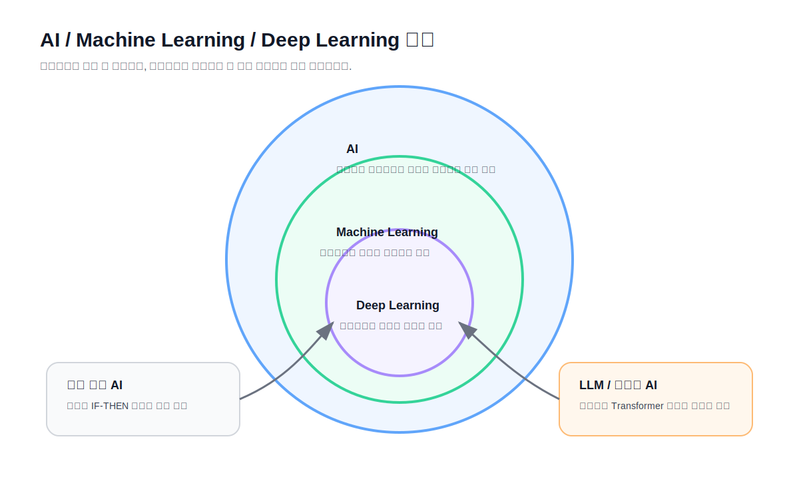
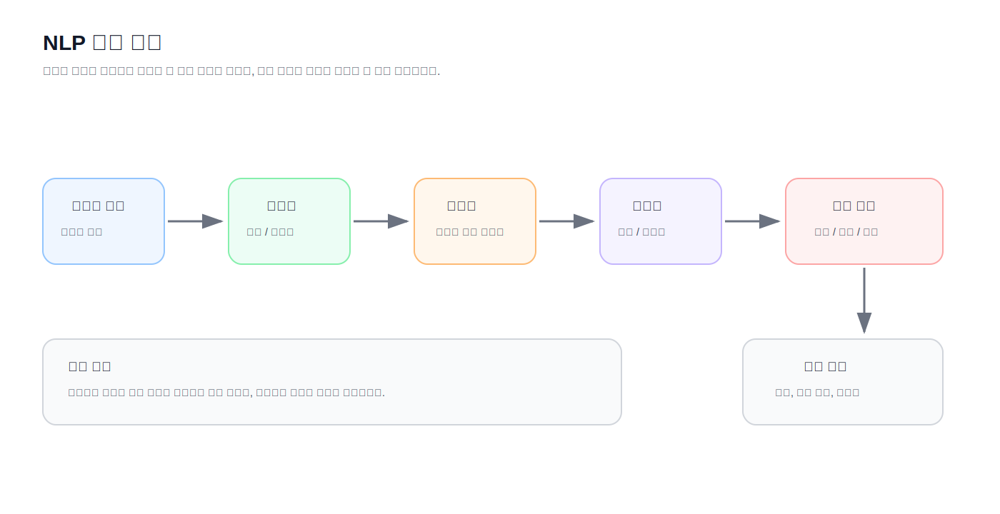
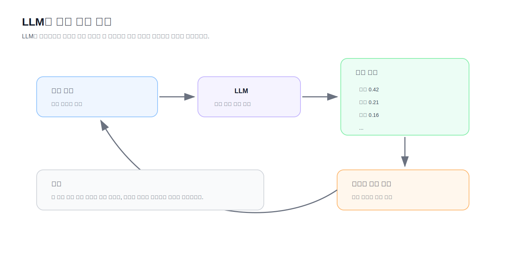
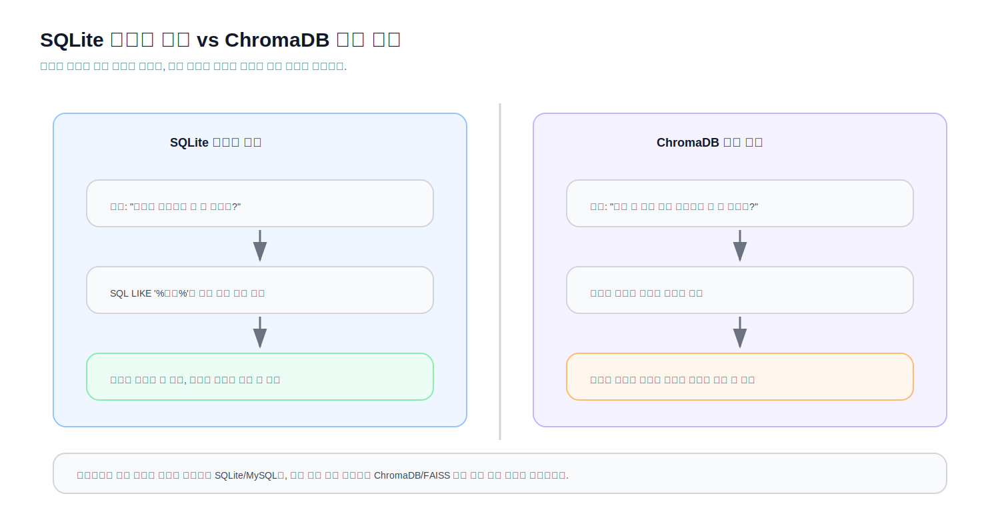

# Chapter 1. 인공지능과 자연어처리의 이해

> 이 문서는 Chapter 1의 최상위 강의 마크다운을 학습 순서대로 합친 통합 원고입니다. 개별 원본 파일은 그대로 유지하며, 합본은 강의 검토와 슬라이드 제작의 단일 참조본으로 사용합니다.

## 통합 목차

- 과정 및 Chapter 안내 — `README.md`
- 도입 — `01_Opening.md`
- 인공지능의 역사 — `02_AI_History.md`
- 머신러닝 — `03_Machine_Learning.md`
- 자연어처리 — `04_NLP.md`
- 생성형 AI와 LLM — `05_Generative_AI_and_LLM.md`
- NLP 활용 사례 — `06_NLP_Cases.md`
- 실습 환경 구성 — `07_Lab_Setup.md`
- 부록 A. Windows 환경 설정 — `WINDOWS_SETUP.md`
- 부록 B. 문제 해결 — `TROUBLESHOOTING.md`
- 핵심 정리 — `08_Summary.md`
- 퀴즈 — `09_Quiz.md`
- 실습 과제 — `10_Assignment.md`
- 미니 프로젝트 — `11_Mini_Project.md`

---

<!-- SOURCE: README.md -->

# 과정 및 Chapter 안내

# Chapter 1. 인공지능과 자연어처리의 이해

## Chapter 핵심 질문

> AI는 어떻게 사람의 언어를 이해하게 되었을까?

## 학습 목표

이 Chapter를 마치면 다음을 설명할 수 있습니다.

- 인공지능, 머신러닝, 딥러닝의 관계
- 규칙 기반 AI와 머신러닝의 차이
- 자연어처리의 기본 흐름
- 생성형 AI와 LLM의 개념
- Hallucination과 RAG가 필요한 이유
- NLP 활용 사례와 최종 프로젝트 방향
- Python 기반 실습 환경의 큰 그림

## 문서 구성

| 순서 | 문서 | 내용 |
|---:|---|---|
| 1 | `01_Opening.md` | Chapter 도입 |
| 2 | `02_AI_History.md` | 인공지능의 발전 |
| 3 | `03_Machine_Learning.md` | 머신러닝과 딥러닝 |
| 4 | `04_NLP.md` | 자연어처리란 무엇인가 |
| 5 | `05_Generative_AI_and_LLM.md` | 생성형 AI와 LLM |
| 6 | `06_NLP_Cases.md` | NLP 활용 사례 |
| 7 | `07_Lab_Setup.md` | 실습 환경 구축 |
| 8 | `08_Summary.md` | Chapter 요약 |
| 9 | `09_Quiz.md` | 퀴즈 |
| 10 | `10_Assignment.md` | 과제 |
| 11 | `11_Mini_Project.md` | 미니 프로젝트 |

## Chapter 흐름

```text
도입
    ↓
AI 역사
    ↓
머신러닝과 딥러닝
    ↓
자연어처리
    ↓
생성형 AI와 LLM
    ↓
NLP 활용 사례
    ↓
실습 환경 구축
    ↓
요약 / 퀴즈 / 과제 / 미니 프로젝트
```

## 다음 Chapter

다음 Chapter에서는 Python과 데이터 처리를 다룹니다.


---

<!-- SOURCE: 01_Opening.md -->

# 도입

# AI는 어떻게 사람의 언어를 이해하게 되었을까?

> **Chapter 1. 인공지능과 자연어처리의 이해**  
> Part 1. 자연어처리 기초와 Python

---

## 시작 질문

여러분은 ChatGPT를 사용해 본 적이 있을 것입니다.

궁금한 내용을 물어보면 답을 해주고,  
프로그램을 작성해 달라고 하면 코드를 작성해 주며,  
보고서나 발표자료까지 만들어 줍니다.

그렇다면 여기서 질문 하나를 해보겠습니다.

> **ChatGPT는 정말 사람처럼 이해하고 있는 것일까요?**

아니면

> **그럴듯하게 답을 만들어 내는 프로그램일 뿐일까요?**

이번 Chapter는 바로 이 질문에서 시작합니다.

---

## AI는 갑자기 등장한 기술이 아닙니다

많은 사람들이 ChatGPT가 등장하면서 AI 시대가 시작되었다고 생각합니다.

하지만 실제로 AI의 역사는 70년이 넘습니다.

AI는 수많은 실패와 성공을 반복하면서 지금의 ChatGPT까지 발전했습니다.

우리가 앞으로 배우게 될 내용은 단순히 최신 도구 사용법이 아닙니다.

AI가 어떻게 발전했고, 왜 지금의 자연어처리 기술이 등장했으며,  
그 기술을 실제 서비스에 어떻게 연결할 수 있는지를 배우는 과정입니다.

---

## 잠깐 생각해 보기

다음 질문에 답해 봅시다.

- ChatGPT는 인터넷을 항상 검색해서 답할까요?
- ChatGPT는 사람처럼 생각할까요?
- ChatGPT는 모든 것을 알고 있을까요?
- ChatGPT도 틀릴까요?
- AI는 왜 거짓말처럼 보이는 답변을 할까요?

정답을 지금 모두 알 필요는 없습니다.

이 강의를 따라가다 보면,  
여러분은 이 질문들에 대해 스스로 설명할 수 있게 됩니다.

---

## 이 과정에서 배우게 될 것

이번 교육에서는 단순히 Python 문법만 배우지 않습니다.

또한 딥러닝 모델을 사용하는 방법만 배우지도 않습니다.

우리가 목표로 하는 것은 다음과 같습니다.

> **AI 서비스를 직접 개발할 수 있는 개발자**

교육이 끝나면 여러분은 다음과 같은 프로그램을 직접 만들 수 있습니다.

- 뉴스 기사 분류 시스템
- 감성 분석 프로그램
- 문서 자동 요약 서비스
- PDF 질의응답 시스템
- 기업용 AI Assistant
- 생성형 AI 기반 챗봇

특히 마지막 프로젝트에서는 지금까지 배운 내용을 바탕으로  
문서를 업로드하고 질문하면 답변과 출처를 함께 보여주는  
**RAG 기반 챗봇**을 직접 구현합니다.

---

## 컴퓨터는 문장을 어떻게 볼까?

사람은 문장을 읽으면 의미를 이해합니다.

예를 들어 다음 문장을 보겠습니다.

```text
오늘 서울의 날씨는 맑습니다.
```

사람은 이 문장을 읽고 자연스럽게 다음 정보를 이해합니다.

| 표현 | 사람이 이해하는 의미 |
|---|---|
| 오늘 | 시간 |
| 서울 | 장소 |
| 날씨 | 주제 |
| 맑습니다 | 상태 |

하지만 컴퓨터는 처음부터 이렇게 이해하지 못합니다.

컴퓨터에게 문장은 처음에는 그저 문자들의 나열입니다.

```text
오 늘   서 울 의   날 씨 는   맑 습 니 다 .
```

그렇다면 컴퓨터는 어떻게 문장을 이해할 수 있을까요?

이 질문에 답하는 기술이 바로 **자연어처리(NLP, Natural Language Processing)** 입니다.

---

## 자연어처리는 왜 어려울까?

사람의 언어는 매우 유연합니다.

같은 뜻을 여러 방식으로 표현할 수 있고,  
같은 문장도 상황에 따라 다른 의미가 될 수 있습니다.

예를 들어 다음 문장을 봅시다.

```text
오늘 날씨 좋네.
```

이 문장은 상황에 따라 전혀 다르게 해석될 수 있습니다.

| 상황 | 의미 |
|---|---|
| 맑고 화창한 날 | 정말 날씨가 좋다는 의미 |
| 비가 많이 오는 날 | 반어적 표현일 수 있음 |
| 약속을 취소한 친구에게 말함 | 감정이 섞인 표현일 수 있음 |

사람은 문맥을 보고 의미를 추론하지만,  
컴퓨터는 이 문맥을 숫자와 패턴으로 배워야 합니다.

그래서 자연어처리는 어렵습니다.

---

## 이번 Chapter에서 다룰 질문

이번 Chapter에서는 다음 질문에 대한 답을 찾아갑니다.

- AI는 어떻게 발전했을까?
- 머신러닝과 딥러닝은 무엇이 다를까?
- 자연어처리란 무엇일까?
- 생성형 AI는 기존 AI와 무엇이 다를까?
- LLM은 무엇일까?
- ChatGPT 같은 모델은 왜 등장했을까?
- NLP는 실제 현업에서 어떻게 사용될까?

---

## 개발자가 왜 AI를 배워야 할까?

불과 몇 년 전까지만 해도 AI는 연구자들의 영역에 가까웠습니다.

하지만 지금은 다릅니다.

웹 개발자도 AI를 사용하고,  
모바일 개발자도 AI를 사용하며,  
데이터 분석가와 기획자도 AI를 사용합니다.

앞으로는 AI를 직접 연구하지 않더라도,  
AI를 이해하고 서비스에 연결할 수 있는 개발자의 가치가 더 높아질 것입니다.

즉, AI는 더 이상 별도의 전문 분야만이 아니라  
개발자가 갖추어야 할 중요한 역량 중 하나가 되어가고 있습니다.

---

## 개발 경험이 있다면 이렇게 생각해 봅시다

AI 애플리케이션도 결국 하나의 소프트웨어입니다.

입력을 받고,  
처리하고,  
결과를 만들어 사용자에게 돌려줍니다.

```text
사용자 입력
    ↓
전처리
    ↓
AI 모델
    ↓
후처리
    ↓
응답
```

처음에는 용어가 낯설 수 있습니다.

하지만 기본 흐름은 우리가 일반적인 프로그램에서 보아 온  
입력, 처리, 출력 구조와 크게 다르지 않습니다.

코딩을 처음 접하는 학습자라면  
지금은 이 구조를 자세히 외우지 않아도 됩니다.

중요한 것은 AI도 마법이 아니라  
데이터를 입력받고 계산한 뒤 결과를 내는 프로그램이라는 점입니다.

---

## 강의를 따라가는 방법

이 강의는 단순히 설명을 듣고 끝나는 방식이 아닙니다.

각 Chapter는 대체로 다음 흐름을 따릅니다.

```text
질문
    ↓
개념
    ↓
그림
    ↓
예제
    ↓
코드
    ↓
실습
    ↓
요약
    ↓
퀴즈
    ↓
과제
    ↓
프로젝트
```

중요한 것은 코드를 눈으로만 보는 것이 아닙니다.

반드시 직접 실행해 보아야 합니다.

AI와 자연어처리는 이론만으로는 익히기 어렵습니다.  
작은 예제를 직접 실행하고, 오류를 만나고, 수정하는 과정에서 실력이 생깁니다.

---

## 이번 Chapter의 학습 목표

이번 Chapter가 끝나면 여러분은 다음 내용을 설명할 수 있어야 합니다.

- 인공지능의 발전 흐름
- 머신러닝과 딥러닝의 차이
- 자연어처리의 기본 개념
- 생성형 AI와 LLM의 의미
- NLP의 대표 활용 사례
- 앞으로의 실습을 위한 개발환경 구성 방향

---

## 우리가 사용할 개발 환경

이번 과정에서는 안정성과 재현성을 우선합니다.

최신 버전이 항상 좋은 선택은 아닙니다.

특히 AI와 딥러닝 분야에서는 Python 버전, 라이브러리 버전, CUDA 버전이 서로 맞지 않으면  
코드가 실행되지 않는 경우가 많습니다.

따라서 이 과정에서는 다음 원칙을 따릅니다.

> **최신 기술보다 검증된 기술을 우선한다.**  
> **학생이 검색 가능한 환경을 우선한다.**  
> **새로운 도구는 왜 등장했는지 함께 설명한다.**

초반에는 Python, venv, pip처럼 가장 널리 쓰이는 방식을 먼저 사용합니다.

이후 프로젝트가 커지면 Docker, pyproject.toml, uv 같은 도구도 단계적으로 소개합니다.

---

## 이번 Chapter의 목표

이번 Chapter의 목표는 거창하지 않습니다.

다음 세 가지면 충분합니다.

1. AI가 왜 중요한지 이해한다.
2. 자연어처리가 어떤 문제를 다루는지 감을 잡는다.
3. 앞으로 실습할 개발환경의 큰 그림을 이해한다.

처음부터 모든 용어를 외우려고 하지 않아도 됩니다.

중요한 것은 다음 질문을 계속 기억하는 것입니다.

> **컴퓨터는 어떻게 사람의 언어를 이해하게 되었을까?**

이 질문을 따라가다 보면  
우리는 자연스럽게 머신러닝, 딥러닝, Transformer, LLM, RAG까지 도달하게 됩니다.

---

## 다음 문서

다음 문서에서는 인공지능의 역사를 살펴봅니다.

단순히 연도를 외우는 것이 아니라,  
AI가 왜 여러 번의 기대와 실망을 반복했는지,  
그리고 왜 지금 다시 폭발적으로 성장하고 있는지를 이해하는 것이 목표입니다.

> 다음: `02_AI_History.md`


---

<!-- SOURCE: 02_AI_History.md -->

# 인공지능의 역사

# 인공지능의 발전

> **Chapter 1. 인공지능과 자연어처리의 이해**  
> 문서: `02_AI_History.md`

---

## 시작 질문

ChatGPT를 처음 사용했을 때 많은 사람들은 이렇게 생각했습니다.

> "AI가 드디어 사람처럼 대화하기 시작했다."

하지만 ChatGPT는 어느 날 갑자기 등장한 기술이 아닙니다.

그 뒤에는 수십 년 동안 이어진 연구, 실패, 기대, 실망, 그리고 다시 도전한 역사가 있습니다.

이번 문서에서는 인공지능의 역사를 단순히 연도로 외우지 않습니다.

우리가 집중할 질문은 이것입니다.

> **AI는 왜 여러 번 실패했고, 왜 지금 다시 강력해졌을까?**

---

## 인공지능의 역사를 보는 관점

인공지능의 역사는 크게 다음 흐름으로 이해할 수 있습니다.

```text
생각하는 기계에 대한 질문
    ↓
규칙 기반 인공지능
    ↓
전문가 시스템
    ↓
AI Winter
    ↓
머신러닝
    ↓
딥러닝
    ↓
Transformer
    ↓
생성형 AI와 LLM
```

이 흐름에서 중요한 것은 기술 이름을 외우는 것이 아닙니다.

각 시대마다 다음 질문을 던져야 합니다.

- 그 시대에는 무엇을 기대했는가?
- 어떤 문제를 해결하려고 했는가?
- 왜 한계에 부딪혔는가?
- 다음 기술은 그 한계를 어떻게 극복했는가?

---

## 생각하는 기계에 대한 질문

인공지능의 출발점은 단순합니다.

> **기계도 생각할 수 있을까?**

1950년, 앨런 튜링(Alan Turing)은 이 질문을 본격적으로 다루었습니다.

튜링은 "기계가 생각할 수 있는가?"라는 질문을 직접 정의하기 어렵다고 보았습니다.

대신 그는 이런 방식으로 접근했습니다.

> 사람이 기계와 대화했을 때,  
> 상대가 사람인지 기계인지 구분할 수 없다면  
> 그 기계는 지능적인 행동을 보인다고 볼 수 있지 않을까?

이 생각은 훗날 **튜링 테스트(Turing Test)** 라고 불리게 됩니다.

---

## 쉬운 설명: 튜링 테스트

튜링 테스트를 아주 쉽게 말하면 다음과 같습니다.

```text
사람 A가 채팅을 한다.
    ↓
상대가 사람인지 컴퓨터인지 모른다.
    ↓
충분히 오래 대화해도 구분하지 못한다.
    ↓
그 컴퓨터는 지능적인 대화를 한다고 볼 수 있지 않을까?
```

물론 이것이 "진짜 이해"를 의미하는지는 여전히 논쟁이 있습니다.

하지만 중요한 점은 튜링 테스트가 이후 인공지능 연구의 중요한 질문을 남겼다는 것입니다.

> **겉으로 지능적으로 보이는 행동은 지능이라고 할 수 있는가?**

이 질문은 오늘날 ChatGPT를 바라볼 때도 그대로 이어집니다.

---

## Dartmouth 회의와 AI라는 이름

1956년 미국 Dartmouth College에서 열린 연구 모임은 인공지능 역사에서 매우 중요한 사건으로 평가됩니다.

이 모임에서 **Artificial Intelligence**, 즉 **인공지능**이라는 표현이 본격적으로 사용되기 시작했습니다.

당시 연구자들은 인간의 지능을 기계로 구현할 수 있다고 기대했습니다.

문제는 기대가 너무 컸다는 점입니다.

초기의 AI 연구자들은 사람이 논리적으로 생각하는 과정을 규칙으로 표현하면, 컴퓨터도 지능적인 문제를 풀 수 있다고 보았습니다.

예를 들어 다음과 같은 방식입니다.

```text
IF 조건 A가 참이면
THEN 행동 B를 수행한다.
```

이 방식은 지금 봐도 자연스럽습니다.

실제로 많은 프로그램은 여전히 이런 규칙 기반 구조를 사용합니다.

하지만 사람의 언어와 현실 세계는 단순한 규칙 몇 개로 설명하기에는 너무 복잡했습니다.

---

## 첫 번째 AI 시대: 규칙 기반 인공지능

초기의 인공지능은 주로 **규칙 기반 AI**였습니다.

규칙 기반 AI는 사람이 직접 규칙을 만들어 컴퓨터에게 알려주는 방식입니다.

예를 들어 날씨에 따라 옷차림을 추천하는 프로그램을 생각해 봅시다.

```text
IF 기온 < 5도
THEN 두꺼운 외투를 추천한다.

IF 비가 온다
THEN 우산을 추천한다.
```

이 방식은 단순한 문제에는 잘 동작합니다.

하지만 조금만 복잡해지면 문제가 생깁니다.

예를 들어 다음과 같은 상황을 생각해 봅시다.

```text
기온은 8도인데 바람이 강하다.
비는 오지 않지만 눈이 올 가능성이 있다.
사용자는 추위를 많이 탄다.
오후에는 실내에 오래 있을 예정이다.
```

이 모든 상황을 규칙으로 작성하려면 어떻게 될까요?

규칙이 점점 많아지고, 서로 충돌하며, 유지보수가 어려워집니다.

---

## 규칙 기반 AI의 장점과 한계

| 구분 | 설명 |
|---|---|
| 장점 | 사람이 규칙을 직접 작성하므로 동작 원리를 이해하기 쉽다 |
| 장점 | 단순하고 명확한 문제에 적합하다 |
| 한계 | 현실 세계의 예외를 모두 규칙으로 만들기 어렵다 |
| 한계 | 규칙이 많아질수록 유지보수가 어렵다 |
| 한계 | 새로운 상황에 유연하게 대응하기 어렵다 |

규칙 기반 AI는 분명 유용했습니다.

하지만 인간의 언어, 이미지, 음성처럼 복잡하고 예외가 많은 문제를 해결하기에는 부족했습니다.

---

## 전문가 시스템의 등장

1970~1980년대에는 **전문가 시스템(Expert System)** 이 크게 주목받았습니다.

전문가 시스템은 특정 분야 전문가의 지식을 규칙으로 정리하여 컴퓨터가 판단하도록 만든 시스템입니다.

예를 들어 의료 진단 시스템을 생각해 볼 수 있습니다.

```text
IF 고열이 있다
AND 기침이 있다
AND 근육통이 있다
THEN 독감 가능성이 높다
```

이런 방식은 특정 분야에서는 실제로 효과가 있었습니다.

당시에는 전문가 시스템이 산업 현장과 연구 분야에서 큰 기대를 받았습니다.

---

## 전문가 시스템은 왜 한계에 부딪혔을까?

전문가 시스템의 가장 큰 문제는 **지식을 사람이 직접 넣어야 한다**는 점이었습니다.

전문가가 알고 있는 지식을 모두 규칙으로 작성해야 했고,  
새로운 지식이 생기면 규칙을 계속 수정해야 했습니다.

또한 현실의 문제는 깔끔한 규칙으로 나누기 어렵습니다.

예를 들어 의사가 환자를 진단할 때는 단순히 증상 목록만 보는 것이 아닙니다.

환자의 말투, 병력, 생활습관, 검사 결과, 의사의 경험이 모두 함께 작용합니다.

이런 복잡한 판단을 `IF-THEN` 규칙으로 모두 표현하는 것은 매우 어렵습니다.

---

## AI Winter: 기대가 식어버린 시기

AI 연구는 여러 번 큰 기대를 받았습니다.

하지만 기대만큼 성과가 나오지 않으면 투자와 관심은 줄어듭니다.

이렇게 AI에 대한 기대가 크게 줄어든 시기를 **AI Winter**라고 부릅니다.

AI Winter는 단순히 "AI가 실패했다"는 뜻이 아닙니다.

보다 정확히 말하면 다음과 같습니다.

> 당시의 기술, 데이터, 컴퓨팅 성능으로는  
> 사람들이 기대한 수준의 AI를 만들기 어려웠다.

즉, 아이디어가 완전히 틀린 것은 아니었지만  
그 아이디어를 구현할 환경이 충분하지 않았던 것입니다.

---

## 잠깐 생각해 보기

다음 두 문장을 비교해 봅시다.

```text
AI는 실패했다.
```

```text
AI는 당시 환경에서 기대만큼 성과를 내지 못했다.
```

두 문장은 비슷해 보이지만 의미가 다릅니다.

AI의 역사는 완전한 실패의 반복이 아닙니다.

오히려 다음 시대로 가기 위한 시행착오의 과정에 가깝습니다.

---

## 머신러닝 시대: 규칙을 직접 만들지 말자

규칙 기반 AI의 한계가 명확해지면서 새로운 접근이 중요해졌습니다.

바로 **머신러닝(Machine Learning)** 입니다.

머신러닝의 핵심 생각은 단순합니다.

> 사람이 규칙을 일일이 만들지 말고,  
> 컴퓨터가 데이터에서 규칙을 찾아내게 하자.

예를 들어 스팸 메일 분류 문제를 생각해 봅시다.

규칙 기반 방식이라면 사람이 다음과 같은 규칙을 만들어야 합니다.

```text
IF 제목에 "무료"가 포함되어 있다
THEN 스팸일 가능성이 높다

IF 본문에 "당첨"이 포함되어 있다
THEN 스팸일 가능성이 높다
```

하지만 이런 규칙은 쉽게 우회됩니다.

스팸 발송자는 단어를 바꿉니다.

```text
무료 → 무 료
당첨 → 당.첨
이벤트 → 특별 혜택
```

머신러닝 방식에서는 사람이 규칙을 직접 만들기보다  
많은 이메일 데이터를 모델에게 보여줍니다.

```text
정상 메일 예시
스팸 메일 예시
    ↓
모델 학습
    ↓
새 메일이 스팸인지 예측
```

---

## 규칙 기반 AI와 머신러닝의 차이

| 구분 | 규칙 기반 AI | 머신러닝 |
|---|---|---|
| 핵심 방식 | 사람이 규칙을 작성 | 데이터에서 패턴을 학습 |
| 장점 | 동작 원리가 비교적 명확 | 복잡한 패턴을 찾을 수 있음 |
| 한계 | 예외가 많으면 관리가 어려움 | 데이터 품질에 크게 의존 |
| 예시 | IF-THEN 규칙 | 스팸 분류, 추천 시스템 |

머신러닝은 AI 연구의 방향을 크게 바꾸었습니다.

이제 중요한 것은 규칙을 얼마나 잘 작성하느냐가 아니라,  
좋은 데이터를 얼마나 잘 준비하고, 모델이 패턴을 잘 학습하도록 만드는가가 되었습니다.

---

## 딥러닝 시대: 특징도 모델이 배우게 하자

머신러닝도 강력했지만 한계가 있었습니다.

많은 경우 사람이 직접 **특징(feature)** 을 설계해야 했습니다.

예를 들어 영화 리뷰가 긍정인지 부정인지 분류한다고 해봅시다.

전통적인 머신러닝에서는 사람이 이런 특징을 만들 수 있습니다.

```text
"좋다"라는 단어가 있는가?
"최악"이라는 단어가 있는가?
느낌표가 많은가?
부정 표현이 있는가?
```

이런 특징 설계를 **Feature Engineering**이라고 합니다.

문제는 좋은 특징을 만드는 일이 쉽지 않다는 것입니다.

딥러닝은 여기서 한 걸음 더 나아갑니다.

> 특징도 사람이 직접 만들지 말고,  
> 모델이 데이터에서 스스로 배우게 하자.

이것이 딥러닝이 강력해진 중요한 이유 중 하나입니다.

---

## 2012년 AlexNet의 의미

2012년 이미지 인식 대회에서 AlexNet은 딥러닝의 가능성을 강하게 보여준 사건으로 자주 언급됩니다.

AlexNet은 이미지 분류 문제에서 기존 방법보다 훨씬 좋은 성능을 보이며 딥러닝 붐을 촉발했습니다.

이 사건은 자연어처리에도 큰 영향을 주었습니다.

왜냐하면 연구자들이 이렇게 생각하기 시작했기 때문입니다.

> 이미지에서 딥러닝이 이렇게 잘 된다면,  
> 언어에서도 딥러닝이 강력하지 않을까?

이후 RNN, LSTM, Seq2Seq, Attention, Transformer로 이어지는 흐름이 자연어처리 분야에서 빠르게 발전했습니다.

---

## 자연어처리의 전환점

자연어처리도 처음부터 지금처럼 강력했던 것은 아닙니다.

초기에는 사람이 직접 규칙을 만들고, 사전을 만들고, 문법 구조를 분석했습니다.

그 다음에는 통계 기반 방법이 등장했습니다.

이후 머신러닝과 딥러닝이 자연어처리에 적용되면서 큰 변화가 일어났습니다.

```text
규칙 기반 NLP
    ↓
통계 기반 NLP
    ↓
머신러닝 기반 NLP
    ↓
딥러닝 기반 NLP
    ↓
Transformer 기반 NLP
    ↓
LLM 기반 NLP
```

이 흐름에서 가장 중요한 전환점 중 하나가 바로 **Transformer**입니다.

---

## 2017년 Transformer의 등장

2017년 발표된 논문 **Attention Is All You Need**는 Transformer 구조를 제안했습니다.

Transformer의 핵심 아이디어는 문장을 순서대로만 읽는 것이 아니라,  
문장 안의 단어들이 서로 얼마나 관련 있는지를 계산하는 것입니다.

쉽게 말하면 다음과 같습니다.

> 문장 전체를 보면서  
> 어떤 단어에 더 집중해야 하는지 계산한다.

예를 들어 다음 문장을 봅시다.

```text
철수는 영희에게 책을 주었다. 그는 매우 기뻐했다.
```

여기서 "그"가 누구를 가리키는지 이해하려면 문맥을 봐야 합니다.

Transformer는 이런 관계를 계산하는 데 매우 강력한 구조를 제공합니다.

---

## Transformer가 바꾼 것

Transformer 이전에도 자연어처리 모델은 존재했습니다.

RNN과 LSTM은 문장을 순서대로 처리하는 데 강점이 있었습니다.

하지만 긴 문장을 처리하거나, 멀리 떨어진 단어 간의 관계를 학습하는 데 어려움이 있었습니다.

Transformer는 Attention 구조를 바탕으로 이 문제를 크게 개선했습니다.

| 구분 | RNN/LSTM | Transformer |
|---|---|---|
| 처리 방식 | 순서대로 처리 | 문장 전체 관계를 한 번에 계산 |
| 긴 문장 처리 | 상대적으로 어려움 | 더 유리함 |
| 병렬 처리 | 제한적 | 유리함 |
| 대표 모델 | Seq2Seq, LSTM | BERT, GPT 계열 |

Transformer는 이후 BERT, GPT, T5, Llama 같은 모델의 기반이 되었습니다.

---

## 생성형 AI 시대

이제 AI는 단순히 분류하거나 예측하는 수준을 넘어섰습니다.

텍스트를 생성하고,  
이미지를 만들고,  
코드를 작성하고,  
문서를 요약하고,  
사람과 대화합니다.

이런 AI를 흔히 **생성형 AI(Generative AI)** 라고 부릅니다.

생성형 AI의 핵심은 다음과 같습니다.

> 기존 데이터를 학습하여  
> 새로운 결과물을 만들어내는 AI

ChatGPT는 생성형 AI가 대중적으로 알려지는 데 큰 역할을 했습니다.

OpenAI는 2022년 11월 30일 ChatGPT를 공개했고, 이후 많은 사람들이 AI를 직접 사용해 보는 계기가 되었습니다.

---

## ChatGPT가 특별했던 이유

ChatGPT 이전에도 언어모델은 있었습니다.

하지만 ChatGPT는 일반 사용자들이 쉽게 대화할 수 있는 형태로 제공되었습니다.

기술 자체도 중요했지만, 사용자 경험도 매우 중요했습니다.

사람들은 더 이상 AI를 논문이나 연구실의 기술로만 보지 않게 되었습니다.

직접 질문하고, 답변을 받고, 코드를 만들고, 글을 고치는 도구로 사용하기 시작했습니다.

즉, ChatGPT는 AI를 대중의 일상 속으로 가져온 사건이었습니다.

---

## AI 발전을 한 장으로 정리하기

다음 흐름을 기억하면 됩니다.

```text
1950년대
생각하는 기계에 대한 질문
    ↓
1956년
AI라는 연구 분야의 출발
    ↓
1960~1970년대
규칙 기반 AI
    ↓
1970~1980년대
전문가 시스템
    ↓
AI Winter
기대와 현실의 차이
    ↓
1990~2000년대
머신러닝의 확산
    ↓
2010년대
딥러닝의 부상
    ↓
2017년
Transformer 등장
    ↓
2020년대
생성형 AI와 LLM 대중화
```

---

## 인공지능 발전 연대표

| 시기 | 핵심 사건 | 의미 |
|---|---|---|
| 1950 | 튜링 테스트 제안 | 기계 지능에 대한 중요한 질문 제시 |
| 1956 | Dartmouth 회의 | Artificial Intelligence라는 분야의 출발점 |
| 1970~1980년대 | 전문가 시스템 | 특정 분야 지식을 규칙으로 표현 |
| 1980~1990년대 | AI Winter | 기대와 현실의 차이로 관심과 투자가 감소 |
| 1997 | IBM Deep Blue가 체스 세계 챔피언 Garry Kasparov를 이김 | 특정 문제에서 컴퓨터 성능을 상징적으로 보여준 사건 |
| 2012 | AlexNet의 이미지 인식 성과 | 딥러닝 붐의 중요한 계기 |
| 2017 | Transformer 발표 | 현대 NLP와 LLM의 핵심 기반 |
| 2022 | ChatGPT 공개 | 생성형 AI가 대중적으로 확산되는 계기 |

---

## 실무에서는 왜 역사가 중요할까?

AI의 역사를 배우는 이유는 과거를 외우기 위해서가 아닙니다.

기술이 왜 바뀌었는지 이해하기 위해서입니다.

현업에서는 새로운 AI 도구가 계속 등장합니다.

하지만 도구 이름만 따라가면 금방 지칩니다.

중요한 것은 다음을 판단하는 능력입니다.

- 이 기술은 어떤 문제를 해결하려고 등장했는가?
- 이전 방식과 무엇이 다른가?
- 실제 프로젝트에 적용할 만큼 안정적인가?
- 우리 문제에 정말 필요한가?

AI의 역사를 이해하면 새로운 기술이 나왔을 때도 더 침착하게 판단할 수 있습니다.

---

## 이번 문서의 핵심 정리

이번 문서에서는 인공지능의 발전 흐름을 살펴보았습니다.

핵심은 다음과 같습니다.

- 초기 AI는 사람이 직접 규칙을 작성하는 방식에서 출발했다.
- 규칙 기반 AI와 전문가 시스템은 명확한 문제에는 유용했지만, 복잡한 현실 문제에는 한계가 있었다.
- AI Winter는 AI 아이디어의 완전한 실패가 아니라 당시 기술 환경의 한계를 보여준 시기였다.
- 머신러닝은 데이터에서 규칙을 학습하는 방식으로 AI의 방향을 바꾸었다.
- 딥러닝은 특징까지 모델이 스스로 학습할 수 있게 만들었다.
- Transformer는 현대 자연어처리와 LLM의 핵심 기반이 되었다.
- ChatGPT는 생성형 AI를 대중적으로 확산시키는 중요한 계기가 되었다.

---

## 잠깐 복습하기

다음 질문에 스스로 답해 봅시다.

1. 규칙 기반 AI와 머신러닝의 차이는 무엇인가?
2. 전문가 시스템은 왜 한계에 부딪혔는가?
3. AI Winter는 왜 발생했는가?
4. 딥러닝은 기존 머신러닝과 무엇이 다른가?
5. Transformer가 자연어처리에서 중요한 이유는 무엇인가?
6. ChatGPT가 대중적으로 큰 영향을 준 이유는 무엇인가?

---

## 강의 중 토론 질문

다음 질문을 조별로 토론해 봅시다.

> AI는 정말 사람처럼 이해하는 것일까,  
> 아니면 통계적으로 그럴듯한 답을 생성하는 것일까?

정답이 하나로 정해진 질문은 아닙니다.

중요한 것은 자신의 생각을 근거와 함께 설명하는 것입니다.

---

## 다음 문서

다음 문서에서는 머신러닝과 딥러닝의 차이를 더 자세히 살펴봅니다.

특히 다음 질문에 집중합니다.

> 사람이 규칙을 만드는 방식과  
> 모델이 데이터에서 패턴을 배우는 방식은  
> 무엇이 다를까?

> 다음: `03_Machine_Learning.md`

---

## 참고 자료

- IBM, "The history of artificial intelligence"
- IBM, "Deep Blue"
- Vaswani et al., "Attention Is All You Need", 2017
- OpenAI, "Introducing ChatGPT", 2022
- Stanford HAI, "AI Index Report"


---

<!-- SOURCE: 03_Machine_Learning.md -->

# 머신러닝

# 머신러닝과 딥러닝

> **Chapter 1. 인공지능과 자연어처리의 이해**  
> 문서: `03_Machine_Learning.md`

---

## 시작 질문

앞 문서에서는 인공지능이 어떻게 발전해 왔는지 살펴보았습니다.

초기의 AI는 사람이 직접 규칙을 작성하는 방식이었습니다.

```text
IF 조건
THEN 행동
```

이 방식은 단순하고 명확한 문제에는 효과적입니다.

하지만 현실 세계의 문제는 대부분 단순하지 않습니다.

예를 들어 스팸 메일을 분류한다고 생각해 봅시다.

```text
제목에 "무료"가 있으면 스팸
본문에 "당첨"이 있으면 스팸
링크가 많으면 스팸
```

처음에는 괜찮아 보입니다.

하지만 스팸 메일 작성자는 금방 표현을 바꿉니다.

```text
무료 → 무 료
당첨 → 특별 혜택
이벤트 → 한정 안내
```

규칙을 계속 추가해야 합니다.

규칙이 늘어나면 프로그램은 점점 복잡해지고, 유지보수도 어려워집니다.

그래서 중요한 질문이 등장합니다.

> **사람이 규칙을 직접 만들지 않고, 컴퓨터가 데이터에서 규칙을 찾게 할 수는 없을까?**

이 질문에서 머신러닝이 시작됩니다.

---

## 머신러닝이란 무엇인가?

머신러닝(Machine Learning)은 말 그대로 **기계가 학습하는 방법**입니다.

조금 더 정확하게 말하면 다음과 같습니다.

> **데이터를 이용해 패턴을 학습하고,  
> 새로운 데이터에 대해 예측하거나 판단하는 기술**

여기서 중요한 단어는 세 가지입니다.

| 핵심 단어 | 의미 |
|---|---|
| 데이터 | 학습의 재료 |
| 패턴 | 데이터 속에 숨어 있는 규칙 |
| 예측 | 새 입력에 대한 판단 결과 |

머신러닝은 사람이 모든 규칙을 직접 작성하지 않습니다.

대신 데이터를 보여주고, 모델이 그 안에서 패턴을 찾도록 합니다.

---

## 규칙 기반 방식과 머신러닝 방식

스팸 메일 분류를 다시 생각해 봅시다.

### 규칙 기반 방식

```text
사람이 규칙을 작성한다.
    ↓
메일이 규칙에 맞는지 검사한다.
    ↓
스팸 또는 정상으로 판단한다.
```

예시는 다음과 같습니다.

```text
IF 제목에 "무료"가 포함되어 있다
THEN 스팸 가능성이 높다
```

### 머신러닝 방식

```text
스팸 메일과 정상 메일 데이터를 준비한다.
    ↓
모델이 데이터에서 패턴을 학습한다.
    ↓
새로운 메일이 들어오면 스팸 여부를 예측한다.
```

머신러닝에서는 사람이 규칙을 하나하나 만들지 않습니다.

대신 모델이 데이터를 보고 규칙에 가까운 패턴을 스스로 찾습니다.

---

## 쉬운 비유: 요리 레시피와 맛보기

규칙 기반 AI는 요리 레시피와 비슷합니다.

```text
소금 1스푼
설탕 2스푼
중불에서 5분
```

정해진 순서를 따르면 결과가 나옵니다.

반면 머신러닝은 많은 음식을 맛보고 감을 익히는 과정과 비슷합니다.

```text
이 음식은 짜다.
이 음식은 달다.
이 음식은 맵다.
이 조합은 맛있다.
```

많은 사례를 경험하면서 어떤 조합이 어떤 결과를 만드는지 배우는 것입니다.

물론 비유에는 한계가 있습니다.

하지만 처음에는 이렇게 이해하면 충분합니다.

> 규칙 기반 AI는 사람이 방법을 알려준다.  
> 머신러닝은 데이터에서 방법을 배우게 한다.

---

## 머신러닝의 기본 구조

머신러닝의 기본 흐름은 다음과 같습니다.

```text
데이터 준비
    ↓
모델 선택
    ↓
학습
    ↓
평가
    ↓
예측
```

각 단계는 다음 의미를 가집니다.

| 단계 | 설명 |
|---|---|
| 데이터 준비 | 학습에 사용할 데이터를 모은다 |
| 모델 선택 | 문제에 맞는 알고리즘을 선택한다 |
| 학습 | 모델이 데이터에서 패턴을 찾는다 |
| 평가 | 모델이 얼마나 잘 맞추는지 확인한다 |
| 예측 | 새로운 데이터에 대해 결과를 출력한다 |

이 흐름은 자연어처리에서도 그대로 사용됩니다.

예를 들어 영화 리뷰 감성 분석을 한다면 다음과 같습니다.

```text
영화 리뷰 데이터 수집
    ↓
리뷰를 숫자로 변환
    ↓
분류 모델 학습
    ↓
정확도 평가
    ↓
새 리뷰가 긍정인지 부정인지 예측
```

---

## 머신러닝에서 데이터가 중요한 이유

머신러닝은 데이터에서 패턴을 학습합니다.

따라서 데이터가 좋지 않으면 모델도 좋은 결과를 내기 어렵습니다.

예를 들어 고양이와 강아지를 구분하는 모델을 만든다고 해봅시다.

학습 데이터가 대부분 고양이 사진이라면 모델은 강아지를 잘 구분하지 못할 수 있습니다.

또는 사진이 모두 밝은 곳에서 찍힌 것이라면 어두운 사진에서는 성능이 떨어질 수 있습니다.

자연어처리에서도 마찬가지입니다.

뉴스 기사로만 학습한 모델은 채팅 문장을 잘 이해하지 못할 수 있습니다.

법률 문서로 학습한 모델은 일상 대화와 다른 표현을 많이 보게 됩니다.

> **머신러닝 모델의 성능은 데이터의 품질과 매우 밀접합니다.**

---

## 지도학습

머신러닝에서 가장 많이 사용하는 방식 중 하나는 **지도학습(Supervised Learning)** 입니다.

지도학습은 정답이 있는 데이터를 이용해 학습하는 방식입니다.

예를 들어 다음과 같은 데이터가 있다고 해봅시다.

| 문장 | 정답 |
|---|---|
| 이 영화 정말 재미있다 | 긍정 |
| 다시는 보고 싶지 않다 | 부정 |
| 배우 연기가 훌륭했다 | 긍정 |
| 시간이 아까웠다 | 부정 |

모델은 문장과 정답을 함께 보면서 학습합니다.

그 후 새로운 문장이 들어오면 긍정인지 부정인지 예측합니다.

```text
입력: "스토리가 정말 좋았다"
출력: 긍정
```

지도학습은 자연어처리에서 매우 자주 사용됩니다.

대표적인 예시는 다음과 같습니다.

- 감성 분석
- 스팸 메일 분류
- 뉴스 카테고리 분류
- 악성 댓글 탐지
- 의도 분류

---

## 분류와 회귀

지도학습은 크게 **분류(Classification)** 와 **회귀(Regression)** 로 나눌 수 있습니다.

### 분류

분류는 정해진 카테고리 중 하나를 예측하는 문제입니다.

예를 들어 다음과 같습니다.

```text
리뷰 → 긍정 / 부정
메일 → 스팸 / 정상
기사 → 정치 / 경제 / 스포츠 / IT
```

자연어처리에서는 분류 문제가 매우 많이 등장합니다.

### 회귀

회귀는 숫자 값을 예측하는 문제입니다.

예를 들어 다음과 같습니다.

```text
집 정보 → 집값 예측
광고 정보 → 클릭률 예측
학습 시간 → 시험 점수 예측
```

자연어처리에서도 회귀를 사용할 수 있습니다.

예를 들어 문서의 난이도 점수나 리뷰 평점을 예측할 수 있습니다.

---

## 비지도학습

**비지도학습(Unsupervised Learning)** 은 정답이 없는 데이터를 이용하는 학습 방식입니다.

예를 들어 많은 뉴스 기사가 있지만, 각 기사의 카테고리 정답이 없다고 해봅시다.

모델은 기사들 사이의 유사성을 보고 비슷한 기사끼리 묶을 수 있습니다.

```text
뉴스 기사들
    ↓
비슷한 주제끼리 그룹화
    ↓
정치 / 경제 / 스포츠처럼 보이는 묶음 발견
```

비지도학습의 대표적인 예시는 다음과 같습니다.

- 군집화(Clustering)
- 차원 축소
- 토픽 모델링
- 문서 유사도 분석

자연어처리에서는 문서들을 주제별로 묶거나, 비슷한 문장을 찾을 때 자주 사용됩니다.

---

## 강화학습

**강화학습(Reinforcement Learning)** 은 행동에 대한 보상을 통해 학습하는 방식입니다.

게임을 생각하면 이해하기 쉽습니다.

```text
행동을 한다.
    ↓
결과를 본다.
    ↓
보상을 받는다.
    ↓
더 좋은 행동을 하도록 학습한다.
```

예를 들어 게임 AI가 있다고 해봅시다.

적을 피하면 보상을 받고, 장애물에 부딪히면 벌점을 받습니다.

이 과정을 반복하면서 더 좋은 행동을 학습합니다.

강화학습은 자연어처리에서도 사용됩니다.

특히 대규모 언어모델을 사람의 선호에 맞게 조정할 때 강화학습 아이디어가 활용됩니다.

다만 이 Chapter에서는 개념만 이해하면 충분합니다.

---

## 머신러닝의 세 가지 학습 방식 정리

| 학습 방식 | 정답 데이터 | 대표 문제 | NLP 예시 |
|---|---|---|---|
| 지도학습 | 있음 | 분류, 회귀 | 감성 분석, 스팸 분류 |
| 비지도학습 | 없음 | 군집화, 패턴 발견 | 문서 군집화, 토픽 분석 |
| 강화학습 | 보상 | 행동 최적화 | 사람 선호에 맞춘 응답 개선 |

처음에는 지도학습을 가장 중요하게 이해하면 됩니다.

이후 자연어처리 실습에서도 지도학습 기반 예제를 많이 다루게 됩니다.

---

## 모델은 무엇을 학습할까?

머신러닝 모델이 학습한다는 말은 무엇을 의미할까요?

모델은 데이터 속에서 입력과 출력 사이의 관계를 찾습니다.

예를 들어 다음 데이터를 봅시다.

| 입력 문장 | 출력 |
|---|---|
| 정말 재미있다 | 긍정 |
| 너무 지루하다 | 부정 |
| 최고였다 | 긍정 |
| 별로였다 | 부정 |

모델은 이런 패턴을 배웁니다.

```text
"재미있다", "최고" 같은 표현은 긍정과 관련이 많다.
"지루하다", "별로" 같은 표현은 부정과 관련이 많다.
```

하지만 실제 모델은 사람이 읽는 단어 그대로 이해하지 않습니다.

컴퓨터는 텍스트를 숫자로 바꿔서 처리합니다.

이 과정이 앞으로 배우게 될 **텍스트 수치화**와 **임베딩**으로 이어집니다.

---

## 아주 작은 머신러닝 예제

아래 코드는 머신러닝의 흐름을 보여주기 위한 아주 간단한 예제입니다.

실제 자연어처리 모델은 아니지만,  
"데이터로부터 규칙을 학습한다"는 느낌을 이해하는 데 도움이 됩니다.

```python
from sklearn.linear_model import LinearRegression
import numpy as np

# 공부 시간
x = np.array([[1], [2], [3], [4], [5]])

# 시험 점수
y = np.array([50, 60, 70, 80, 90])

model = LinearRegression()
model.fit(x, y)

pred = model.predict([[6]])

print(pred)
```

예상 결과는 다음과 비슷합니다.

```text
[100.]
```

이 모델은 사람이 직접 이런 규칙을 작성하지 않았습니다.

```text
점수 = 공부 시간 * 10 + 40
```

대신 데이터를 보고 관계를 학습했습니다.

이것이 머신러닝의 기본 아이디어입니다.

---

## 자연어처리에서는 무엇이 다를까?

자연어처리에서는 입력이 숫자가 아니라 텍스트입니다.

예를 들어 다음과 같은 문장이 입력됩니다.

```text
이 영화 정말 재미있다.
```

하지만 모델은 문장을 그대로 이해할 수 없습니다.

그래서 텍스트를 숫자로 바꾸어야 합니다.

```text
"이 영화 정말 재미있다"
    ↓
토큰화
    ↓
숫자 인덱스
    ↓
벡터
    ↓
모델 입력
```

이 과정은 앞으로 Chapter 3, Chapter 4, Chapter 5에서 자세히 배우게 됩니다.

지금은 다음 정도만 기억하면 됩니다.

> 자연어처리에서 머신러닝을 사용하려면  
> 문장을 모델이 처리할 수 있는 숫자 형태로 바꾸어야 한다.

---

## 딥러닝은 머신러닝과 무엇이 다를까?

딥러닝(Deep Learning)은 머신러닝의 한 분야입니다.

즉, 딥러닝은 머신러닝과 완전히 다른 것이 아닙니다.

관계는 다음과 같이 이해할 수 있습니다.

```text
인공지능
    └── 머신러닝
            └── 딥러닝
```

딥러닝은 인공신경망을 여러 층으로 쌓아 복잡한 패턴을 학습하는 방식입니다.

여기서 "Deep"은 층이 깊다는 의미입니다.

---

## 쉬운 비유: 여러 단계로 이해하기

사람이 사진을 보고 고양이를 알아본다고 생각해 봅시다.

처음에는 단순한 선이나 색을 봅니다.

그 다음에는 귀, 눈, 수염 같은 부분을 봅니다.

마지막에는 전체 모양을 보고 고양이라고 판단합니다.

딥러닝도 이와 비슷하게 여러 층을 거치며 점점 복잡한 특징을 학습합니다.

```text
입력 데이터
    ↓
단순한 특징
    ↓
조금 더 복잡한 특징
    ↓
의미 있는 패턴
    ↓
예측 결과
```

텍스트에서도 마찬가지입니다.

처음에는 단어 수준의 정보를 보고,  
그 다음에는 문장 구조와 문맥을 학습하며,  
마지막에는 전체 의미에 가까운 표현을 만들어냅니다.

---

## 전통적 머신러닝과 딥러닝 비교

| 구분 | 전통적 머신러닝 | 딥러닝 |
|---|---|---|
| 특징 설계 | 사람이 직접 설계하는 경우가 많음 | 모델이 스스로 학습 |
| 데이터 요구량 | 비교적 적은 데이터로도 가능 | 많은 데이터가 필요 |
| 계산 비용 | 상대적으로 낮음 | 상대적으로 높음 |
| 해석 가능성 | 비교적 높음 | 상대적으로 낮음 |
| 강점 | 작은 데이터, 명확한 문제 | 이미지, 음성, 자연어 같은 복잡한 문제 |
| NLP 예시 | TF-IDF + 분류기 | RNN, LSTM, Transformer |

딥러닝이 항상 정답은 아닙니다.

데이터가 적고 문제가 단순하다면 전통적인 머신러닝이 더 좋은 선택일 수도 있습니다.

---

## 실무에서는 어떤 기준으로 선택할까?

실무에서는 "최신 기술"보다 "문제에 맞는 기술"이 중요합니다.

예를 들어 다음과 같이 생각할 수 있습니다.

| 상황 | 적합한 접근 |
|---|---|
| 데이터가 적고 규칙이 명확함 | 규칙 기반 방식 |
| 데이터가 어느 정도 있고 설명 가능성이 중요함 | 전통적 머신러닝 |
| 데이터가 많고 패턴이 복잡함 | 딥러닝 |
| 문서 이해, 생성, 질의응답이 필요함 | Transformer, LLM |
| 내부 문서 기반 답변이 필요함 | RAG |

중요한 것은 도구 이름이 아닙니다.

문제를 보고 적절한 방식을 선택하는 능력입니다.

---

## 딥러닝이 자연어처리에 강력했던 이유

자연어는 복잡합니다.

단어 하나의 의미도 문맥에 따라 달라집니다.

예를 들어 "차"라는 단어를 생각해 봅시다.

```text
차를 마셨다.
차를 운전했다.
두 값의 차가 크다.
```

같은 단어지만 의미가 다릅니다.

전통적인 방식에서는 이런 차이를 처리하기가 쉽지 않았습니다.

딥러닝은 대량의 텍스트를 학습하면서 단어와 문맥의 관계를 더 잘 표현할 수 있게 되었습니다.

특히 Transformer 이후에는 문장 안에서 단어들이 서로 어떤 관계를 가지는지 학습하는 능력이 크게 향상되었습니다.

---

## 생성형 AI는 어디에 위치할까?

생성형 AI는 딥러닝과 Transformer 발전 위에서 등장했습니다.

관계를 단순화하면 다음과 같습니다.

```text
AI
    ↓
Machine Learning
    ↓
Deep Learning
    ↓
Transformer
    ↓
Large Language Model
    ↓
Generative AI Service
```

ChatGPT 같은 서비스는 이 흐름의 결과물입니다.

하지만 중요한 점은 하나입니다.

ChatGPT도 마법이 아닙니다.

많은 텍스트 데이터, 거대한 모델, 학습 알고리즘, 인프라, 사용자 인터페이스가 결합된 소프트웨어 시스템입니다.

---

## 머신러닝 프로젝트의 기본 흐름

실제 머신러닝 프로젝트는 보통 다음 흐름으로 진행됩니다.

```text
문제 정의
    ↓
데이터 수집
    ↓
데이터 전처리
    ↓
특징 추출 또는 임베딩
    ↓
모델 학습
    ↓
평가
    ↓
배포
    ↓
모니터링
```

자연어처리 프로젝트도 크게 다르지 않습니다.

예를 들어 악성 댓글 탐지 시스템을 만든다면 다음과 같습니다.

| 단계 | 예시 |
|---|---|
| 문제 정의 | 댓글이 악성인지 정상인지 분류 |
| 데이터 수집 | 댓글 데이터 수집 |
| 전처리 | 불필요한 문자 제거, 토큰화 |
| 특징 추출 | TF-IDF 또는 임베딩 |
| 모델 학습 | 분류 모델 학습 |
| 평가 | 정확도, 정밀도, 재현율 확인 |
| 배포 | API 또는 웹 서비스로 제공 |
| 모니터링 | 새로운 표현, 우회 표현 대응 |

실무에서는 학습보다 데이터 준비와 운영이 더 많은 시간을 차지하는 경우가 많습니다.

---

## 주의: 정확도만 보면 안 된다

머신러닝 모델을 평가할 때 정확도(Accuracy)를 많이 사용합니다.

하지만 정확도만 보면 위험할 수 있습니다.

예를 들어 전체 댓글 중 95%가 정상 댓글이고 5%만 악성 댓글이라고 해봅시다.

모델이 모든 댓글을 정상이라고 예측해도 정확도는 95%입니다.

하지만 이 모델은 악성 댓글을 하나도 잡지 못합니다.

그래서 분류 문제에서는 다음 지표도 함께 봐야 합니다.

- 정밀도(Precision)
- 재현율(Recall)
- F1-score
- Confusion Matrix

이 지표들은 이후 분류 모델 실습에서 자세히 다룹니다.

---

## 머신러닝이 잘못될 수 있는 이유

머신러닝은 강력하지만 완벽하지 않습니다.

대표적인 문제는 다음과 같습니다.

| 문제 | 설명 |
|---|---|
| 데이터 부족 | 학습할 사례가 부족하면 일반화가 어렵다 |
| 편향된 데이터 | 특정 패턴만 많이 보면 편향된 판단을 할 수 있다 |
| 과적합 | 학습 데이터에는 잘 맞지만 새로운 데이터에는 약하다 |
| 해석 어려움 | 모델이 왜 그런 판단을 했는지 설명하기 어려울 수 있다 |
| 운영 환경 변화 | 시간이 지나 데이터 분포가 바뀔 수 있다 |

AI 서비스를 만들 때는 모델을 학습시키는 것만큼 이런 위험을 이해하고 관리하는 것도 중요합니다.

---

## 자연어처리 학습에서 머신러닝을 먼저 이해해야 하는 이유

앞으로 우리는 토큰화, 임베딩, RNN, LSTM, Transformer, BERT, GPT, RAG를 배우게 됩니다.

이 기술들은 모두 머신러닝과 딥러닝의 흐름 위에 있습니다.

기초를 이해하지 못하면 뒤로 갈수록 용어만 외우게 됩니다.

반대로 머신러닝의 기본 구조를 이해하면 새로운 모델이 나와도 훨씬 쉽게 받아들일 수 있습니다.

다음 질문을 계속 기억하면 됩니다.

> 이 모델은 어떤 데이터를 보고,  
> 어떤 패턴을 학습하며,  
> 어떤 결과를 예측하는가?

이 질문은 앞으로 모든 Chapter에서 반복해서 등장할 것입니다.

---

## 이번 문서의 핵심 정리

이번 문서에서는 머신러닝과 딥러닝의 기본 개념을 살펴보았습니다.

핵심은 다음과 같습니다.

- 규칙 기반 AI는 사람이 규칙을 직접 만든다.
- 머신러닝은 데이터에서 패턴을 학습한다.
- 지도학습은 정답이 있는 데이터로 학습한다.
- 비지도학습은 정답 없이 데이터의 구조를 찾는다.
- 강화학습은 행동에 대한 보상을 통해 학습한다.
- 딥러닝은 머신러닝의 한 분야이며, 여러 층의 신경망을 사용한다.
- 딥러닝은 복잡한 데이터에서 특징을 스스로 학습하는 데 강하다.
- 자연어처리는 텍스트를 숫자로 바꾼 뒤 모델에 입력한다.
- 실무에서는 최신 기술보다 문제에 맞는 기술 선택이 중요하다.

---

## 잠깐 복습하기

다음 질문에 스스로 답해 봅시다.

1. 규칙 기반 AI와 머신러닝의 가장 큰 차이는 무엇인가?
2. 지도학습, 비지도학습, 강화학습은 각각 어떤 방식인가?
3. 분류와 회귀의 차이는 무엇인가?
4. 딥러닝은 머신러닝과 어떤 관계인가?
5. 자연어처리에서 텍스트를 숫자로 바꿔야 하는 이유는 무엇인가?
6. 딥러닝이 항상 전통적인 머신러닝보다 좋은 선택일까?
7. 실무에서 모델을 선택할 때 어떤 기준을 고려해야 할까?

---

## 강의 중 토론 질문

다음 질문을 조별로 토론해 봅시다.

> 데이터가 적은 프로젝트에서 무조건 딥러닝을 사용하는 것이 좋은 선택일까?

토론할 때 다음 관점을 함께 고려해 봅시다.

- 데이터 크기
- 구현 난이도
- 설명 가능성
- 운영 비용
- 유지보수

---

## 작은 실습 아이디어

이번 문서에서는 개념을 중심으로 학습했습니다.

강의 중 시간이 있다면 다음 작은 실습을 진행할 수 있습니다.

### 실습: 규칙 기반 분류기 만들기

```python
def classify_review(text):
    positive_words = ["좋다", "재미있다", "최고", "훌륭"]
    negative_words = ["별로", "지루", "최악", "싫다"]

    positive_score = sum(word in text for word in positive_words)
    negative_score = sum(word in text for word in negative_words)

    if positive_score > negative_score:
        return "긍정"
    elif negative_score > positive_score:
        return "부정"
    else:
        return "판단 어려움"


reviews = [
    "이 영화 정말 재미있다",
    "스토리가 지루하고 별로였다",
    "배우 연기는 훌륭했지만 결말은 별로였다"
]

for review in reviews:
    print(review, "→", classify_review(review))
```

이 실습의 목적은 좋은 모델을 만드는 것이 아닙니다.

규칙 기반 방식이 어떤 장점과 한계를 가지는지 직접 느껴보는 것입니다.

---

## 다음 문서

다음 문서에서는 자연어처리 자체에 집중합니다.

우리는 다음 질문을 다룹니다.

> 컴퓨터가 사람의 언어를 처리하려면  
> 문장을 어떤 단계로 나누어야 할까?

## AI / Machine Learning / Deep Learning 관계



> AI는 가장 큰 개념이고, Machine Learning과 Deep Learning은 그 안에 포함되는 하위 접근 방식입니다.

## 규칙 기반 AI와 머신러닝 비교


> 규칙 기반 AI는 사람이 규칙을 직접 작성하고, 머신러닝은 데이터에서 패턴을 학습합니다.

> 다음: `04_NLP.md`


---

<!-- SOURCE: 04_NLP.md -->

# 자연어처리

# 자연어처리란 무엇인가

> **Chapter 1. 인공지능과 자연어처리의 이해**  
> 문서: `04_NLP.md`

---

## 시작 질문

우리는 앞에서 머신러닝과 딥러닝의 기본 개념을 살펴보았습니다.

이제 질문을 조금 더 좁혀보겠습니다.

> **컴퓨터는 사람의 언어를 어떻게 처리할 수 있을까?**

사람은 문장을 읽으면 자연스럽게 의미를 이해합니다.

```text
오늘 회의는 오후 3시에 시작합니다.
```

이 문장을 보면 우리는 다음 정보를 바로 파악합니다.

| 표현 | 의미 |
|---|---|
| 오늘 | 날짜 또는 시간 정보 |
| 회의 | 일정의 대상 |
| 오후 3시 | 시작 시간 |
| 시작합니다 | 어떤 일이 시작됨 |

하지만 컴퓨터 입장에서는 이 문장이 처음부터 의미를 가진 정보가 아닙니다.

컴퓨터에게 문장은 기본적으로 문자들의 나열입니다.

```text
오, 늘,  , 회, 의, 는,  , 오, 후,  , 3, 시, ...
```

자연어처리는 바로 이 간격을 줄이는 기술입니다.

> 사람이 사용하는 언어를  
> 컴퓨터가 처리할 수 있는 형태로 바꾸고,  
> 그 안에서 의미 있는 정보를 찾아내는 기술

---

## 자연어란 무엇인가?

자연어(Natural Language)는 사람이 일상적으로 사용하는 언어를 의미합니다.

예를 들면 다음과 같습니다.

- 한국어
- 영어
- 일본어
- 중국어
- 프랑스어
- 스페인어

자연어는 사람이 의사소통을 위해 자연스럽게 발전시킨 언어입니다.

반대로 프로그래밍 언어는 사람이 컴퓨터에게 명령을 전달하기 위해 만든 인공적인 언어입니다.

| 구분 | 예시 | 특징 |
|---|---|---|
| 자연어 | 한국어, 영어 | 애매함, 문맥, 감정, 생략이 많음 |
| 프로그래밍 언어 | Python, Java, SQL | 문법이 엄격하고 의미가 명확해야 함 |

프로그래밍 언어는 문법 오류가 있으면 실행되지 않습니다.

하지만 자연어는 조금 틀려도 사람은 대체로 이해합니다.

```text
나 어제 밥 먹었어.
나 어제 밥 먹음.
어제 나 밥 먹었는데.
```

위 문장들은 모두 조금씩 다르지만 사람은 비슷한 의미로 이해할 수 있습니다.

이 유연함이 자연어의 장점이자, 컴퓨터에게는 어려운 점입니다.

---

## 자연어처리란 무엇인가?

자연어처리(NLP, Natural Language Processing)는 사람이 사용하는 언어를 컴퓨터가 처리하도록 만드는 기술입니다.

여기서 "처리한다"는 말은 여러 의미를 포함합니다.

| 처리 | 예시 |
|---|---|
| 이해 | 문장의 의미 파악 |
| 분류 | 리뷰가 긍정인지 부정인지 판단 |
| 추출 | 문장에서 날짜, 장소, 사람 이름 찾기 |
| 변환 | 한국어를 영어로 번역 |
| 요약 | 긴 문서를 짧게 정리 |
| 생성 | 질문에 대한 답변 작성 |

즉 자연어처리는 단순히 문장을 읽는 기술이 아닙니다.

언어 데이터를 이용해 다양한 작업을 수행하는 전체 기술 영역입니다.

---

## 쉬운 비유: 통역사와 정리 담당자

자연어처리를 쉽게 비유하면 두 가지 역할로 볼 수 있습니다.

첫 번째는 **통역사**입니다.

```text
사람의 말
    ↓
컴퓨터가 이해할 수 있는 형태
```

두 번째는 **정리 담당자**입니다.

```text
복잡한 문서
    ↓
중요한 정보 추출
    ↓
분류, 요약, 검색, 답변
```

예를 들어 고객센터에 다음 문장이 들어왔다고 해봅시다.

```text
어제 주문한 상품이 아직 배송되지 않았어요.
```

자연어처리 시스템은 이 문장에서 다음 정보를 찾을 수 있습니다.

| 항목 | 추출된 정보 |
|---|---|
| 문제 유형 | 배송 지연 |
| 시간 표현 | 어제 |
| 대상 | 주문한 상품 |
| 감정 | 불만 가능성 |

이렇게 문장을 처리하면 고객센터 시스템은 자동으로 관련 부서에 문의를 연결하거나, 배송 상태를 조회하는 기능을 실행할 수 있습니다.


---

## 자연어처리가 어려운 이유

자연어처리는 단순하지 않습니다.

사람의 언어에는 애매함이 많기 때문입니다.

### 같은 단어, 다른 의미

```text
차를 마셨다.
차를 운전했다.
두 값의 차가 크다.
```

여기서 "차"는 각각 다른 의미입니다.

| 문장 | "차"의 의미 |
|---|---|
| 차를 마셨다 | 마시는 차 |
| 차를 운전했다 | 자동차 |
| 두 값의 차가 크다 | 차이 |

사람은 문맥을 보고 쉽게 구분합니다.

하지만 컴퓨터는 이 문맥을 계산으로 처리해야 합니다.

---

## 같은 뜻, 다른 표현

자연어에서는 같은 의미를 여러 방식으로 표현할 수 있습니다.

```text
배송이 늦어요.
상품이 아직 안 왔어요.
주문한 물건을 못 받았어요.
택배가 도착하지 않았습니다.
```

표현은 다르지만 모두 비슷한 문제를 말하고 있습니다.

고객센터 시스템이라면 이 문장들을 모두 "배송 지연"으로 이해할 수 있어야 합니다.

이것이 자연어처리의 어려움입니다.

---

## 생략과 문맥

사람의 대화에서는 많은 정보가 생략됩니다.

예를 들어 다음 대화를 봅시다.

```text
A: 내일 회의 몇 시야?
B: 3시.
```

B는 "내일 회의는 3시에 시작합니다"라고 말하지 않았습니다.

그냥 "3시"라고 답했습니다.

사람은 앞 문맥을 보고 의미를 이해합니다.

하지만 컴퓨터는 대화의 앞뒤 흐름을 기억하고 해석해야 합니다.

---

## 감정과 뉘앙스

자연어에는 감정과 뉘앙스도 들어 있습니다.

```text
참 잘했네.
```

이 문장은 상황에 따라 칭찬일 수도 있고, 비꼬는 말일 수도 있습니다.

| 상황 | 의미 |
|---|---|
| 좋은 결과를 냈을 때 | 칭찬 |
| 큰 실수를 했을 때 | 비꼼 |
| 장난치는 상황 | 농담 |

자연어처리 시스템이 이런 뉘앙스를 정확히 이해하는 것은 매우 어렵습니다.

그래서 감성 분석, 의도 분석, 문맥 이해가 중요한 연구 주제가 됩니다.

---

## 자연어처리의 기본 흐름

자연어처리는 보통 다음과 같은 흐름으로 진행됩니다.

```text
텍스트 입력
    ↓
전처리
    ↓
토큰화
    ↓
수치화
    ↓
모델 처리
    ↓
결과 해석
```

예를 들어 감성 분석을 한다고 해봅시다.

```text
"이 영화 정말 재미있다."
    ↓
전처리
    ↓
["이", "영화", "정말", "재미있다"]
    ↓
숫자 벡터
    ↓
분류 모델
    ↓
긍정
```

이 흐름은 앞으로 NLP 실습에서 계속 반복해서 보게 됩니다.


---

## 전처리

전처리(Preprocessing)는 모델에 입력하기 전에 텍스트를 정리하는 과정입니다.

예를 들어 다음 문장을 봅시다.

```text
와!!! 이 영화 진짜ㅋㅋㅋ 너무 재밌다!!! 😊
```

이 문장을 그대로 사용할 수도 있지만, 문제에 따라 정리가 필요할 수 있습니다.

```text
이 영화 진짜 너무 재밌다
```

전처리에서는 다음 작업을 수행할 수 있습니다.

| 작업 | 설명 |
|---|---|
| 소문자 변환 | 영어에서 대소문자 차이를 줄임 |
| 특수문자 제거 | 불필요한 기호 제거 |
| 불용어 제거 | 의미가 적은 단어 제거 |
| 띄어쓰기 정리 | 비정상적인 공백 정리 |
| 이모지 처리 | 삭제하거나 감정 정보로 변환 |

하지만 전처리는 항상 많이 할수록 좋은 것은 아닙니다.

예를 들어 감성 분석에서는 이모지가 중요한 정보일 수 있습니다.

```text
좋아요 😊
별로예요 😡
```

따라서 전처리는 문제에 맞게 결정해야 합니다.

---

## 토큰화

토큰화(Tokenization)는 문장을 작은 단위로 나누는 과정입니다.

여기서 작은 단위를 **토큰(Token)** 이라고 부릅니다.

예를 들어 다음 문장을 봅시다.

```text
나는 자연어처리를 공부한다.
```

단어 단위로 나누면 다음과 같습니다.

```text
["나는", "자연어처리를", "공부한다"]
```

조금 더 세밀하게 나누면 다음처럼 볼 수도 있습니다.

```text
["나", "는", "자연어", "처리", "를", "공부", "한다"]
```

토큰화 방식은 언어와 모델에 따라 달라집니다.

자연어처리에서 토큰화는 매우 중요한 단계입니다.

왜냐하면 모델이 문장을 그대로 보는 것이 아니라, 토큰 단위로 처리하는 경우가 많기 때문입니다.

---

## 수치화

컴퓨터는 문자를 그대로 계산하지 못합니다.

따라서 텍스트를 숫자로 바꾸어야 합니다.

예를 들어 단어마다 번호를 붙일 수 있습니다.

| 단어 | 번호 |
|---|---:|
| 나는 | 1 |
| 자연어처리를 | 2 |
| 공부한다 | 3 |

그러면 문장은 다음과 같이 바뀝니다.

```text
"나는 자연어처리를 공부한다"
    ↓
[1, 2, 3]
```

하지만 단순히 번호를 붙이는 것만으로는 의미를 충분히 표현하기 어렵습니다.

그래서 이후에는 단어를 벡터로 표현하는 방법을 배웁니다.

```text
자연어처리 → [0.12, -0.33, 0.58, ...]
```

이런 표현을 **임베딩(Embedding)** 이라고 합니다.

---

## 모델 처리

텍스트가 숫자로 바뀌면 모델에 입력할 수 있습니다.

모델은 입력된 숫자 패턴을 보고 결과를 예측합니다.

예를 들어 감성 분석 모델은 다음과 같이 동작합니다.

```text
문장 벡터
    ↓
모델
    ↓
긍정 확률: 0.92
부정 확률: 0.08
```

출력은 문제에 따라 달라집니다.

| 문제 | 입력 | 출력 |
|---|---|---|
| 감성 분석 | 리뷰 문장 | 긍정/부정 |
| 번역 | 한국어 문장 | 영어 문장 |
| 요약 | 긴 문서 | 짧은 요약 |
| 질의응답 | 질문 + 문서 | 답변 |
| 챗봇 | 사용자 질문 | 응답 문장 |


---

## 자연어처리의 대표 작업

자연어처리에서는 다양한 작업을 다룹니다.

아래는 대표적인 NLP 작업입니다.

| 작업 | 설명 | 예시 |
|---|---|---|
| 텍스트 분류 | 문서를 카테고리로 분류 | 뉴스 분류 |
| 감성 분석 | 감정을 판단 | 리뷰 긍정/부정 |
| 개체명 인식 | 사람, 장소, 조직명 추출 | "서울", "삼성전자" |
| 기계 번역 | 한 언어를 다른 언어로 변환 | 한국어 → 영어 |
| 문서 요약 | 긴 문서를 짧게 정리 | 뉴스 요약 |
| 질의응답 | 질문에 대한 답 찾기 | FAQ 챗봇 |
| 문장 생성 | 새로운 문장 작성 | 이메일 초안 작성 |
| 문서 검색 | 질문과 관련 문서 찾기 | RAG 검색 |

이 과정에서는 위 작업들을 단계적으로 다루게 됩니다.

---

## 검색과 자연어처리

검색은 자연어처리의 대표적인 활용 분야입니다.

사용자가 검색창에 다음과 같이 입력했다고 해봅시다.

```text
서울 근처 조용한 카페
```

검색 시스템은 단순히 이 단어들이 포함된 문서만 찾는 것이 아닙니다.

사용자의 의도를 파악해야 합니다.

| 표현 | 가능한 의미 |
|---|---|
| 서울 근처 | 위치 조건 |
| 조용한 | 분위기 조건 |
| 카페 | 장소 유형 |

최근 검색 시스템은 단어 일치뿐 아니라 의미 기반 검색도 사용합니다.

예를 들어 사용자가 "공부하기 좋은 카페"라고 검색해도 "조용한 카페"와 비슷한 의미로 이해할 수 있어야 합니다.

---

## 챗봇과 자연어처리

챗봇은 자연어처리를 가장 쉽게 체감할 수 있는 예입니다.

사용자가 질문합니다.

```text
환불은 어떻게 하나요?
```

챗봇은 다음을 판단해야 합니다.

| 단계 | 설명 |
|---|---|
| 의도 파악 | 환불 방법을 묻고 있음 |
| 정보 검색 | 환불 정책 문서 찾기 |
| 답변 생성 | 사용자에게 이해하기 쉽게 설명 |
| 추가 질문 처리 | 주문번호 요청 등 |

단순한 챗봇은 미리 정해진 답변을 선택합니다.

반면 최근의 생성형 AI 챗봇은 문맥을 보고 답변을 생성할 수 있습니다.

하지만 생성형 AI 챗봇도 항상 정확한 것은 아닙니다.

그래서 기업에서는 내부 문서를 검색한 뒤 답변을 생성하는 RAG 방식이 많이 사용됩니다.

---

## RAG와 자연어처리

RAG는 Retrieval-Augmented Generation의 약자입니다.

쉽게 말하면 다음과 같은 방식입니다.

```text
질문
    ↓
관련 문서 검색
    ↓
검색된 문서를 바탕으로 답변 생성
```

예를 들어 사용자가 다음과 같이 묻습니다.

```text
우리 회사 연차 규정 알려줘.
```

LLM이 아무 근거 없이 답변하면 위험합니다.

대신 회사 규정 문서를 먼저 검색한 뒤, 그 내용을 바탕으로 답변해야 합니다.

```text
질문
    ↓
사내 규정 문서 검색
    ↓
관련 조항 추출
    ↓
LLM이 답변 생성
    ↓
출처 표시
```

이 과정이 최종 프로젝트에서 만들 RAG 챗봇의 핵심입니다.


---

## 한국어 자연어처리의 특징

한국어 자연어처리는 영어와 다른 어려움이 있습니다.

대표적인 특징은 다음과 같습니다.

| 특징 | 설명 |
|---|---|
| 조사 | 은/는, 이/가, 을/를 등이 의미에 영향을 줌 |
| 어미 변화 | 먹다, 먹었다, 먹겠습니다처럼 형태가 바뀜 |
| 띄어쓰기 | 사람마다 다르게 쓰는 경우가 많음 |
| 복합명사 | 자연어처리, 인공지능모델처럼 단어 결합이 많음 |
| 형태소 | 의미를 가진 가장 작은 단위 분석이 중요함 |

예를 들어 다음 문장을 봅시다.

```text
나는 밥을 먹었다.
```

한국어에서는 조사와 어미가 중요한 정보를 줍니다.

| 표현 | 역할 |
|---|---|
| 나 | 주체 |
| 는 | 주제 표시 |
| 밥 | 대상 |
| 을 | 목적격 조사 |
| 먹 | 동작 |
| 었다 | 과거 시제 |

이런 구조 때문에 한국어 자연어처리에서는 형태소 분석이 중요하게 다뤄집니다.

---

## 띄어쓰기 문제

한국어에서는 띄어쓰기 오류가 자주 발생합니다.

```text
자연어 처리를 공부한다.
자연어처리를 공부한다.
자연어처리 를 공부한다.
```

사람은 대부분 이해할 수 있습니다.

하지만 컴퓨터는 입력 형태가 달라지면 다르게 처리할 수 있습니다.

따라서 한국어 NLP에서는 띄어쓰기와 형태소 분석이 중요한 전처리 문제가 됩니다.

---

## 형태소 분석

형태소는 의미를 가진 가장 작은 언어 단위입니다.

예를 들어 다음 문장을 보겠습니다.

```text
학생들이 공부했다.
```

형태소 단위로 나누면 대략 다음과 같이 볼 수 있습니다.

```text
학생 / 들 / 이 / 공부 / 하 / 았 / 다
```

형태소 분석은 문장을 이런 작은 단위로 나누고 각 단위의 역할을 분석하는 작업입니다.

한국어에서는 단어 하나 안에 여러 정보가 붙어 있는 경우가 많기 때문에 형태소 분석이 중요합니다.

---

## 자연어처리와 딥러닝의 만남

초기의 자연어처리는 규칙과 사전에 많이 의존했습니다.

이후 통계 기반 방법과 머신러닝이 사용되었고, 딥러닝이 등장하면서 큰 변화가 생겼습니다.

```text
규칙 기반 NLP
    ↓
통계 기반 NLP
    ↓
머신러닝 기반 NLP
    ↓
딥러닝 기반 NLP
    ↓
Transformer 기반 NLP
    ↓
LLM 기반 NLP
```

딥러닝은 텍스트 속의 복잡한 패턴을 학습하는 데 강력했습니다.

특히 Transformer 이후 자연어처리는 검색, 번역, 요약, 질의응답, 챗봇 분야에서 빠르게 발전했습니다.

---

## 자연어처리 시스템의 전체 그림

자연어처리 시스템은 보통 다음과 같은 구조를 가집니다.

```text
사용자 입력
    ↓
텍스트 전처리
    ↓
토큰화
    ↓
임베딩
    ↓
모델 처리
    ↓
후처리
    ↓
사용자에게 결과 제공
```

RAG 챗봇으로 확장하면 다음과 같습니다.

```text
사용자 질문
    ↓
질문 임베딩
    ↓
벡터 DB 검색
    ↓
관련 문서 추출
    ↓
LLM 답변 생성
    ↓
출처와 함께 응답
```

이 그림은 최종 프로젝트까지 계속 반복해서 등장할 핵심 구조입니다.


---

## 자연어처리를 배울 때 자주 만나는 용어

앞으로 자주 만날 용어를 미리 정리해 봅시다.

| 용어 | 쉬운 의미 |
|---|---|
| Corpus | 학습이나 분석에 사용하는 텍스트 모음 |
| Token | 문장을 나눈 작은 단위 |
| Tokenization | 문장을 토큰으로 나누는 과정 |
| Vocabulary | 모델이 알고 있는 토큰 목록 |
| Embedding | 단어나 문장을 숫자 벡터로 표현한 것 |
| Model | 입력을 받아 예측이나 생성을 수행하는 구조 |
| Inference | 학습된 모델로 결과를 예측하는 과정 |
| Fine-tuning | 기존 모델을 특정 목적에 맞게 추가 학습하는 것 |

지금 모든 용어를 완벽히 외울 필요는 없습니다.

앞으로 실습을 하면서 반복적으로 만나게 됩니다.

---

## 작은 코드 예시: 문장을 단어로 나누기

아래 예시는 매우 단순한 토큰화 예시입니다.

실제 자연어처리에서는 더 정교한 토크나이저를 사용하지만, 개념을 이해하기에는 충분합니다.

```python
sentence = "나는 자연어처리를 공부한다"

tokens = sentence.split()

print(tokens)
```

실행 결과는 다음과 같습니다.

```text
['나는', '자연어처리를', '공부한다']
```

이 코드는 공백을 기준으로 문장을 나눕니다.

하지만 한국어에서는 공백 기준 토큰화만으로는 부족합니다.

```text
자연어처리를
```

이 표현 안에는 다음 정보가 함께 들어 있습니다.

```text
자연어 / 처리 / 를
```

그래서 이후에는 한국어 형태소 분석 도구를 사용하게 됩니다.

---

## 실무에서는 자연어처리를 어떻게 바라볼까?

실무에서 자연어처리는 단순히 모델을 학습하는 일이 아닙니다.

전체 서비스 흐름 안에서 생각해야 합니다.

예를 들어 고객 문의 자동 분류 시스템을 만든다고 해봅시다.

```text
고객 문의 수집
    ↓
개인정보 제거
    ↓
문의 유형 분류
    ↓
담당 부서 연결
    ↓
처리 결과 저장
    ↓
모델 성능 모니터링
```

여기서 모델은 전체 시스템의 한 부분입니다.

좋은 NLP 서비스는 모델뿐 아니라 데이터 흐름, 운영 방식, 예외 처리, 사용자 경험까지 함께 고려해야 합니다.

---

## 자연어처리에서 중요한 세 가지 질문

앞으로 자연어처리를 공부할 때는 다음 세 가지 질문을 계속 던져야 합니다.

### 첫 번째 질문

> 입력 텍스트를 어떻게 나눌 것인가?

이 질문은 토큰화와 관련됩니다.

### 두 번째 질문

> 텍스트를 어떻게 숫자로 표현할 것인가?

이 질문은 임베딩과 관련됩니다.

### 세 번째 질문

> 모델의 출력을 실제 서비스에서 어떻게 사용할 것인가?

이 질문은 평가, 후처리, 서비스 설계와 관련됩니다.

이 세 질문은 단순한 이론이 아니라 실무 프로젝트에서도 매우 중요합니다.


---

## 이번 문서의 핵심 정리

이번 문서에서는 자연어처리의 기본 개념을 살펴보았습니다.

핵심은 다음과 같습니다.

- 자연어는 사람이 일상적으로 사용하는 언어이다.
- 자연어는 문맥, 생략, 감정, 중의성 때문에 컴퓨터가 처리하기 어렵다.
- 자연어처리는 사람의 언어를 컴퓨터가 처리할 수 있도록 만드는 기술이다.
- NLP의 기본 흐름은 전처리, 토큰화, 수치화, 모델 처리, 결과 해석으로 볼 수 있다.
- 텍스트는 모델에 입력되기 전에 숫자 형태로 변환되어야 한다.
- 한국어 NLP는 조사, 어미, 띄어쓰기, 형태소 분석 때문에 별도의 어려움이 있다.
- 최근 자연어처리는 Transformer와 LLM을 중심으로 빠르게 발전하고 있다.
- 최종 프로젝트의 RAG 챗봇도 자연어처리 기술의 응용이다.

---

## 잠깐 복습하기

다음 질문에 스스로 답해 봅시다.

1. 자연어와 프로그래밍 언어의 차이는 무엇인가?
2. 자연어처리에서 전처리는 왜 필요한가?
3. 토큰화란 무엇인가?
4. 텍스트를 숫자로 바꾸어야 하는 이유는 무엇인가?
5. 한국어 자연어처리가 영어보다 어려운 이유는 무엇인가?
6. 형태소 분석은 왜 필요한가?
7. RAG에서 자연어처리는 어떤 역할을 하는가?

---

## 강의 중 토론 질문

다음 질문을 조별로 토론해 봅시다.

> 챗봇이 사용자의 질문을 "이해했다"고 말하려면  
> 어느 정도까지 처리할 수 있어야 할까?

토론할 때 다음 관점을 함께 고려해 봅시다.

- 단어의 의미
- 문맥
- 사용자 의도
- 감정
- 출처와 근거
- 실제 문제 해결 여부

---

## 작은 실습 아이디어

이번 문서에서는 자연어처리의 기본 흐름을 배웠습니다.

강의 중 시간이 있다면 다음 간단한 실습을 진행할 수 있습니다.

### 실습: 간단한 키워드 기반 의도 분류

```python
def detect_intent(text):
    if "환불" in text:
        return "환불 문의"
    elif "배송" in text or "택배" in text:
        return "배송 문의"
    elif "결제" in text:
        return "결제 문의"
    else:
        return "기타 문의"


sentences = [
    "상품 환불은 어떻게 하나요?",
    "배송이 아직 안 왔어요.",
    "결제가 두 번 된 것 같아요.",
    "상담원 연결 가능한가요?"
]

for sentence in sentences:
    print(sentence, "→", detect_intent(sentence))
```

이 코드는 매우 단순한 규칙 기반 방식입니다.

하지만 자연어처리 시스템이 실제 서비스에서 어떤 문제를 다루는지 이해하는 데 도움이 됩니다.

이후에는 이런 규칙 기반 방식을 머신러닝과 딥러닝 방식으로 확장해 나가게 됩니다.

---

## 다음 문서

다음 문서에서는 생성형 AI와 LLM을 살펴봅니다.

우리는 다음 질문을 다룹니다.

> 기존 AI는 주로 분류하고 예측했는데,  
> 생성형 AI는 어떻게 새로운 문장을 만들어낼까?

## NLP 처리 흐름



> 자연어처리는 텍스트를 전처리하고, 토큰화하고, 수치화한 뒤 모델이 처리할 수 있게 만드는 과정입니다.

> 다음: `05_Generative_AI_and_LLM.md`


---

<!-- SOURCE: 05_Generative_AI_and_LLM.md -->

# 생성형 AI와 LLM

# 생성형 AI와 LLM

> **Chapter 1. 인공지능과 자연어처리의 이해**  
> 문서: `05_Generative_AI_and_LLM.md`

---

## 시작 질문

앞 문서에서는 자연어처리가 무엇인지 살펴보았습니다.

자연어처리는 사람의 언어를 컴퓨터가 처리할 수 있도록 만드는 기술입니다.

그런데 최근 우리가 자주 접하는 AI는 단순히 문장을 분류하거나 분석하는 수준을 넘어섰습니다.

ChatGPT 같은 서비스는 질문에 답하고, 글을 요약하고, 코드를 작성하고, 보고서 초안을 만들고, 대화까지 이어갑니다.

여기서 중요한 질문이 생깁니다.

> **AI는 어떻게 새로운 문장을 만들어낼 수 있을까?**

이번 문서에서는 이 질문을 중심으로 생성형 AI와 LLM을 살펴봅니다.

---

## 기존 AI와 생성형 AI의 차이

기존의 많은 AI 시스템은 주로 **판단**이나 **예측**을 수행했습니다.

예를 들어 다음과 같습니다.

| 입력 | AI가 하는 일 | 출력 |
|---|---|---|
| 영화 리뷰 | 긍정/부정 판단 | 긍정 |
| 이메일 | 스팸 여부 판단 | 스팸 |
| 이미지 | 고양이/강아지 분류 | 고양이 |
| 고객 문의 | 문의 유형 분류 | 배송 문의 |

이런 AI는 주어진 입력을 보고 정해진 범주 중 하나를 선택하거나, 숫자를 예측하는 경우가 많습니다.

반면 생성형 AI는 새로운 결과물을 만들어냅니다.

| 입력 | 생성형 AI가 하는 일 | 출력 |
|---|---|---|
| 주제 | 글 작성 | 보고서 초안 |
| 질문 | 답변 생성 | 자연어 답변 |
| 코드 요청 | 코드 생성 | Python 코드 |
| 문서 | 요약 생성 | 핵심 요약 |
| 아이디어 | 이미지 생성 | 새 이미지 |

즉, 기존 AI가 주로 **분류하고 예측하는 AI**였다면, 생성형 AI는 **새로운 내용을 만들어내는 AI**라고 볼 수 있습니다.

---

## 생성형 AI란 무엇인가?

생성형 AI(Generative AI)는 학습한 데이터를 바탕으로 새로운 결과물을 만들어내는 AI입니다.

여기서 결과물은 텍스트일 수도 있고, 이미지, 음성, 영상, 코드일 수도 있습니다.

```text
학습 데이터
    ↓
패턴 학습
    ↓
새로운 결과 생성
```

텍스트 생성형 AI는 많은 문장을 학습한 뒤, 주어진 문맥에 이어질 가능성이 높은 문장을 생성합니다.

예를 들어 다음 문장이 있다고 해봅시다.

```text
오늘 날씨가 좋아서
```

사람은 자연스럽게 다음 말을 예상할 수 있습니다.

```text
산책을 나갔다.
공원에 갔다.
기분이 좋았다.
```

언어모델도 비슷한 일을 합니다.

앞의 문맥을 보고 다음에 올 가능성이 높은 단어를 예측합니다.


---

## 생성한다는 것은 무엇일까?

생성형 AI가 글을 만든다고 해서 사람처럼 생각하고 글을 쓰는 것은 아닙니다.

텍스트 생성 모델은 기본적으로 다음 과정을 반복합니다.

```text
지금까지의 문맥을 본다.
    ↓
다음에 올 가능성이 높은 토큰을 예측한다.
    ↓
토큰 하나를 선택한다.
    ↓
선택한 토큰을 문맥에 추가한다.
    ↓
다시 다음 토큰을 예측한다.
```

이 과정을 반복하면 문장이 만들어집니다.

예를 들어 다음과 같습니다.

```text
입력: 자연어처리는
    ↓
예측: 컴퓨터가
    ↓
자연어처리는 컴퓨터가
    ↓
예측: 사람의
    ↓
자연어처리는 컴퓨터가 사람의
    ↓
예측: 언어를
```

결국 긴 답변도 작은 토큰 예측이 반복되어 만들어집니다.

---

## 쉬운 비유: 이어 말하기 게임

생성형 AI를 쉽게 이해하려면 이어 말하기 게임을 떠올리면 됩니다.

누군가 이렇게 말합니다.

```text
오늘 점심에는
```

우리는 다음 말을 자연스럽게 이어갈 수 있습니다.

```text
김치찌개를 먹었다.
친구와 식당에 갔다.
간단히 샌드위치를 먹었다.
```

어떤 말을 이어갈지는 앞 문맥, 경험, 상황에 따라 달라집니다.

언어모델도 비슷합니다.

다만 사람처럼 경험을 이해하는 것이 아니라, 대량의 텍스트에서 배운 패턴을 바탕으로 다음에 올 가능성이 높은 표현을 선택합니다.

---

## 토큰이란 무엇인가?

생성형 AI를 이해하려면 **토큰(Token)** 이라는 개념이 중요합니다.

토큰은 모델이 텍스트를 처리하는 기본 단위입니다.

사람은 문장을 단어 단위로 이해하는 경우가 많지만, 언어모델은 문장을 토큰 단위로 나눕니다.

예를 들어 다음 문장을 봅시다.

```text
나는 자연어처리를 공부한다.
```

토큰화 결과는 모델에 따라 달라질 수 있습니다.

```text
["나는", "자연어", "처리", "를", "공부", "한다", "."]
```

또는 더 작은 단위로 나눌 수도 있습니다.

중요한 점은 이것입니다.

> LLM은 문장을 통째로 처리하는 것이 아니라, 토큰 단위로 나누어 처리한다.


---

## LLM이란 무엇인가?

LLM은 **Large Language Model**의 약자입니다.

한국어로는 보통 **대규모 언어모델**이라고 부릅니다.

단어를 나누어 보면 다음과 같습니다.

| 표현 | 의미 |
|---|---|
| Large | 매우 큰 규모 |
| Language | 사람의 언어 |
| Model | 패턴을 학습한 구조 |

즉 LLM은 다음과 같이 이해할 수 있습니다.

> 대량의 텍스트 데이터를 학습하여 언어의 패턴을 매우 큰 규모로 학습한 모델

LLM은 문장을 읽고, 다음에 올 단어를 예측하고, 그 과정을 반복하면서 글을 생성합니다.

---

## 언어모델이란 무엇인가?

언어모델(Language Model)은 언어의 패턴을 학습한 모델입니다.

가장 단순하게 말하면 다음 질문에 답하는 모델입니다.

> **다음에 어떤 단어가 올 가능성이 높은가?**

예를 들어 다음 문장을 봅시다.

```text
하늘이 맑아서 기분이
```

다음에 올 단어로는 무엇이 자연스러울까요?

```text
좋다
상쾌하다
나아졌다
```

반대로 다음 단어는 어색합니다.

```text
컴퓨터
냉장고
계산기
```

언어모델은 이런 자연스러운 연결 패턴을 학습합니다.

LLM은 이 언어모델을 아주 큰 규모로 확장한 것입니다.

---

## LLM은 무엇을 배울까?

LLM은 많은 텍스트를 학습하면서 여러 가지 패턴을 배웁니다.

예를 들어 다음과 같은 것들입니다.

- 단어와 단어의 연결 관계
- 문장 구조
- 문맥 흐름
- 질문과 답변의 형식
- 글쓰기 스타일
- 코드 패턴
- 번역 패턴
- 요약 방식
- 대화의 흐름

하지만 여기서 주의할 점이 있습니다.

LLM이 사람처럼 세상을 직접 경험하는 것은 아닙니다.

LLM은 텍스트 속에 나타난 패턴을 학습합니다.

이 차이를 이해하는 것이 중요합니다.


---

## LLM은 정말 이해하는 걸까?

이 질문은 매우 중요합니다.

LLM은 놀라울 정도로 자연스러운 답변을 생성합니다.

그렇다면 LLM은 정말 사람처럼 이해하고 있는 걸까요?

정답은 간단하지 않습니다.

LLM은 사람처럼 의식이나 경험을 가지고 이해하는 것은 아닙니다.

하지만 언어 패턴과 문맥 관계를 매우 정교하게 학습했기 때문에, 겉으로 보기에는 이해하는 것처럼 보이는 답변을 만들 수 있습니다.

이 강의에서는 다음 관점을 사용하겠습니다.

> LLM은 사람처럼 이해한다고 단정하지 않는다.  
> 대신 텍스트 패턴과 문맥을 이용해 매우 정교한 언어 처리를 수행한다고 본다.

이 관점은 과장도 아니고, 과소평가도 아닙니다.

---

## ChatGPT는 LLM인가?

ChatGPT는 LLM을 기반으로 만들어진 대화형 AI 서비스입니다.

여기서 중요한 구분이 있습니다.

| 구분 | 설명 |
|---|---|
| LLM | 언어를 처리하고 생성하는 핵심 모델 |
| ChatGPT 같은 서비스 | LLM을 사용자가 쉽게 대화할 수 있도록 만든 애플리케이션 |

즉 ChatGPT는 단순히 모델 하나만을 의미하지 않습니다.

실제 서비스에는 다음 요소들이 함께 들어갑니다.

```text
사용자 인터페이스
    ↓
프롬프트 처리
    ↓
LLM 호출
    ↓
안전 정책
    ↓
응답 후처리
    ↓
대화 기록 관리
```

우리가 최종 프로젝트에서 만들 챗봇도 이 구조와 비슷한 방향으로 발전하게 됩니다.

---

## LLM의 기본 동작 흐름

LLM 기반 챗봇의 기본 흐름은 다음과 같습니다.

```text
사용자 질문
    ↓
프롬프트 구성
    ↓
토큰화
    ↓
LLM 추론
    ↓
응답 생성
    ↓
사용자에게 출력
```

예를 들어 사용자가 다음과 같이 묻습니다.

```text
자연어처리가 뭐야?
```

시스템은 이 질문을 모델이 처리할 수 있는 형태로 바꿉니다.

그다음 모델은 문맥을 바탕으로 응답을 생성합니다.

```text
자연어처리는 사람이 사용하는 언어를 컴퓨터가 이해하고 처리하도록 만드는 기술입니다.
```

사용자는 자연스러운 답변을 받지만, 내부적으로는 토큰화와 확률적 생성 과정이 진행됩니다.


---

## 프롬프트란 무엇인가?

프롬프트(Prompt)는 모델에게 주는 입력 지시문입니다.

쉽게 말하면 AI에게 전달하는 요청입니다.

예를 들어 다음은 모두 프롬프트입니다.

```text
자연어처리를 초등학생도 이해할 수 있게 설명해줘.
```

```text
다음 문장을 영어로 번역해줘.
```

```text
아래 회의록을 세 줄로 요약해줘.
```

프롬프트에 따라 모델의 답변은 크게 달라질 수 있습니다.

그래서 생성형 AI를 잘 사용하려면 프롬프트를 명확하게 작성하는 능력이 중요합니다.

---

## 좋은 프롬프트와 나쁜 프롬프트

다음 두 프롬프트를 비교해 봅시다.

### 애매한 프롬프트

```text
AI 설명해줘.
```

이 요청은 너무 넓습니다.

모델은 어떤 수준으로, 어떤 목적에 맞게 설명해야 하는지 알기 어렵습니다.

### 더 나은 프롬프트

```text
AI를 처음 배우는 대학생에게 설명하듯이,
머신러닝과 딥러닝의 차이를 포함해서
500자 이내로 설명해줘.
```

이 프롬프트는 대상, 내용, 길이가 더 명확합니다.

| 요소 | 설명 |
|---|---|
| 대상 | AI를 처음 배우는 대학생 |
| 내용 | 머신러닝과 딥러닝의 차이 포함 |
| 형식 | 500자 이내 |

좋은 프롬프트는 모델이 답변할 방향을 더 분명하게 만들어 줍니다.

---

## 생성형 AI로 할 수 있는 일

생성형 AI는 다양한 작업에 사용할 수 있습니다.

| 작업 | 예시 |
|---|---|
| 글쓰기 | 보고서 초안 작성 |
| 요약 | 긴 문서 핵심 정리 |
| 번역 | 한국어를 영어로 변환 |
| 코드 작성 | Python 함수 작성 |
| 코드 설명 | 기존 코드 해설 |
| 아이디어 발상 | 서비스 기획 아이디어 생성 |
| 질의응답 | 문서 기반 질문 답변 |
| 대화 | 챗봇, 상담 도우미 |

하지만 생성형 AI를 사용할 때는 항상 결과를 검토해야 합니다.

특히 사실 확인이 필요한 업무에서는 AI의 답변을 그대로 믿으면 안 됩니다.


---

## LLM이 잘하는 일

LLM은 특히 다음과 같은 작업에 강합니다.

- 자연스러운 문장 생성
- 긴 글 요약
- 문장 스타일 변환
- 번역
- 코드 예시 생성
- 아이디어 정리
- 문서 초안 작성
- 질문에 대한 설명 생성

이런 작업들은 언어 패턴과 문맥을 활용하는 능력이 중요합니다.

LLM은 대량의 텍스트를 학습했기 때문에 이런 작업에서 좋은 성능을 보이는 경우가 많습니다.

---

## LLM이 약한 일

반대로 LLM이 항상 잘하는 것은 아닙니다.

대표적인 한계는 다음과 같습니다.

| 한계 | 설명 |
|---|---|
| 사실 오류 | 그럴듯하지만 틀린 내용을 말할 수 있음 |
| 최신 정보 부족 | 학습 시점 이후 정보를 모를 수 있음 |
| 계산 실수 | 복잡한 계산에서 실수할 수 있음 |
| 출처 부족 | 답변의 근거가 명확하지 않을 수 있음 |
| 보안 위험 | 민감한 정보를 입력하면 문제가 될 수 있음 |
| 일관성 문제 | 같은 질문에도 다른 답변을 할 수 있음 |

이 한계를 이해해야 LLM을 안전하게 사용할 수 있습니다.

LLM은 매우 강력한 도구지만, 완벽한 지식 저장소는 아닙니다.

---

## Hallucination이란 무엇인가?

생성형 AI에서 자주 등장하는 문제가 **Hallucination**입니다.

한국어로는 보통 "환각"이라고 번역하지만, 강의에서는 다음처럼 이해하는 것이 좋습니다.

> AI가 실제 근거가 없거나 틀린 내용을 그럴듯하게 생성하는 현상

예를 들어 존재하지 않는 논문을 인용하거나, 없는 법 조항을 설명하거나, 실제와 다른 회사 정책을 말할 수 있습니다.

문제는 답변이 매우 자연스럽게 보인다는 점입니다.

그래서 사용자는 틀린 답변을 사실로 착각할 수 있습니다.

---

## Hallucination은 왜 생길까?

LLM은 기본적으로 다음 토큰을 예측하는 모델입니다.

즉, 모델은 다음에 올 법한 말을 생성합니다.

하지만 "그럴듯한 말"과 "사실인 말"은 다릅니다.

예를 들어 어떤 사람이 자신감 있게 말한다고 해서 그 말이 항상 사실은 아닙니다.

LLM도 마찬가지입니다.

문맥상 자연스러운 답변을 만들 수 있지만, 그 답변이 실제 사실인지 항상 보장하지는 않습니다.


---

## 그래서 RAG가 필요하다

LLM의 한계를 보완하기 위해 자주 사용하는 방법이 **RAG**입니다.

RAG는 관련 문서를 먼저 검색한 뒤, 그 문서를 바탕으로 답변을 생성하는 방식입니다.

```text
사용자 질문
    ↓
관련 문서 검색
    ↓
검색된 문서 제공
    ↓
LLM 답변 생성
    ↓
출처와 함께 응답
```

예를 들어 회사 규정을 묻는 질문에 대해 LLM이 기억에 의존해 답하면 위험합니다.

대신 실제 회사 규정 문서를 검색하고, 그 문서에 근거해서 답변해야 합니다.

이것이 최종 프로젝트에서 만들 RAG 챗봇의 핵심입니다.

---

## LLM과 검색의 차이

LLM과 검색 엔진은 비슷해 보이지만 역할이 다릅니다.

| 구분 | 검색 엔진 | LLM |
|---|---|---|
| 핵심 역할 | 관련 문서 찾기 | 자연어 답변 생성 |
| 장점 | 출처 확인이 쉬움 | 설명이 자연스러움 |
| 한계 | 사용자가 직접 읽고 판단해야 함 | 근거 없이 답할 수 있음 |
| 함께 쓰면 | 관련 문서를 찾고, 그 문서를 바탕으로 답변 생성 | RAG 구조 |

RAG는 검색과 LLM의 장점을 결합하는 방식입니다.

검색은 근거를 찾고, LLM은 그 근거를 이해하기 쉬운 답변으로 정리합니다.

---

## Foundation Model이란 무엇인가?

최근 AI에서 자주 등장하는 용어 중 하나가 **Foundation Model**입니다.

Foundation Model은 다양한 작업에 활용할 수 있도록 대규모 데이터로 미리 학습된 기반 모델을 의미합니다.

예를 들어 하나의 큰 언어모델을 기반으로 다음 작업을 수행할 수 있습니다.

- 요약
- 번역
- 질의응답
- 분류
- 코드 생성
- 챗봇

즉, Foundation Model은 특정 작업 하나만을 위해 만든 모델이 아니라, 여러 작업에 활용할 수 있는 범용 기반 모델입니다.

LLM은 Foundation Model의 대표적인 예라고 볼 수 있습니다.


---

## Pre-training과 Fine-tuning

LLM을 이해할 때 자주 등장하는 개념이 **Pre-training**과 **Fine-tuning**입니다.

### Pre-training

Pre-training은 대량의 일반 텍스트를 이용해 모델을 미리 학습하는 단계입니다.

```text
대량의 텍스트 데이터
    ↓
언어 패턴 학습
    ↓
기반 모델 생성
```

이 단계에서 모델은 언어의 일반적인 구조와 패턴을 배웁니다.

### Fine-tuning

Fine-tuning은 이미 학습된 모델을 특정 목적에 맞게 추가로 학습하는 과정입니다.

예를 들어 고객 상담 데이터로 추가 학습하면 상담에 더 적합한 모델이 될 수 있습니다.

```text
기반 모델
    ↓
특정 분야 데이터
    ↓
목적에 맞게 조정된 모델
```

다만 최근에는 모든 문제를 Fine-tuning으로 해결하지 않습니다.

RAG, 프롬프트 엔지니어링, 도구 호출 같은 방법도 함께 사용합니다.

---

## 프롬프트 엔지니어링

프롬프트 엔지니어링은 모델에게 원하는 답변을 더 잘 얻기 위해 입력을 설계하는 기술입니다.

예를 들어 같은 질문이라도 다음처럼 바꿀 수 있습니다.

```text
자연어처리 설명해줘.
```

```text
자연어처리를 처음 배우는 대학생에게 설명하듯이,
정의, 예시, 실무 활용 사례를 포함해서 설명해줘.
```

두 번째 프롬프트가 더 좋은 답변을 유도할 가능성이 높습니다.

프롬프트 엔지니어링은 생성형 AI를 실무에서 사용할 때 매우 중요합니다.

하지만 프롬프트만으로 모든 문제를 해결할 수는 없습니다.

근거 문서가 필요한 업무에서는 RAG가 필요하고, 외부 시스템과 연결해야 하는 업무에서는 Tool Calling이나 Agent 구조가 필요할 수 있습니다.

---

## LLM 기반 애플리케이션의 기본 구조

LLM을 이용한 애플리케이션은 보통 다음과 같은 구조를 가집니다.

```text
사용자 입력
    ↓
프롬프트 구성
    ↓
LLM 호출
    ↓
응답 검증
    ↓
후처리
    ↓
사용자에게 출력
```

RAG를 포함하면 구조가 조금 더 확장됩니다.

```text
사용자 질문
    ↓
질문 임베딩
    ↓
문서 검색
    ↓
검색 결과를 프롬프트에 포함
    ↓
LLM 호출
    ↓
출처 포함 답변 생성
    ↓
사용자에게 출력
```

최종 프로젝트에서는 이 구조를 실제로 구현합니다.


---

## 실무에서는 생성형 AI를 어떻게 사용할까?

실무에서는 생성형 AI를 단순히 "질문하면 답하는 도구"로만 사용하지 않습니다.

업무 흐름 안에 넣어 자동화하거나, 보조 도구로 사용합니다.

예를 들어 다음과 같습니다.

| 분야 | 활용 예시 |
|---|---|
| 고객센터 | 문의 요약, 답변 초안 작성 |
| 교육 | 학습 자료 생성, 퀴즈 생성 |
| 개발 | 코드 작성, 코드 리뷰 보조 |
| 법무 | 계약서 초안 검토 보조 |
| 인사 | 채용 공고 작성, 지원서 요약 |
| 제조 | 설비 매뉴얼 검색 챗봇 |
| 공공 | 민원 분류, 안내문 작성 |

하지만 모든 업무에 바로 적용할 수 있는 것은 아닙니다.

보안, 개인정보, 정확도, 책임 소재를 함께 고려해야 합니다.

---

## 생성형 AI 사용 시 주의할 점

생성형 AI를 사용할 때는 다음 원칙을 기억해야 합니다.

### 민감한 정보를 입력하지 않는다

개인정보, 회사 기밀, 고객 데이터는 주의해야 합니다.

### 결과를 검토한다

AI가 만든 답변은 초안으로 보고 사람이 확인해야 합니다.

### 출처가 필요한 업무는 근거를 확인한다

법률, 의료, 재무, 회사 규정처럼 정확성이 중요한 업무에서는 출처가 필요합니다.

### 자동화를 하더라도 예외 처리를 준비한다

모델이 항상 같은 품질의 답변을 내는 것은 아닙니다.

운영 환경에서는 실패 상황을 고려해야 합니다.

---

## LLM을 바라보는 균형 잡힌 관점

LLM은 매우 강력합니다.

하지만 만능은 아닙니다.

강의에서는 다음 관점을 유지합니다.

```text
LLM은 마법이 아니다.
    ↓
하지만 매우 강력한 언어 처리 도구다.
    ↓
잘 쓰려면 구조와 한계를 이해해야 한다.
```

이 관점이 중요합니다.

과도한 기대는 위험합니다.

반대로 LLM의 가능성을 과소평가하는 것도 좋지 않습니다.

중요한 것은 문제를 이해하고, 적절한 방식으로 활용하는 것입니다.


---

## 이번 문서의 핵심 정리

이번 문서에서는 생성형 AI와 LLM의 기본 개념을 살펴보았습니다.

핵심은 다음과 같습니다.

- 생성형 AI는 새로운 텍스트, 이미지, 코드 등을 만들어내는 AI이다.
- 텍스트 생성 모델은 다음 토큰을 예측하는 과정을 반복해 문장을 만든다.
- LLM은 대규모 텍스트 데이터로 학습한 대규모 언어모델이다.
- LLM은 자연스러운 문장을 생성하고 요약, 번역, 질의응답, 코드 작성 등에 활용된다.
- LLM은 사람처럼 세상을 경험하는 것이 아니라 텍스트 패턴을 학습한다.
- Hallucination은 그럴듯하지만 틀린 답변을 생성하는 현상이다.
- RAG는 검색과 LLM을 결합해 근거 기반 답변을 만들기 위한 방법이다.
- 실무에서는 보안, 정확도, 출처, 운영 안정성을 함께 고려해야 한다.

---

## 잠깐 복습하기

다음 질문에 스스로 답해 봅시다.

1. 기존 AI와 생성형 AI의 차이는 무엇인가?
2. LLM은 무엇의 약자인가?
3. 언어모델은 기본적으로 어떤 문제를 푸는 모델인가?
4. 토큰이란 무엇인가?
5. LLM이 Hallucination을 일으킬 수 있는 이유는 무엇인가?
6. RAG는 왜 필요한가?
7. 검색 엔진과 LLM은 어떤 차이가 있는가?
8. 실무에서 생성형 AI를 사용할 때 주의해야 할 점은 무엇인가?

---

## 강의 중 토론 질문

다음 질문을 조별로 토론해 봅시다.

> 생성형 AI의 답변이 매우 자연스럽다면, 우리는 그것을 "이해"라고 불러도 될까?

토론할 때 다음 관점을 함께 고려해 봅시다.

- 사람의 이해와 모델의 패턴 학습
- 정확성과 자연스러움의 차이
- 출처와 근거의 중요성
- 실무에서의 책임 문제

---

## 작은 실습 아이디어

이번 문서에서는 생성형 AI와 LLM의 개념을 배웠습니다.

강의 중에는 실제 LLM API를 사용하기 전, 프롬프트에 따라 답변이 어떻게 달라지는지 비교해 볼 수 있습니다.

### 실습: 프롬프트 개선하기

다음 프롬프트를 개선해 봅시다.

```text
AI 설명해줘.
```

개선 예시는 다음과 같습니다.

```text
AI를 처음 배우는 대학생에게 설명하듯이,
머신러닝, 딥러닝, 생성형 AI의 차이를
표와 예시를 포함해 설명해줘.
```

다음 기준으로 프롬프트를 비교합니다.

| 기준 | 확인할 내용 |
|---|---|
| 대상 | 누구에게 설명하는가? |
| 범위 | 어떤 내용을 포함하는가? |
| 형식 | 표, 목록, 예시 등 원하는 형식이 있는가? |
| 길이 | 답변 길이를 제한했는가? |
| 목적 | 학습, 보고서, 실습 중 무엇을 위한 답변인가? |

---

## 다음 문서

다음 문서에서는 자연어처리와 생성형 AI가 실제로 어디에 활용되는지 살펴봅니다.

검색, 번역, 요약, 감성 분석, 챗봇, RAG, 기업용 AI Assistant까지 연결해서 봅니다.

## LLM의 다음 토큰 예측



> LLM은 한 번에 전체 답을 만드는 것이 아니라, 지금까지의 문맥을 바탕으로 다음에 올 가능성이 높은 토큰을 반복적으로 예측합니다.

## RAG 구조


> RAG는 질문과 관련된 문서를 먼저 검색한 뒤, 그 문서를 근거로 LLM이 답변을 생성하게 만드는 구조입니다.

> 다음: `06_NLP_Cases.md`


---

<!-- SOURCE: 06_NLP_Cases.md -->

# NLP 활용 사례

# NLP 활용 사례

> **Chapter 1. 인공지능과 자연어처리의 이해**  
> 문서: `06_NLP_Cases.md`

---

## 시작 질문

지금까지 우리는 다음 내용을 살펴보았습니다.

- 인공지능은 어떻게 발전했는가
- 머신러닝과 딥러닝은 무엇이 다른가
- 자연어처리는 무엇인가
- 생성형 AI와 LLM은 어떻게 등장했는가

이제 질문을 바꿔보겠습니다.

> **자연어처리는 실제로 어디에 쓰이고 있을까?**

자연어처리는 연구실 안에만 있는 기술이 아닙니다.

우리는 이미 매일 자연어처리 기술을 사용하고 있습니다.

검색창에 질문을 입력할 때,  
번역기를 사용할 때,  
쇼핑몰 리뷰를 읽을 때,  
고객센터 챗봇과 대화할 때,  
문서 요약 기능을 사용할 때,  
이메일 자동완성 기능을 사용할 때,  
이미 자연어처리 기술이 동작하고 있습니다.

이번 문서에서는 자연어처리의 대표적인 활용 사례를 살펴봅니다.

---

## 자연어처리 활용 사례를 보는 관점

자연어처리 활용 사례는 매우 많습니다.

하지만 모든 사례를 외울 필요는 없습니다.

중요한 것은 다음 관점으로 바라보는 것입니다.

```text
입력되는 언어 데이터는 무엇인가?
    ↓
AI가 수행해야 하는 작업은 무엇인가?
    ↓
출력 결과는 어떻게 사용되는가?
```

예를 들어 감성 분석을 보면 다음과 같습니다.

```text
입력: 고객 리뷰
    ↓
작업: 긍정/부정 판단
    ↓
출력: 긍정, 부정, 중립
    ↓
활용: 상품 개선, 고객 대응, 마케팅 분석
```

이 관점은 앞으로 모든 NLP 프로젝트에서 반복해서 사용됩니다.

---

## 대표 활용 분야 한눈에 보기

자연어처리의 대표 활용 분야는 다음과 같습니다.

| 분야 | 입력 | 출력 | 활용 예시 |
|---|---|---|---|
| 검색 | 검색어, 질문 | 관련 문서 | 웹 검색, 사내 문서 검색 |
| 번역 | 한 언어의 문장 | 다른 언어의 문장 | 한국어 → 영어 |
| 요약 | 긴 문서 | 짧은 요약 | 보고서 요약, 뉴스 요약 |
| 감성 분석 | 리뷰, 댓글 | 긍정/부정/중립 | 상품 리뷰 분석 |
| 텍스트 분류 | 문서, 문의 | 카테고리 | 뉴스 분류, 민원 분류 |
| 개체명 인식 | 문장 | 사람, 장소, 조직명 | 정보 추출 |
| 질의응답 | 질문 + 문서 | 답변 | FAQ, 문서 QA |
| 챗봇 | 사용자 메시지 | 응답 | 고객센터, AI Assistant |
| RAG | 질문 + 문서 저장소 | 근거 기반 답변 | 기업용 문서 챗봇 |

이 문서에서는 각 사례를 하나씩 살펴봅니다.

---

## 검색

검색은 자연어처리의 가장 대표적인 활용 사례입니다.

사용자는 검색창에 자연어로 원하는 내용을 입력합니다.

```text
서울 근처 조용한 카페
```

검색 시스템은 이 문장을 단순한 글자 배열로만 보지 않습니다.

가능하면 사용자의 의도를 파악하려고 합니다.

| 표현 | 의미 |
|---|---|
| 서울 근처 | 위치 조건 |
| 조용한 | 분위기 조건 |
| 카페 | 장소 유형 |

검색 시스템은 관련 문서, 장소, 상품, 게시글을 찾아 사용자에게 보여줍니다.

초기 검색은 단어가 포함되어 있는지를 중심으로 동작했습니다.

하지만 최근 검색은 단어의 의미와 문맥까지 고려하는 방향으로 발전하고 있습니다.

예를 들어 다음 두 검색어는 표현은 다르지만 비슷한 의도를 가질 수 있습니다.

```text
공부하기 좋은 카페
조용한 카페
```

의미 기반 검색은 이런 유사성을 더 잘 처리할 수 있습니다.

---

## 검색 시스템의 기본 흐름

검색 시스템은 단순해 보이지만 내부적으로 여러 단계를 거칩니다.

```text
사용자 검색어
    ↓
검색어 분석
    ↓
문서 후보 찾기
    ↓
관련도 계산
    ↓
순위 정렬
    ↓
검색 결과 제공
```

여기서 자연어처리는 검색어 분석과 관련도 계산에 중요한 역할을 합니다.

예를 들어 사용자가 다음과 같이 검색했다고 해봅시다.

```text
노트북 배터리가 너무 빨리 닳아요
```

시스템은 이 문장을 다음과 같이 이해할 수 있어야 합니다.

| 항목 | 의미 |
|---|---|
| 대상 | 노트북 배터리 |
| 문제 | 빨리 닳음 |
| 의도 | 해결 방법 검색 |

이런 분석이 잘 되어야 사용자가 원하는 결과를 찾을 수 있습니다.

---

## 번역

기계 번역은 한 언어의 문장을 다른 언어로 바꾸는 작업입니다.

```text
입력: 저는 자연어처리를 공부하고 있습니다.
출력: I am studying natural language processing.
```

번역은 단순히 단어를 하나씩 바꾸는 작업이 아닙니다.

언어마다 어순, 표현 방식, 문화적 맥락이 다르기 때문입니다.

예를 들어 한국어는 주어를 생략하는 경우가 많습니다.

```text
밥 먹었어?
```

영어로 번역하려면 주어가 필요할 수 있습니다.

```text
Did you eat?
```

이처럼 번역 시스템은 문장 구조와 문맥을 함께 고려해야 합니다.

---

## 번역이 어려운 이유

번역이 어려운 이유는 여러 가지입니다.

| 어려움 | 예시 |
|---|---|
| 어순 차이 | 한국어는 동사가 뒤에 오는 경우가 많음 |
| 생략 | 한국어는 주어를 자주 생략함 |
| 다의어 | 같은 단어가 여러 의미를 가질 수 있음 |
| 문화적 표현 | 직역하면 어색한 표현이 있음 |
| 존댓말 | 한국어는 높임 표현이 중요함 |

예를 들어 다음 문장을 봅시다.

```text
수고하셨습니다.
```

이 표현은 상황에 따라 영어로 다르게 번역될 수 있습니다.

| 상황 | 가능한 번역 |
|---|---|
| 업무를 마친 동료에게 | Thank you for your hard work. |
| 회의를 마치며 | Great job, everyone. |
| 가볍게 인사하며 | Thanks. |

따라서 좋은 번역은 단어 변환이 아니라 문맥 이해에 가깝습니다.

---

## 문서 요약

문서 요약은 긴 문서에서 핵심 내용을 짧게 정리하는 작업입니다.

예를 들어 회의록, 기사, 보고서, 논문, 고객 상담 기록 등을 요약할 수 있습니다.

```text
긴 문서
    ↓
중요한 내용 추출
    ↓
짧은 요약
```

요약에는 크게 두 가지 방식이 있습니다.

| 방식 | 설명 |
|---|---|
| 추출 요약 | 원문에서 중요한 문장을 뽑아 요약 |
| 생성 요약 | 원문을 이해한 뒤 새로운 문장으로 요약 |

추출 요약은 원문 문장을 그대로 사용하기 때문에 비교적 안정적입니다.

생성 요약은 더 자연스럽고 짧게 정리할 수 있지만, 원문에 없는 내용을 만들어낼 위험도 있습니다.

---

## 요약 활용 사례

요약은 실무에서 매우 유용합니다.

| 분야 | 활용 예시 |
|---|---|
| 업무 | 회의록 요약 |
| 언론 | 뉴스 요약 |
| 법무 | 계약서 주요 조항 요약 |
| 고객센터 | 상담 내용 요약 |
| 교육 | 강의 내용 요약 |
| 연구 | 논문 초록 요약 |

예를 들어 고객센터 상담 기록이 길게 남아 있다고 해봅시다.

```text
고객이 배송 지연에 대해 문의했고,
상담원은 배송사 확인 후 내일 오전까지 재안내하기로 함.
```

요약 시스템은 이런 내용을 짧게 정리해 다음 상담원이 빠르게 파악할 수 있도록 도와줍니다.

---

## 감성 분석

감성 분석(Sentiment Analysis)은 텍스트에 담긴 감정을 판단하는 작업입니다.

가장 기본적인 형태는 긍정, 부정, 중립을 분류하는 것입니다.

```text
이 제품 정말 좋아요. → 긍정
배송이 너무 늦어요. → 부정
아직 사용 전입니다. → 중립
```

감성 분석은 쇼핑몰 리뷰, 영화 리뷰, 앱 리뷰, SNS 댓글 분석에 많이 사용됩니다.

기업은 감성 분석을 통해 고객 반응을 빠르게 파악할 수 있습니다.

---

## 감성 분석이 어려운 이유

감성 분석은 쉬워 보이지만 실제로는 어렵습니다.

예를 들어 다음 문장을 봅시다.

```text
배송은 늦었지만 제품은 마음에 들어요.
```

이 문장에는 긍정과 부정이 함께 들어 있습니다.

| 표현 | 감성 |
|---|---|
| 배송은 늦었지만 | 부정 |
| 제품은 마음에 들어요 | 긍정 |

전체 감성을 어떻게 판단해야 할까요?

문제의 목적에 따라 답이 달라질 수 있습니다.

배송 품질 분석이라면 부정에 가깝고,  
제품 만족도 분석이라면 긍정에 가까울 수 있습니다.

---

## 풍자와 반어

감성 분석에서 특히 어려운 것은 풍자와 반어입니다.

```text
와, 배송이 일주일이나 걸리다니 정말 빠르네요.
```

문장만 보면 "빠르네요"라는 긍정 표현이 있습니다.

하지만 실제 의미는 부정에 가깝습니다.

사람은 상황을 보고 비꼬는 표현임을 알아차릴 수 있습니다.

하지만 모델은 이런 표현을 정확히 이해하기 어려울 수 있습니다.

따라서 감성 분석은 단어 목록만으로 해결하기 어렵고, 문맥 이해가 필요합니다.

---

## 텍스트 분류

텍스트 분류는 문서를 정해진 카테고리 중 하나로 분류하는 작업입니다.

예를 들어 뉴스 기사를 분류할 수 있습니다.

| 기사 제목 | 카테고리 |
|---|---|
| 기준금리 동결 발표 | 경제 |
| 국가대표 축구 경기 승리 | 스포츠 |
| 새로운 스마트폰 공개 | IT |
| 선거 후보 토론 진행 | 정치 |

텍스트 분류는 실무에서 매우 많이 사용됩니다.

- 뉴스 분류
- 고객 문의 분류
- 민원 유형 분류
- 이메일 자동 분류
- 문서 보안 등급 분류
- 게시글 주제 분류

텍스트 분류는 자연어처리 입문 실습으로도 적합합니다.

입력과 출력이 비교적 명확하기 때문입니다.

---

## 고객 문의 자동 분류

고객센터에는 다양한 문의가 들어옵니다.

```text
환불은 어떻게 하나요?
배송이 아직 안 왔어요.
비밀번호를 잊어버렸어요.
결제가 두 번 되었어요.
```

이 문의들을 자동으로 분류하면 업무 효율이 높아집니다.

| 문의 | 분류 |
|---|---|
| 환불은 어떻게 하나요? | 환불 |
| 배송이 아직 안 왔어요. | 배송 |
| 비밀번호를 잊어버렸어요. | 계정 |
| 결제가 두 번 되었어요. | 결제 |

이런 시스템은 담당 부서 연결, 자동 답변 추천, 상담 우선순위 결정에 사용할 수 있습니다.

---

## 개체명 인식

개체명 인식(NER, Named Entity Recognition)은 문장에서 중요한 이름 정보를 찾는 작업입니다.

예를 들어 다음 문장을 봅시다.

```text
삼성전자는 서울에서 열린 행사에서 새로운 반도체 기술을 발표했다.
```

개체명 인식 시스템은 다음 정보를 찾을 수 있습니다.

| 표현 | 유형 |
|---|---|
| 삼성전자 | 조직 |
| 서울 | 장소 |
| 반도체 기술 | 기술 또는 제품 관련 표현 |

개체명 인식은 정보 추출에서 매우 중요합니다.

뉴스, 계약서, 이력서, 의료 기록, 고객 문의 등 다양한 문서에서 핵심 정보를 뽑는 데 사용됩니다.

---

## 정보 추출

정보 추출은 문서에서 필요한 정보를 구조화된 형태로 뽑아내는 작업입니다.

예를 들어 채용 공고에서 다음 정보를 추출할 수 있습니다.

```text
회사명: ABC Tech
직무: 백엔드 개발자
경력: 3년 이상
근무지: 서울
기술스택: Java, Spring, MySQL
```

원문은 자유로운 문장으로 작성되어 있지만,  
정보 추출을 통해 데이터베이스에 저장 가능한 형태로 바꿀 수 있습니다.

```text
문서
    ↓
개체명 인식
    ↓
관계 추출
    ↓
구조화된 데이터
```

이런 작업은 기업 데이터 분석과 업무 자동화에 매우 중요합니다.

---

## 질의응답

질의응답(QA, Question Answering)은 질문에 대한 답을 찾는 작업입니다.

예를 들어 다음과 같은 문서가 있다고 해봅시다.

```text
환불은 상품 수령 후 7일 이내에 신청할 수 있습니다.
단, 사용 흔적이 있는 상품은 환불이 제한될 수 있습니다.
```

사용자가 질문합니다.

```text
환불은 언제까지 가능한가요?
```

질의응답 시스템은 문서에서 답을 찾아야 합니다.

```text
상품 수령 후 7일 이내
```

질의응답은 FAQ, 고객센터, 사내 문서 검색, 법률 문서 검색 등에 활용됩니다.

---

## 챗봇

챗봇은 사용자와 대화하는 시스템입니다.

초기 챗봇은 대부분 규칙 기반이었습니다.

```text
사용자: 배송 조회
챗봇: 주문번호를 입력해 주세요.
```

정해진 키워드나 버튼 흐름을 따라가는 방식입니다.

최근 챗봇은 LLM을 활용해 훨씬 자연스러운 대화가 가능해졌습니다.

```text
사용자: 어제 주문한 상품이 아직 안 왔어요.
챗봇: 주문하신 상품의 배송 상태를 확인하려면 주문번호가 필요합니다.
```

하지만 챗봇이 자연스럽게 말한다고 해서 항상 정확한 것은 아닙니다.

그래서 기업용 챗봇에서는 근거 문서를 함께 사용하는 RAG 구조가 중요합니다.

---

## RAG 기반 문서 챗봇

RAG 기반 문서 챗봇은 최종 프로젝트에서 구현할 핵심 시스템입니다.

기본 구조는 다음과 같습니다.

```text
문서 업로드
    ↓
문서 분할
    ↓
임베딩 생성
    ↓
벡터 DB 저장
    ↓
사용자 질문
    ↓
관련 문서 검색
    ↓
LLM 답변 생성
    ↓
출처 표시
```

이 방식은 기업에서 매우 유용합니다.

예를 들어 다음 문서를 대상으로 챗봇을 만들 수 있습니다.

- 사내 규정
- 제품 매뉴얼
- 기술 문서
- 고객 지원 문서
- 교육 자료
- 계약서
- FAQ

사용자는 문서를 직접 찾아 읽지 않고 질문할 수 있습니다.

```text
연차는 입사 후 언제부터 사용할 수 있나요?
```

챗봇은 관련 규정 문서를 찾아 답변합니다.

```text
입사 후 1개월 개근 시 1일의 연차가 발생합니다.
출처: 인사규정_휴가.md
```

출처를 함께 보여주는 것이 중요합니다.

---

## 기업용 AI Assistant

기업용 AI Assistant는 단순한 챗봇보다 더 넓은 개념입니다.

문서 검색뿐 아니라 업무 도구와 연결될 수 있습니다.

예를 들어 다음과 같은 기능을 가질 수 있습니다.

| 기능 | 설명 |
|---|---|
| 문서 검색 | 사내 문서 기반 질의응답 |
| 회의록 요약 | 회의 내용을 요약하고 할 일 추출 |
| 이메일 초안 작성 | 상황에 맞는 이메일 작성 |
| 코드 설명 | 코드 리뷰와 설명 보조 |
| 업무 자동화 | 일정 조회, 티켓 생성, 보고서 생성 |
| 데이터 분석 보조 | 표나 로그를 요약하고 해석 |

이런 시스템은 LLM, RAG, Tool Calling, Agent 구조를 함께 사용합니다.

이번 교육의 마지막 목표도 이 방향과 연결됩니다.

---

## 교육 분야 활용

자연어처리는 교육 분야에서도 많이 활용됩니다.

| 활용 | 예시 |
|---|---|
| 자동 피드백 | 학생 답안에 대한 피드백 제공 |
| 퀴즈 생성 | 학습 내용 기반 문제 생성 |
| 학습 요약 | 긴 강의 내용을 짧게 정리 |
| 튜터 챗봇 | 학생 질문에 답변 |
| 학습 수준 분석 | 학생 답변을 분석해 취약점 파악 |

예를 들어 학생이 다음과 같이 질문할 수 있습니다.

```text
머신러닝과 딥러닝 차이를 다시 설명해줘.
```

AI 튜터는 학생 수준에 맞게 설명을 바꿀 수 있습니다.

하지만 교육 분야에서도 답변의 정확성과 학습 윤리를 고려해야 합니다.

---

## 의료와 법률 분야 활용

의료와 법률 분야에서도 자연어처리는 많이 연구되고 있습니다.

예를 들어 의료 분야에서는 다음 작업이 가능합니다.

- 진료 기록 요약
- 의학 문헌 검색
- 증상 기반 문서 검색
- 보험 청구 문서 분석

법률 분야에서는 다음 작업이 가능합니다.

- 판례 검색
- 계약서 검토 보조
- 법률 문서 요약
- 조항 비교

하지만 이 분야들은 특히 주의가 필요합니다.

의료와 법률 판단은 사람에게 큰 영향을 줄 수 있기 때문입니다.

따라서 AI는 전문가를 대체하기보다 보조하는 방식으로 사용해야 합니다.

---

## 금융 분야 활용

금융 분야에서도 자연어처리는 다양하게 활용됩니다.

| 활용 | 설명 |
|---|---|
| 뉴스 분석 | 금융 뉴스에서 시장 영향 분석 |
| 보고서 요약 | 리서치 보고서 핵심 정리 |
| 고객 상담 | 금융 상품 문의 응대 |
| 이상 징후 탐지 | 의심 거래 설명 문장 분석 |
| 공시 문서 분석 | 기업 공시에서 중요 정보 추출 |

금융 분야에서는 정확성, 보안, 규정 준수가 중요합니다.

따라서 생성형 AI를 사용할 때도 출처 확인과 감사 가능성이 중요합니다.

---

## 제조와 공공 분야 활용

제조 분야에서는 매뉴얼과 기술 문서가 많습니다.

자연어처리는 이런 문서를 검색하고 요약하는 데 유용합니다.

예를 들어 설비 담당자가 질문합니다.

```text
장비 오류 코드 E104가 발생하면 어떻게 조치해야 하나요?
```

AI Assistant는 설비 매뉴얼에서 관련 내용을 찾아 답변할 수 있습니다.

공공 분야에서는 민원 분류, 정책 안내, 법령 검색, 행정 문서 요약에 활용할 수 있습니다.

```text
전입신고는 어디에서 하나요?
```

AI는 관련 행정 절차를 안내할 수 있습니다.

다만 공공 서비스에서는 정확성과 책임 소재가 매우 중요합니다.

---

## 자연어처리 프로젝트를 설계하는 방법

활용 사례를 실제 프로젝트로 만들려면 다음 질문을 던져야 합니다.

### 첫 번째 질문

> 입력 데이터는 무엇인가?

예를 들어 리뷰, 고객 문의, 문서, 회의록, 이메일 등이 될 수 있습니다.

### 두 번째 질문

> 원하는 출력은 무엇인가?

분류 결과인지, 요약인지, 답변인지, 검색 결과인지 명확히 해야 합니다.

### 세 번째 질문

> 결과를 누가 어떻게 사용할 것인가?

사용자가 직접 보는지, 내부 시스템이 사용하는지에 따라 설계가 달라집니다.

### 네 번째 질문

> 틀렸을 때 어떤 문제가 생기는가?

AI 시스템에서는 실패 비용을 반드시 생각해야 합니다.

---

## 활용 사례와 필요한 기술 연결

각 활용 사례는 서로 다른 기술과 연결됩니다.

| 활용 사례 | 필요한 기술 |
|---|---|
| 감성 분석 | 텍스트 분류, 임베딩 |
| 뉴스 분류 | 전처리, 분류 모델 |
| 문서 요약 | Sequence-to-Sequence, LLM |
| 번역 | Transformer |
| 챗봇 | 의도 분석, LLM |
| 문서 검색 | 임베딩, 벡터 DB |
| RAG | Retriever, LLM, Prompt |
| AI Assistant | RAG, Tool Calling, Agent |

이 과정에서는 단순한 분류 문제에서 시작해 최종적으로 RAG 기반 AI Assistant까지 확장합니다.

---

## 최종 프로젝트와의 연결

이번 교육의 마지막 프로젝트는 **RAG 기반 챗봇**입니다.

이 프로젝트는 지금까지 살펴본 여러 NLP 활용 사례를 종합합니다.

```text
문서 검색
    +
질의응답
    +
요약
    +
LLM 답변 생성
    +
출처 표시
```

최종 프로젝트에서 구현할 주요 기능은 다음과 같습니다.

| 기능 | 설명 |
|---|---|
| 문서 업로드 | PDF, TXT, Markdown 등 문서 입력 |
| 문서 분할 | 긴 문서를 작은 조각으로 나눔 |
| 임베딩 | 문서를 벡터로 변환 |
| 벡터 DB 저장 | 검색 가능한 형태로 저장 |
| 질문 입력 | 사용자가 자연어로 질문 |
| 문서 검색 | 질문과 관련 있는 문서 조각 찾기 |
| 답변 생성 | LLM이 검색 결과를 바탕으로 답변 |
| 출처 표시 | 어떤 문서를 근거로 답했는지 표시 |

이 프로젝트를 완성하면 자연어처리와 생성형 AI가 실제 서비스로 어떻게 연결되는지 경험할 수 있습니다.

---

## 실무에서 가장 중요한 것

NLP 활용 사례를 볼 때 기술 자체보다 더 중요한 것이 있습니다.

바로 **문제 정의**입니다.

좋은 문제 정의는 다음을 명확히 합니다.

- 누구의 문제인가?
- 어떤 입력 데이터가 있는가?
- 어떤 결과가 필요한가?
- 정확도는 어느 정도 필요할까?
- 틀렸을 때 위험은 얼마나 큰가?
- 사람이 검토해야 하는 부분은 어디인가?

AI 프로젝트는 모델부터 고르는 것이 아니라 문제부터 정의해야 합니다.

> 좋은 AI 서비스는 좋은 모델에서 시작하는 것이 아니라,  
> 좋은 문제 정의에서 시작한다.

---

## 이번 문서의 핵심 정리

이번 문서에서는 자연어처리의 다양한 활용 사례를 살펴보았습니다.

핵심은 다음과 같습니다.

- 자연어처리는 검색, 번역, 요약, 감성 분석, 분류, 질의응답, 챗봇 등에 사용된다.
- 같은 NLP 기술이라도 분야와 목적에 따라 설계 방식이 달라진다.
- 감성 분석과 텍스트 분류는 NLP 입문 실습으로 적합하다.
- 문서 요약과 질의응답은 LLM과 잘 연결된다.
- 기업용 챗봇에서는 정확성과 출처가 중요하므로 RAG가 자주 사용된다.
- 의료, 법률, 금융, 공공 분야에서는 정확성, 보안, 책임 소재를 특히 고려해야 한다.
- 최종 프로젝트의 RAG 챗봇은 검색, 질의응답, 요약, 생성형 AI를 결합한 응용 사례이다.
- 실무 NLP 프로젝트는 모델 선택보다 문제 정의가 먼저다.

---

## 잠깐 복습하기

다음 질문에 스스로 답해 봅시다.

1. 검색에서 자연어처리는 어떤 역할을 하는가?
2. 번역이 단순한 단어 변환이 아닌 이유는 무엇인가?
3. 추출 요약과 생성 요약의 차이는 무엇인가?
4. 감성 분석이 어려운 이유는 무엇인가?
5. 개체명 인식은 어떤 작업인가?
6. RAG 기반 챗봇에서 출처 표시가 중요한 이유는 무엇인가?
7. 기업용 AI Assistant는 일반 챗봇과 무엇이 다른가?
8. NLP 프로젝트를 설계할 때 가장 먼저 해야 할 일은 무엇인가?

---

## 강의 중 토론 질문

다음 질문을 조별로 토론해 봅시다.

> 우리 주변 업무 중 자연어처리를 적용하면 가장 효과가 클 것 같은 일은 무엇일까?

토론할 때 다음 관점을 함께 고려해 봅시다.

- 반복적으로 발생하는 업무인가?
- 텍스트 데이터가 충분히 있는가?
- 결과를 사람이 검토할 수 있는가?
- 자동화했을 때 위험은 크지 않은가?
- 실제 사용자에게 도움이 되는가?

---

## 작은 실습 아이디어

이번 문서에서는 다양한 NLP 활용 사례를 살펴보았습니다.

강의 중에는 다음 활동을 진행할 수 있습니다.

### 실습: NLP 적용 아이디어 찾기

다음 표를 채워 봅시다.

| 항목 | 작성 내용 |
|---|---|
| 해결하고 싶은 문제 | 예: 고객 문의가 너무 많다 |
| 입력 데이터 | 고객 문의 텍스트 |
| 원하는 출력 | 문의 유형, 답변 초안 |
| 사용할 NLP 기술 | 텍스트 분류, RAG, LLM |
| 실패했을 때 위험 | 잘못된 답변 제공 가능 |
| 사람 검토 필요 여부 | 필요 |

이 활동은 최종 프로젝트 주제를 정할 때도 도움이 됩니다.

---

## 다음 문서

다음 문서에서는 앞으로의 실습을 위한 개발환경을 구축합니다.

Python, VS Code, Git, 가상환경, Jupyter, Colab, Docker의 역할을 살펴보고  
교육 과정에서 어떤 순서로 사용할지 정리합니다.

## RAG 기반 활용 사례 구조


> RAG는 질문과 관련된 문서를 먼저 검색한 뒤, 그 문서를 근거로 LLM이 답변을 생성하게 만드는 구조입니다.

> 다음: `07_Lab_Setup.md`


---

<!-- SOURCE: 07_Lab_Setup.md -->

# 실습 환경 구성

# 실습 환경 구축

> **Chapter 1. 인공지능과 자연어처리의 이해**  
> 문서: `07_Lab_Setup.md`

---

## 시작 질문

이제 우리는 인공지능, 머신러닝, 자연어처리, 생성형 AI, LLM의 큰 그림을 살펴보았습니다.

하지만 AI를 제대로 배우려면 설명을 듣는 것만으로는 부족합니다.

직접 코드를 실행하고,  
오류를 만나고,  
수정하고,  
다시 실행해 보아야 합니다.

이번 문서에서는 앞으로의 실습을 위한 개발환경을 준비합니다.

여기서 중요한 질문은 이것입니다.

> **AI와 자연어처리 실습을 안정적으로 따라가기 위해 어떤 환경이 필요할까?**

---

## 개발환경이 중요한 이유

AI 실습에서는 개발환경이 매우 중요합니다.

일반적인 Python 코드보다 AI 관련 코드는 라이브러리 의존성이 복잡한 경우가 많습니다.

예를 들어 다음 요소들이 서로 영향을 줍니다.

- Python 버전
- 패키지 버전
- 운영체제
- GPU 사용 여부
- CUDA 버전
- 딥러닝 프레임워크 버전
- Jupyter 실행 환경
- 데이터 파일 경로
- API Key 관리 방식
- 문서 저장 방식
- 벡터 검색 도구

환경이 맞지 않으면 같은 코드도 어떤 컴퓨터에서는 실행되고, 어떤 컴퓨터에서는 실행되지 않을 수 있습니다.

그래서 이 과정에서는 처음부터 다음 원칙을 가지고 진행합니다.

> **최신 기술보다 검증된 기술을 우선한다.**  
> **학생이 검색 가능한 환경을 우선한다.**  
> **재현 가능한 실습 환경을 만든다.**

---

## 이번 과정의 표준 환경

이번 과정에서는 다음 환경을 기본으로 사용합니다.

| 항목 | 표준 |
|---|---|
| Python | Python 3.11 |
| 패키지 관리 | venv + pip |
| 코드 편집기 | Visual Studio Code |
| 버전 관리 | Git |
| 실습 노트북 | Jupyter Notebook / JupyterLab |
| 클라우드 실습 | Google Colab |
| 딥러닝 프레임워크 | PyTorch 중심 |
| NLP 라이브러리 | Hugging Face Transformers |
| 웹 API | FastAPI |
| 데모 UI | Streamlit |
| 기본 데이터 저장 | SQLite |
| 일반 관계형 DB 비교 | MySQL은 비교 설명용 |
| 벡터 검색 | ChromaDB 중심 |
| 고급 벡터 검색 | FAISS 소개 |
| 배포/재현성 | Docker |
| 문서화 | MkDocs Material |

모든 도구를 처음부터 한꺼번에 사용하지는 않습니다.

초반에는 Python, VS Code, Git, Jupyter 정도만 사용합니다.

SQLite는 간단한 데이터 저장과 키워드 검색의 한계를 이해할 때 사용합니다.

ChromaDB는 후반부 RAG 실습에서 의미 기반 검색을 구현할 때 사용합니다.

Docker, FastAPI, Streamlit, Vector DB는 후반부 프로젝트에서 단계적으로 사용합니다.

---

## 왜 Python 3.11인가?

Python은 AI와 데이터 분석 분야에서 가장 널리 사용되는 언어입니다.

그중에서도 이 과정에서는 **Python 3.11**을 기준으로 합니다.

이유는 다음과 같습니다.

| 이유 | 설명 |
|---|---|
| 안정성 | 많은 AI 라이브러리와 호환성이 좋다 |
| 검색 가능성 | 오류 해결 자료를 찾기 쉽다 |
| 성능 | 이전 버전보다 성능 개선이 있다 |
| 교육 재현성 | 학생들이 비슷한 환경을 구성하기 쉽다 |
| 실무 적합성 | 너무 오래된 버전도 아니고, 너무 최신 실험 버전도 아니다 |

Python 3.13처럼 더 최신 버전이 있을 수 있습니다.

하지만 AI 라이브러리는 최신 Python 버전을 바로 완벽히 지원하지 않는 경우가 있습니다.

반대로 Python 3.7처럼 오래된 버전은 현재 AI 생태계에서는 호환성 문제가 생길 수 있습니다.

따라서 이번 과정에서는 Python 3.11을 표준으로 사용합니다.

---

## 전체 설치 흐름

앞으로 실습 환경은 다음 순서로 준비합니다.

```text
Python 설치
    ↓
VS Code 설치
    ↓
Git 설치
    ↓
프로젝트 폴더 생성
    ↓
가상환경 생성
    ↓
필수 패키지 설치
    ↓
Jupyter 실행
    ↓
Colab 사용법 확인
    ↓
SQLite로 간단한 데이터 저장 실습
    ↓
후반부에서 ChromaDB 기반 벡터 검색 도입
    ↓
Docker는 후반부 프로젝트에서 도입
```

이 순서를 따르면 처음부터 너무 많은 도구에 압도되지 않고 차근차근 실습 환경을 준비할 수 있습니다.

---

## 로컬 환경과 Colab 환경

AI 실습은 크게 두 가지 환경에서 진행할 수 있습니다.

| 환경 | 장점 | 단점 |
|---|---|---|
| 로컬 환경 | 내 컴퓨터에서 자유롭게 작업 가능 | 설치와 환경 문제가 생길 수 있음 |
| Colab 환경 | 설치 부담이 적고 GPU 사용 가능 | 파일 관리와 장기 프로젝트에는 불편할 수 있음 |

이 과정에서는 두 환경을 모두 사용합니다.

초반에는 로컬 환경에서 Python과 Git에 익숙해지고,  
GPU가 필요한 실습이나 빠른 데모는 Colab을 활용합니다.

후반 프로젝트에서는 로컬 환경과 Docker를 사용해 실제 서비스 구조에 가깝게 구성합니다.

---

## Python 설치 확인

Python을 설치한 뒤 터미널에서 다음 명령어를 실행합니다.

### macOS / Linux

```bash
python3 --version
```

### Windows

```bash
python --version
```

또는 다음 명령어를 사용할 수도 있습니다.

```bash
py --version
```

정상적으로 설치되었다면 다음과 비슷한 결과가 나옵니다.

```text
Python 3.11.x
```

여기서 `x`는 세부 패치 버전입니다.

중요한 것은 앞의 두 숫자가 `3.11`인지 확인하는 것입니다.

---

## pip 확인

pip는 Python 패키지를 설치하는 도구입니다.

다음 명령어로 확인할 수 있습니다.

### macOS / Linux

```bash
python3 -m pip --version
```

### Windows

```bash
python -m pip --version
```

pip는 단독으로 실행하기보다 `python -m pip` 형태로 실행하는 것이 안전합니다.

이 방식은 현재 사용 중인 Python 환경에 연결된 pip를 실행하기 때문입니다.

---

## VS Code 설치

VS Code는 이번 과정에서 사용할 기본 코드 편집기입니다.

VS Code를 사용하는 이유는 다음과 같습니다.

- 무료로 사용할 수 있다.
- Python 개발에 필요한 확장 기능이 많다.
- Jupyter Notebook도 열 수 있다.
- Git 연동이 편리하다.
- 학생들이 오류 해결 자료를 검색하기 쉽다.

VS Code를 설치한 뒤 다음 확장을 설치합니다.

| 확장 | 용도 |
|---|---|
| Python | Python 코드 실행 |
| Jupyter | Notebook 실행 |
| Pylance | Python 코드 분석 |
| GitLens | Git 작업 보조 |
| Markdown All in One | Markdown 작성 보조 |

모든 확장을 한꺼번에 완벽히 이해할 필요는 없습니다.

처음에는 Python과 Jupyter 확장만 있어도 충분합니다.

---

## Git 설치

Git은 코드와 문서를 버전 관리하기 위한 도구입니다.

이번 과정에서는 Git을 사용해 실습 파일과 강의 자료의 변경 이력을 관리합니다.

Git을 사용하는 이유는 다음과 같습니다.

- 실습 코드의 변경 이력을 남길 수 있다.
- 실수했을 때 이전 상태로 되돌릴 수 있다.
- 프로젝트를 체계적으로 관리할 수 있다.
- 나중에 GitHub에 업로드하기 쉽다.
- 협업 프로젝트의 기본 도구이다.

설치 후 다음 명령어로 확인합니다.

```bash
git --version
```

정상적으로 설치되었다면 다음과 비슷한 결과가 나옵니다.

```text
git version 2.x.x
```

---

## Git 기본 설정

Git 설치 후 처음 한 번은 사용자 이름과 이메일을 설정합니다.

```bash
git config --global user.name "Your Name"
git config --global user.email "your_email@example.com"
```

설정이 잘 되었는지 확인하려면 다음 명령어를 사용합니다.

```bash
git config --global --list
```

예시는 다음과 같습니다.

```text
user.name=Your Name
user.email=your_email@example.com
```

이 정보는 커밋 기록에 사용됩니다.

---

## 프로젝트 폴더 생성

이번 과정의 로컬 프로젝트 이름은 다음과 같이 사용합니다.

```text
NLP-Training-2026
```

터미널에서 원하는 위치로 이동한 뒤 폴더를 만듭니다.

```bash
mkdir NLP-Training-2026
cd NLP-Training-2026
```

Git 저장소로 초기화합니다.

```bash
git init
```

이제 이 폴더는 Git으로 관리되는 프로젝트 폴더가 됩니다.

---

## 권장 디렉터리 구조

이번 과정의 기본 디렉터리 구조는 다음과 같습니다.

```text
NLP-Training-2026/
├── README.md
├── requirements.txt
├── environment.yml
├── pyproject.toml
├── mkdocs.yml
├── lecture/
│   └── Part01_자연어처리기초와Python/
│       └── Chapter01_인공지능과자연어처리의이해/
│           ├── README.md
│           ├── 01_Opening.md
│           ├── 02_AI_History.md
│           ├── 03_Machine_Learning.md
│           ├── 04_NLP.md
│           ├── 05_Generative_AI_and_LLM.md
│           ├── 06_NLP_Cases.md
│           ├── 07_Lab_Setup.md
│           ├── images/
│           ├── examples/
│           ├── notebooks/
│           └── slides/
├── notebooks/
├── examples/
├── datasets/
├── exercises/
├── quizzes/
├── assignments/
├── projects/
└── assets/
```

강의 본문은 `lecture/` 아래에 둡니다.

실습 코드는 `examples/`, 노트북은 `notebooks/`, 데이터는 `datasets/`에 둡니다.

---

## 가상환경이란 무엇인가?

Python 프로젝트를 진행할 때는 가상환경을 사용하는 것이 좋습니다.

가상환경은 프로젝트마다 독립된 Python 패키지 공간을 만들어 주는 기능입니다.

예를 들어 A 프로젝트에서는 `numpy 1.x`가 필요하고,  
B 프로젝트에서는 `numpy 2.x`가 필요할 수 있습니다.

하나의 전역 환경에 모두 설치하면 충돌이 생길 수 있습니다.

가상환경을 사용하면 프로젝트마다 필요한 패키지를 따로 관리할 수 있습니다.

```text
프로젝트 A
    └── 전용 Python 패키지 환경

프로젝트 B
    └── 전용 Python 패키지 환경
```

이번 과정에서는 Python 기본 가상환경 도구인 `venv`를 먼저 사용합니다.

---

## 가상환경 생성

프로젝트 폴더 안에서 다음 명령어를 실행합니다.

### macOS / Linux

```bash
python3.11 -m venv .venv
```

또는 Python 명령어가 3.11을 가리키고 있다면 다음처럼 실행할 수 있습니다.

```bash
python3 -m venv .venv
```

### Windows

```bash
python -m venv .venv
```

명령어를 실행하면 `.venv` 폴더가 생성됩니다.

이 폴더 안에는 현재 프로젝트에서 사용할 Python 실행 환경과 패키지들이 들어갑니다.

---

## 가상환경 활성화

가상환경을 생성한 뒤에는 활성화해야 합니다.

### macOS / Linux

```bash
source .venv/bin/activate
```

### Windows PowerShell

```powershell
.\.venv\Scripts\Activate.ps1
```

### Windows Command Prompt

```cmd
.venv\Scripts\activate.bat
```

활성화되면 터미널 앞에 다음과 같이 표시될 수 있습니다.

```text
(.venv)
```

이 표시가 보이면 현재 프로젝트의 가상환경 안에서 작업하고 있다는 뜻입니다.

---

## 가상환경 비활성화

가상환경을 종료하려면 다음 명령어를 사용합니다.

```bash
deactivate
```

실습 중에는 가상환경이 활성화된 상태에서 패키지를 설치하고 코드를 실행하는 습관을 들이는 것이 좋습니다.

---

## requirements.txt

`requirements.txt`는 프로젝트에 필요한 Python 패키지 목록을 적어두는 파일입니다.

예를 들어 다음과 같이 작성할 수 있습니다.

```text
numpy
pandas
matplotlib
scikit-learn
jupyterlab
```

설치할 때는 다음 명령어를 사용합니다.

```bash
python -m pip install -r requirements.txt
```

이 파일이 있으면 다른 사람도 같은 패키지를 쉽게 설치할 수 있습니다.

---

## 초반 실습용 패키지

Chapter 1과 Part 1 초반에서는 너무 무거운 딥러닝 패키지를 바로 설치하지 않아도 됩니다.

초반에는 다음 정도면 충분합니다.

```text
numpy
pandas
matplotlib
scikit-learn
jupyterlab
ipykernel
```

설치 명령어는 다음과 같습니다.

```bash
python -m pip install numpy pandas matplotlib scikit-learn jupyterlab ipykernel
```

나중에 딥러닝과 Transformer를 다룰 때 PyTorch, Transformers 등을 추가로 설치합니다.

---

## 후반 RAG 실습용 패키지

RAG 프로젝트 단계에서는 다음 패키지들이 추가될 수 있습니다.

```text
chromadb
sentence-transformers
faiss-cpu
fastapi
uvicorn
streamlit
python-dotenv
```

다만 이 패키지들은 처음부터 설치하지 않습니다.

교육 초반에는 환경 구성을 단순하게 유지하고,  
RAG를 구현하는 시점에 필요한 패키지만 추가합니다.

---

## pip 업그레이드

가상환경을 만든 뒤 pip를 업그레이드할 수 있습니다.

```bash
python -m pip install --upgrade pip
```

다만 교육 현장에서는 모든 학생의 환경이 다르기 때문에,  
무조건 최신으로 올리는 것보다 오류가 적은 안정적인 조합을 유지하는 것이 중요합니다.

---

## SQLite, MySQL, Vector DB의 역할

이번 과정에서는 MySQL을 직접 실습 도구로 사용하지 않습니다.

SQL과 관계형 데이터베이스의 기본 개념은 다른 강의에서 이미 다루었다고 가정합니다.

다만 RAG를 이해하려면 일반 데이터베이스와 Vector DB의 차이를 알아야 하므로,  
MySQL은 비교 대상으로만 언급합니다.

---

## SQLite를 사용하는 이유

SQLite는 별도의 서버 설치 없이 사용할 수 있는 가벼운 데이터베이스입니다.

Python에도 기본적으로 `sqlite3` 모듈이 포함되어 있어 간단한 실습에 적합합니다.

이번 과정에서 SQLite는 다음 용도로 사용할 수 있습니다.

| 용도 | 설명 |
|---|---|
| 문서 목록 저장 | 업로드한 문서 파일명, 경로, 생성일 저장 |
| 메타데이터 저장 | 문서 제목, 작성자, 카테고리 등 저장 |
| 키워드 검색 실습 | SQL `LIKE`를 이용한 간단한 검색 |
| 검색 한계 확인 | 문자열 검색이 의미 검색과 다르다는 점 확인 |
| 최종 프로젝트 보조 저장소 | 사용자 질문 로그, 문서 메타데이터 저장 |

SQLite는 학습 부담이 적고 설치가 간단하기 때문에 초반 실습에 적합합니다.

---

## MySQL은 왜 직접 사용하지 않을까?

MySQL은 실무에서 많이 사용하는 관계형 데이터베이스입니다.

사용자, 권한, 주문, 게시글, 로그 같은 구조화된 데이터를 안정적으로 관리하는 데 적합합니다.

하지만 이번 과정은 SQL 강의가 아니라 자연어처리와 생성형 AI 실습 과정입니다.

따라서 MySQL을 설치하고 운영하는 데 시간을 많이 쓰면 강의의 초점이 흐려질 수 있습니다.

이 과정에서는 MySQL을 다음처럼만 다룹니다.

```text
MySQL
    ↓
실습 도구가 아니라 비교 설명용
    ↓
일반 관계형 데이터베이스의 대표 예시
```

즉, 학생들이 이미 알고 있는 관계형 DB와 새로 배울 Vector DB를 비교하기 위한 기준으로 사용합니다.

---

## 일반 DB 검색과 Vector DB 검색의 차이

SQLite나 MySQL 같은 일반 관계형 데이터베이스는 정확한 값 검색, 조건 검색, 문자열 검색에 강합니다.

예를 들어 다음과 같은 검색입니다.

```sql
SELECT *
FROM documents
WHERE content LIKE '%연차%';
```

이 방식은 문서 안에 특정 단어가 포함되어 있는지 찾는 데는 유용합니다.

하지만 RAG에서는 사용자의 질문과 의미가 비슷한 문서 조각을 찾아야 합니다.

예를 들어 사용자가 이렇게 질문했다고 해봅시다.

```text
입사 후 휴가는 언제부터 쓸 수 있나요?
```

문서에는 다음과 같이 적혀 있을 수 있습니다.

```text
연차휴가는 입사일 기준으로 산정한다.
```

사람은 두 문장이 관련 있다는 것을 알 수 있습니다.

하지만 단순 문자열 검색만으로는 이런 의미적 관련성을 찾기 어렵습니다.

그래서 RAG에서는 문장을 벡터로 바꾸고, 의미가 가까운 문서를 찾는 Vector DB를 사용합니다.

---

## ChromaDB를 사용하는 이유

ChromaDB는 RAG 입문 실습에 적합한 Vector DB입니다.

문서 조각과 임베딩 벡터를 저장하고,  
사용자 질문과 의미가 가까운 문서를 검색하는 데 사용할 수 있습니다.

ChromaDB를 사용하는 이유는 다음과 같습니다.

| 이유 | 설명 |
|---|---|
| 입문 난이도 | Python 코드로 비교적 쉽게 사용할 수 있음 |
| RAG 예제 | LangChain, LlamaIndex 등 여러 예제에서 자주 사용 |
| 메타데이터 관리 | 문서 출처, 페이지, 제목 등을 함께 저장하기 쉬움 |
| 로컬 실습 | 별도 서버 없이 로컬에서 실습하기 좋음 |
| 교육 적합성 | 의미 기반 검색 개념을 설명하기 좋음 |

따라서 이번 과정에서는 RAG 입문 실습의 기본 Vector DB로 ChromaDB를 사용합니다.

---

## FAISS는 언제 사용할까?

FAISS는 Meta에서 공개한 고성능 벡터 유사도 검색 라이브러리입니다.

대량의 벡터를 빠르게 검색하는 데 강점이 있습니다.

하지만 입문 단계에서는 ChromaDB보다 조금 더 저수준으로 느껴질 수 있습니다.

| 구분 | ChromaDB | FAISS |
|---|---|---|
| 교육 난이도 | 쉬움 | 상대적으로 어려움 |
| 메타데이터 저장 | 편리함 | 별도 관리 필요 |
| 로컬 RAG 실습 | 적합 | 가능하지만 구조 설명 필요 |
| 대규모 검색 성능 | 보통 | 강함 |
| 입문 추천 | 적합 | 고급 선택지 |

이 과정에서는 FAISS를 다음 위치로 둡니다.

```text
ChromaDB
    ↓
RAG 입문 실습 기본 도구

FAISS
    ↓
고급 벡터 검색과 대용량 검색 선택지
```

---

## 데이터 저장과 벡터 검색의 역할 분리

실무 RAG 시스템에서는 일반 데이터 저장소와 벡터 검색 저장소를 함께 사용하는 경우가 많습니다.

역할을 나누면 다음과 같습니다.

| 역할 | 적합한 도구 | 예시 |
|---|---|---|
| 문서 메타데이터 저장 | SQLite, MySQL, PostgreSQL | 파일명, 업로드 시간, 사용자 ID |
| 업무 데이터 저장 | MySQL, PostgreSQL | 주문, 회원, 권한, 로그 |
| 벡터 검색 | ChromaDB, FAISS, pgvector | 의미가 비슷한 문서 chunk 검색 |
| 실무 통합형 | PostgreSQL + pgvector | 일반 데이터와 벡터 검색 통합 |

이번 과정에서는 처음부터 복잡한 DB 구조를 사용하지 않습니다.

교육 흐름은 다음처럼 단계적으로 진행합니다.

```text
SQLite로 문서와 메타데이터 저장
    ↓
키워드 검색의 한계 확인
    ↓
Embedding 개념 학습
    ↓
ChromaDB로 의미 기반 검색 구현
    ↓
FAISS는 고급 벡터 검색 도구로 소개
```

이 흐름을 통해 학생들은 왜 Vector DB가 필요한지 자연스럽게 이해할 수 있습니다.

---

## Jupyter Notebook과 JupyterLab

Jupyter는 Python 코드를 셀 단위로 실행하면서 결과를 바로 확인할 수 있는 도구입니다.

AI와 데이터 분석 교육에서 매우 많이 사용됩니다.

Jupyter를 사용하는 이유는 다음과 같습니다.

- 코드와 설명을 함께 작성할 수 있다.
- 실행 결과를 바로 확인할 수 있다.
- 그래프와 표를 쉽게 확인할 수 있다.
- 실험 과정을 기록하기 좋다.

JupyterLab 실행 명령어는 다음과 같습니다.

```bash
jupyter lab
```

브라우저가 열리면 Notebook을 만들고 코드를 실행할 수 있습니다.

---

## VS Code에서 Jupyter 사용하기

VS Code에서도 `.ipynb` 파일을 열어 Jupyter Notebook처럼 사용할 수 있습니다.

기본 흐름은 다음과 같습니다.

```text
VS Code 실행
    ↓
프로젝트 폴더 열기
    ↓
Python Interpreter 선택
    ↓
.ipynb 파일 열기
    ↓
셀 단위 실행
```

여기서 중요한 것은 Python Interpreter입니다.

반드시 프로젝트의 `.venv` 환경을 선택해야 합니다.

VS Code 오른쪽 아래 또는 명령 팔레트에서 Python Interpreter를 선택할 수 있습니다.

---

## Google Colab

Google Colab은 브라우저에서 Python Notebook을 실행할 수 있는 환경입니다.

설치 부담이 적고, GPU를 사용할 수 있다는 장점이 있습니다.

Colab은 다음 상황에서 유용합니다.

- 학생 컴퓨터 환경이 제각각일 때
- GPU가 필요한 딥러닝 실습을 할 때
- 빠르게 Notebook을 공유하고 실행할 때
- 로컬 설치 오류를 피하고 싶을 때

하지만 Colab에도 단점이 있습니다.

| 장점 | 단점 |
|---|---|
| 설치 부담이 적다 | 파일 경로 관리가 불편할 수 있다 |
| GPU 사용 가능 | 세션이 끊길 수 있다 |
| 공유가 쉽다 | 장기 프로젝트 관리에는 불편할 수 있다 |
| 브라우저만 있으면 실행 가능 | 로컬 서비스 실행에는 제한이 있다 |

따라서 초반에는 로컬 환경과 Colab을 모두 경험해 보는 것이 좋습니다.

---

## Docker는 언제 사용할까?

Docker는 실행 환경을 컨테이너로 묶어 재현 가능하게 만드는 도구입니다.

하지만 처음부터 Docker를 사용하면 초보 학습자에게 부담이 될 수 있습니다.

그래서 이번 과정에서는 Docker를 후반부에 도입합니다.

초반에는 다음 도구에 먼저 익숙해집니다.

```text
Python
venv
pip
VS Code
Git
Jupyter
SQLite
```

이후 프로젝트가 커지면 Docker를 사용합니다.

예를 들어 최종 RAG 챗봇 프로젝트에서는 다음 구성 요소가 필요할 수 있습니다.

```text
FastAPI 서버
Streamlit UI
SQLite 메타데이터 저장소
ChromaDB 벡터 저장소
LLM API 연결
문서 저장소
```

이런 구조를 안정적으로 실행하려면 Docker가 도움이 됩니다.

---

## Docker를 사용하는 이유

Docker를 사용하는 이유는 다음과 같습니다.

| 이유 | 설명 |
|---|---|
| 재현성 | 다른 컴퓨터에서도 같은 환경으로 실행 가능 |
| 배포 준비 | 실제 서비스 배포 구조와 비슷하게 구성 가능 |
| 의존성 관리 | Python, OS 패키지, 서비스 환경을 함께 관리 |
| 협업 | 팀원 간 환경 차이를 줄일 수 있음 |
| 실무성 | 현업 프로젝트에서 자주 사용됨 |

다만 Docker는 처음 배우면 개념이 낯설 수 있습니다.

따라서 이 과정에서는 프로젝트 후반부에 자연스럽게 도입합니다.

---

## uv는 언제 다룰까?

최근 Python 생태계에서는 `uv`라는 도구도 많이 사용되고 있습니다.

`uv`는 빠른 패키지 설치와 프로젝트 관리를 지원하는 최신 도구입니다.

하지만 이번 과정의 초반 표준은 `venv + pip`입니다.

이유는 다음과 같습니다.

- 대부분의 학생이 검색하기 쉽다.
- Python 공식 문서와 자료가 많다.
- 오류가 발생했을 때 해결 사례를 찾기 쉽다.
- 교육 초반에는 도구보다 개념 이해가 중요하다.

`uv`는 후반부에서 최신 Python 프로젝트 관리 도구로 소개할 수 있습니다.

---

## Git으로 첫 커밋 만들기

프로젝트 폴더를 만들고 파일을 작성했다면 Git으로 첫 커밋을 만들어 봅니다.

```bash
git status
```

변경된 파일을 확인한 뒤 추가합니다.

```bash
git add .
```

커밋을 만듭니다.

```bash
git commit -m "Initial project setup"
```

Git은 실습 코드와 강의 자료의 변경 이력을 남기는 중요한 도구입니다.

처음에는 어렵게 느껴질 수 있지만, 자주 쓰다 보면 자연스러워집니다.

---

## .gitignore

Git 저장소에는 모든 파일을 다 넣으면 안 됩니다.

예를 들어 가상환경 폴더나 캐시 파일은 Git에 올리지 않는 것이 좋습니다.

이를 위해 `.gitignore` 파일을 사용합니다.

예시는 다음과 같습니다.

```gitignore
# Python
__pycache__/
*.py[cod]
.ipynb_checkpoints/

# Virtual environment
.venv/
venv/

# OS files
.DS_Store
Thumbs.db

# Environment variables
.env

# Data
datasets/raw/

# Local databases
*.db
*.sqlite
*.sqlite3

# Vector DB local files
chroma/
chroma_db/
faiss_index/
```

`.venv`는 각자의 컴퓨터에서 다시 만들 수 있으므로 Git에 올리지 않습니다.

SQLite DB 파일이나 ChromaDB 로컬 저장소도 실습 상황에 따라 Git에 올리지 않는 것이 좋습니다.

---

## 환경 변수와 API Key

후반부에서 LLM API를 사용할 때 API Key가 필요할 수 있습니다.

API Key는 비밀번호와 비슷하게 다루어야 합니다.

절대로 코드 안에 직접 적어 Git에 올리면 안 됩니다.

나쁜 예시는 다음과 같습니다.

```python
api_key = "sk-..."
```

대신 `.env` 파일이나 환경 변수를 사용합니다.

```text
OPENAI_API_KEY=your_api_key_here
```

그리고 `.env` 파일은 `.gitignore`에 포함해야 합니다.

```gitignore
.env
```

API Key 관리는 AI 실무에서 매우 중요한 보안 습관입니다.

---

## 실습 환경 점검 코드

가상환경을 활성화한 뒤 다음 코드를 실행해 봅니다.

```python
import sys
import platform

print("Python version:", sys.version)
print("Platform:", platform.platform())
```

추가로 주요 패키지가 설치되었는지 확인합니다.

```python
import numpy as np
import pandas as pd
import sklearn

print("numpy:", np.__version__)
print("pandas:", pd.__version__)
print("scikit-learn:", sklearn.__version__)
```

오류 없이 버전이 출력되면 기본 환경이 준비된 것입니다.

---

## SQLite 점검 코드

SQLite는 Python 기본 라이브러리로 사용할 수 있습니다.

간단히 다음 코드를 실행해 봅니다.

```python
import sqlite3

conn = sqlite3.connect(":memory:")
cur = conn.cursor()

cur.execute("CREATE TABLE documents (id INTEGER PRIMARY KEY, title TEXT, content TEXT)")
cur.execute(
    "INSERT INTO documents (title, content) VALUES (?, ?)",
    ("휴가 규정", "연차휴가는 입사일 기준으로 산정합니다.")
)

cur.execute("SELECT title, content FROM documents WHERE content LIKE ?", ("%연차%",))
rows = cur.fetchall()

print(rows)

conn.close()
```

이 코드는 메모리 안에 임시 SQLite DB를 만들고,  
간단한 문서를 저장한 뒤 키워드 검색을 수행합니다.

이후 RAG 실습에서는 이 키워드 검색의 한계를 확인하고,  
ChromaDB 기반 의미 검색으로 확장합니다.

---

## 첫 번째 Python 실습

아주 간단한 자연어처리 느낌의 코드를 실행해 봅시다.

```python
sentence = "나는 자연어처리를 공부하고 있습니다."

tokens = sentence.replace(".", "").split()

print(tokens)
```

예상 결과는 다음과 같습니다.

```text
['나는', '자연어처리를', '공부하고', '있습니다']
```

이 코드는 매우 단순한 공백 기준 토큰화입니다.

하지만 여기서 중요한 개념이 등장합니다.

```text
문장
    ↓
토큰
    ↓
모델 입력 준비
```

앞으로 우리는 이 단순한 과정을 훨씬 정교하게 확장하게 됩니다.

---

## 자주 발생하는 오류

실습 환경을 만들 때 자주 발생하는 오류를 미리 알아봅시다.

| 오류 상황 | 가능한 원인 |
|---|---|
| `python` 명령어가 동작하지 않음 | Python PATH 설정 문제 |
| `pip` 설치가 안 됨 | 가상환경 미활성화 또는 pip 문제 |
| VS Code에서 패키지를 못 찾음 | Interpreter가 `.venv`가 아님 |
| Jupyter에서 import 오류 | Notebook Kernel이 다른 환경을 사용 |
| Git 명령어가 안 됨 | Git 미설치 또는 PATH 문제 |
| 한글 경로 문제 | 프로젝트 경로에 공백/특수문자가 있음 |
| SQLite 파일 경로 오류 | DB 파일 위치 또는 상대 경로 문제 |
| ChromaDB 저장소 오류 | 로컬 저장 경로 또는 패키지 버전 문제 |

오류가 발생하면 당황하지 않아도 됩니다.

개발환경 오류는 실습 과정에서 자연스럽게 만나는 문제입니다.

중요한 것은 오류 메시지를 읽고, 현재 어떤 환경에서 실행 중인지 확인하는 습관입니다.

---

## 환경 문제를 해결하는 기본 순서

문제가 생기면 다음 순서로 확인합니다.

```text
1. 현재 폴더가 맞는가?
2. 가상환경이 활성화되어 있는가?
3. Python 버전이 맞는가?
4. pip가 현재 Python과 연결되어 있는가?
5. 패키지가 설치되어 있는가?
6. VS Code Interpreter가 맞는가?
7. Jupyter Kernel이 맞는가?
8. 데이터 파일 경로가 맞는가?
9. 로컬 DB 또는 Vector DB 저장 경로가 맞는가?
```

명령어로 확인할 수 있습니다.

```bash
python --version
python -m pip --version
python -m pip list
```

macOS나 Linux에서 Python 명령어가 다르면 다음도 확인합니다.

```bash
python3 --version
python3 -m pip --version
```

---

## 강의에서 사용할 환경 전략

이번 과정에서는 다음 전략을 사용합니다.

### 초반

```text
Python
venv
pip
VS Code
Git
Jupyter
SQLite
```

기본 개발 습관, 실습 흐름, 간단한 데이터 저장을 익힙니다.

### 중반

```text
scikit-learn
PyTorch
Hugging Face
Notebook 실습
```

머신러닝, 딥러닝, Transformer 실습을 진행합니다.

### 후반

```text
FastAPI
Streamlit
SQLite
ChromaDB
FAISS 소개
Docker
RAG 프로젝트
```

실제 서비스 구조에 가까운 프로젝트를 만듭니다.

이렇게 단계적으로 진행하면 처음부터 너무 많은 도구에 부담을 느끼지 않고 학습할 수 있습니다.

---

## 이번 문서의 핵심 정리

이번 문서에서는 앞으로의 실습을 위한 개발환경을 살펴보았습니다.

핵심은 다음과 같습니다.

- AI 실습에서는 Python 버전과 패키지 환경이 중요하다.
- 이번 과정의 표준 Python 버전은 Python 3.11이다.
- 초반에는 `venv + pip`를 사용해 기본 환경을 구성한다.
- VS Code는 코드 편집과 Jupyter 실행에 사용한다.
- Git은 실습 코드와 강의 자료의 변경 이력을 관리하는 도구이다.
- Jupyter는 코드와 설명을 함께 실험하기 좋은 환경이다.
- Colab은 설치 부담을 줄이고 GPU 실습에 유용하다.
- SQLite는 초반 문서/메타데이터 저장과 키워드 검색 실습에 적합하다.
- MySQL은 직접 실습하지 않고 일반 관계형 DB 비교 대상으로만 언급한다.
- ChromaDB는 RAG의 의미 기반 검색 실습에 사용할 기본 Vector DB이다.
- FAISS는 고급/대용량 벡터 검색 선택지로 소개한다.
- Docker는 초반이 아니라 후반 프로젝트에서 도입한다.
- API Key는 코드에 직접 적지 않고 환경 변수로 관리해야 한다.
- 개발환경 오류는 자연스러운 학습 과정이며, 확인 순서를 가지고 접근해야 한다.

---

## 잠깐 복습하기

다음 질문에 스스로 답해 봅시다.

1. AI 실습에서 개발환경이 중요한 이유는 무엇인가?
2. 이번 과정에서 Python 3.11을 기준으로 사용하는 이유는 무엇인가?
3. 가상환경은 왜 필요한가?
4. `venv`와 `pip`는 각각 어떤 역할을 하는가?
5. VS Code에서 Python Interpreter를 올바르게 선택해야 하는 이유는 무엇인가?
6. Jupyter Notebook은 어떤 실습에 유용한가?
7. Colab의 장점과 단점은 무엇인가?
8. SQLite를 초반 실습에서 사용하는 이유는 무엇인가?
9. MySQL을 직접 실습하지 않고 비교 대상으로만 언급하는 이유는 무엇인가?
10. 일반 DB 검색과 Vector DB 검색의 차이는 무엇인가?
11. ChromaDB가 RAG 입문 실습에 적합한 이유는 무엇인가?
12. FAISS는 어떤 경우에 유용한가?
13. Docker를 초반이 아니라 후반에 도입하는 이유는 무엇인가?
14. API Key를 코드에 직접 적으면 왜 위험한가?
15. 환경 오류가 발생했을 때 어떤 순서로 확인해야 하는가?

---

## 강의 중 실습

이번 문서의 내용은 설명만 듣고 끝내지 않습니다.

강의 중에는 다음 작업을 직접 진행합니다.

```text
1. Python 버전 확인
2. Git 버전 확인
3. 프로젝트 폴더 생성
4. 가상환경 생성
5. 가상환경 활성화
6. 기본 패키지 설치
7. VS Code에서 프로젝트 열기
8. Jupyter Notebook 실행
9. 간단한 토큰화 코드 실행
10. SQLite 메모리 DB 실습
11. Git 첫 커밋 만들기
```

---

## 실습 체크리스트

아래 항목을 하나씩 확인합니다.

| 체크 | 항목 |
|---|---|
| ☐ | Python 3.11 설치 확인 |
| ☐ | pip 확인 |
| ☐ | VS Code 설치 |
| ☐ | Python 확장 설치 |
| ☐ | Jupyter 확장 설치 |
| ☐ | Git 설치 |
| ☐ | 프로젝트 폴더 생성 |
| ☐ | `.venv` 가상환경 생성 |
| ☐ | 가상환경 활성화 |
| ☐ | 기본 패키지 설치 |
| ☐ | JupyterLab 실행 |
| ☐ | VS Code Interpreter 설정 |
| ☐ | SQLite 기본 코드 실행 |
| ☐ | `.gitignore` 작성 |
| ☐ | 첫 커밋 생성 |

---

## 다음 문서

다음 문서에서는 Chapter 1에서 배운 내용을 정리합니다.

AI, 머신러닝, 딥러닝, 자연어처리, 생성형 AI, LLM, RAG의 관계를 한 번에 정리하고,  
앞으로 이어질 Part 1 학습으로 연결합니다.

## 키워드 검색과 벡터 검색 비교



> 일반 키워드 검색은 단어 일치에 강하고, 벡터 검색은 표현이 달라도 의미가 비슷한 문서를 찾는 데 유리합니다.

> 다음: `08_Summary.md`

---

# 부록. 실행 환경 점검과 문제 해결

이번 과정에서는 같은 예제를 여러 환경에서 실행할 수 있습니다.

권장 확인 순서는 다음과 같습니다.

```text
콘솔에서 Python 파일 실행
    ↓
VS Code에서 Python 파일 실행
    ↓
VS Code에서 Notebook 실행
    ↓
JupyterLab에서 Notebook 실행
    ↓
Google Colab에서 Notebook 실행
```

이 순서로 확인하면 문제가 발생했을 때 어느 환경에서 문제가 생겼는지 쉽게 찾을 수 있습니다.

---

## 콘솔에서 예제 코드 실행 확인

먼저 프로젝트 루트에서 Python 파일이 정상 실행되는지 확인합니다.

```bash
cd /Users/jeongjonguk/Documents/GitHub/NLP-Training-2026
source .venv/bin/activate

python examples/01_simple_tokenization.py
python examples/02_rule_based_intent.py
python examples/03_sqlite_keyword_search.py
```

`04_faq_chatbot.py`는 대화형 입력을 받는 예제입니다.

```bash
python examples/04_faq_chatbot.py
```

종료하려면 다음을 입력합니다.

```text
q
```

콘솔에서 실행이 정상이라면 코드 자체와 Python 가상환경은 대부분 정상입니다.

---

## VS Code에서 Python 파일 실행 확인

VS Code는 프로젝트 폴더 전체를 열어야 합니다.

```bash
cd /Users/jeongjonguk/Documents/GitHub/NLP-Training-2026
code .
```

VS Code 왼쪽 Explorer 최상단이 `NLP-Training-2026`인지 확인합니다.

그 다음 Python Interpreter를 선택합니다.

```text
Cmd + Shift + P
→ Python: Select Interpreter
→ .venv 선택
```

선택해야 할 Python 경로는 보통 다음과 비슷합니다.

```text
/Users/jeongjonguk/Documents/GitHub/NLP-Training-2026/.venv/bin/python
```

VS Code에서 Python 파일을 실행했을 때 콘솔과 같은 결과가 나오면 정상입니다.

---

## VS Code에서 Notebook 실행이 안 될 때

VS Code에서 `.ipynb` 파일 실행이 실패하거나, 개발자 도구를 확인하라는 메시지가 나올 수 있습니다.

이 경우 대부분 Python 가상환경은 준비되어 있지만, Jupyter Kernel이 VS Code에 제대로 등록되지 않은 상태입니다.

프로젝트 루트에서 다음 명령어를 실행합니다.

```bash
cd /Users/jeongjonguk/Documents/GitHub/NLP-Training-2026

source .venv/bin/activate

python -m pip install ipykernel jupyterlab notebook

python -m ipykernel install --user \
  --name nlp-training-2026 \
  --display-name "Python 3.11 (NLP Training 2026)"
```

그 다음 VS Code에서 Notebook을 열고 오른쪽 위의 Kernel을 선택합니다.

```text
Select Kernel
→ Python 3.11 (NLP Training 2026)
```

또는 `.venv` 경로의 Python을 선택합니다.

그래도 안 되면 VS Code를 다시 로드합니다.

```text
Cmd + Shift + P
→ Developer: Reload Window
```

---

## JupyterLab에서 Notebook 실행 확인

VS Code 문제가 아니라 Notebook 자체가 정상인지 확인하려면 JupyterLab에서 실행해 볼 수 있습니다.

```bash
cd /Users/jeongjonguk/Documents/GitHub/NLP-Training-2026
source .venv/bin/activate
jupyter lab
```

브라우저가 열리면 다음 파일을 실행합니다.

```text
notebooks/01_chapter01_quick_demo.ipynb
notebooks/02_rule_based_faq_chatbot.ipynb
```

JupyterLab에서는 정상인데 VS Code에서만 실패한다면, 대부분 VS Code의 Kernel 선택 또는 Jupyter 확장 문제입니다.

---

## Google Colab 사용 안내

Google Colab은 브라우저에서 Python Notebook을 실행할 수 있는 환경입니다.

별도 설치 부담이 적고, GPU가 필요한 실습에서도 유용합니다.

다만 Colab을 안정적으로 사용하려면 Google 계정 로그인이 필요합니다.

수강생은 강의 전에 다음을 준비합니다.

- Google 계정
- Chrome 브라우저 권장
- Google Drive 사용 가능 상태
- Colab 접속 확인

접속 주소는 다음과 같습니다.

```text
https://colab.research.google.com/
```

Notebook을 Colab에서 실행하는 방법은 다음과 같습니다.

```text
Colab 접속
    ↓
Google 계정 로그인
    ↓
파일 업로드 또는 Google Drive에서 Notebook 열기
    ↓
런타임 연결
    ↓
셀 실행
```

Chapter 1 Notebook은 기본 Python 기능을 중심으로 구성되어 있습니다.

주로 다음 기능을 사용합니다.

```text
문자열 처리
list / dict
함수
sqlite3
간단한 출력
```

`sqlite3`는 Python 표준 라이브러리이므로 Colab에서도 바로 사용할 수 있습니다.

따라서 Chapter 1 Notebook은 별도 패키지 설치 없이 Colab에서 실행 가능합니다.

---

## Colab 사용 시 주의할 점

Colab은 편리하지만 로컬 환경과 다른 점이 있습니다.

| 항목 | 로컬 환경 | Google Colab |
|---|---|---|
| 파일 저장 | 내 컴퓨터 폴더 | 런타임 또는 Google Drive |
| 패키지 설치 | 가상환경에 설치 | 런타임마다 설치 필요할 수 있음 |
| 세션 유지 | 직접 종료 전까지 유지 | 일정 시간 후 끊길 수 있음 |
| Git 작업 | 로컬 저장소 사용 | 별도 clone 또는 업로드 필요 |
| 장기 프로젝트 | 적합 | 파일 관리에 주의 필요 |

따라서 Colab은 초반 실습과 GPU 실습에는 유용하지만, 최종 프로젝트처럼 파일 구조가 중요한 작업은 로컬 환경에서 진행하는 것이 더 좋습니다.

---

## 강의 전 환경 점검 체크리스트

| 체크 | 항목 |
|---|---|
| ☐ | 콘솔에서 Python 예제 실행 확인 |
| ☐ | VS Code에서 프로젝트 폴더 열기 확인 |
| ☐ | VS Code Python Interpreter가 `.venv`인지 확인 |
| ☐ | VS Code에서 Python 파일 실행 확인 |
| ☐ | `ipykernel` 설치 및 Kernel 등록 확인 |
| ☐ | VS Code에서 Notebook 실행 확인 |
| ☐ | JupyterLab에서 Notebook 실행 확인 |
| ☐ | Google Colab 접속 확인 |
| ☐ | Colab에서 Notebook 업로드 후 실행 확인 |
| ☐ | MkDocs `mkdocs serve` 실행 확인 |

---

## 수강생 안내용 빠른 해결 명령어

VS Code Notebook 실행이 되지 않는 경우, 수강생에게 다음 명령어를 안내할 수 있습니다.

```bash
cd /Users/jeongjonguk/Documents/GitHub/NLP-Training-2026

source .venv/bin/activate

python -m pip install ipykernel jupyterlab notebook

python -m ipykernel install --user \
  --name nlp-training-2026 \
  --display-name "Python 3.11 (NLP Training 2026)"
```

이후 VS Code에서 Kernel을 다시 선택합니다.

```text
Python 3.11 (NLP Training 2026)
```

---

## 이번 문서에 추가된 운영 메모

이번 부록의 핵심은 다음과 같습니다.

```text
콘솔 실행이 되면 코드와 Python 환경은 대체로 정상이다.
VS Code Notebook 문제는 대부분 Kernel 등록 문제이다.
ipykernel을 설치하고 명시적으로 Kernel을 등록하면 해결되는 경우가 많다.
Colab은 Chapter 1 Notebook 실행에 적합하지만 Google 계정 로그인이 필요하다.
```


---

<!-- SOURCE: WINDOWS_SETUP.md -->

# 부록 A. Windows 환경 설정

# Windows 실습 환경 확인

> **기준 환경:** Windows 10/11, Python 3.11.9, VS Code, PowerShell

## Python 버전

이 과정은 Python `>=3.11,<3.12`를 사용합니다. Windows용 공식 설치 프로그램이 제공된 마지막 Python 3.11 릴리스는 3.11.9이므로 Windows 실습 기준 버전은 **Python 3.11.9**입니다.

Python 3.11.15는 보안 수정 릴리스지만 소스 코드만 배포되므로 Windows 교육 환경에서 직접 빌드해 사용할 필요는 없습니다.

```powershell
py -3.11 --version
```

예상 결과:

```text
Python 3.11.9
```

## 가상환경 생성과 활성화

```powershell
cd D:\git\NLP_Training_2026
py -3.11 -m venv .venv
.\.venv\Scripts\Activate.ps1
python -m pip install --upgrade pip
python -m pip install -r requirements.txt
```

PowerShell 실행 정책 때문에 활성화가 차단되면 현재 프로세스에서만 정책을 완화합니다.

```powershell
Set-ExecutionPolicy -Scope Process -ExecutionPolicy Bypass
.\.venv\Scripts\Activate.ps1
```

## VS Code 설정

1. VS Code에서 `D:\git\NLP_Training_2026` 폴더를 엽니다.
2. `Ctrl+Shift+P`를 누릅니다.
3. `Python: Select Interpreter`를 실행합니다.
4. `.venv\Scripts\python.exe`를 선택합니다.
5. Notebook 오른쪽 위에서도 같은 `.venv` Kernel을 선택합니다.

## 실행 확인

```powershell
python examples\chapter01\01_simple_tokenization.py
python projects\chapter01_mini_project\test_faq_chatbot.py
```

Notebook 전체 실행 확인:

```powershell
python -m jupyter nbconvert --to notebook --execute `
  notebooks\chapter01\01_chapter01_quick_demo.ipynb `
  --output 01_executed.ipynb
```

## MkDocs 실행

```powershell
mkdocs build --strict
mkdocs serve
```

브라우저에서 `http://127.0.0.1:8000/`에 접속해 모든 메뉴가 열리는지 확인합니다.

## JupyterLab 실행

```powershell
jupyter lab
```

Notebook이 실행되지 않으면 VS Code와 JupyterLab이 모두 `.venv`의 Python 3.11.9를 사용하고 있는지 먼저 확인합니다.


---

<!-- SOURCE: TROUBLESHOOTING.md -->

# 부록 B. 문제 해결

# Chapter 1 Troubleshooting

> **Chapter 1. 인공지능과 자연어처리의 이해**  
> 문서: `TROUBLESHOOTING.md`

---

## 이 문서의 목적

이 문서는 Chapter 1 실습 중 자주 발생할 수 있는 환경 문제를 정리한 문서입니다.

강의 중 문제가 발생했을 때 다음 순서로 확인합니다.

```text
콘솔 실행 확인
    ↓
VS Code Python Interpreter 확인
    ↓
VS Code Notebook Kernel 확인
    ↓
JupyterLab 실행 확인
    ↓
Google Colab 실행 확인
```

---

## 1. 콘솔에서 Python 예제 실행 확인

프로젝트 루트로 이동합니다.

```bash
cd /Users/jeongjonguk/Documents/GitHub/NLP-Training-2026
```

가상환경을 활성화합니다.

```bash
source .venv/bin/activate
```

Python 버전을 확인합니다.

```bash
python --version
```

권장 버전은 다음과 같습니다.

```text
Python 3.11.x
```

Chapter 1 예제 파일을 실행합니다.

```bash
python examples/01_simple_tokenization.py
python examples/02_rule_based_intent.py
python examples/03_sqlite_keyword_search.py
```

FAQ 챗봇 예제는 대화형입니다.

```bash
python examples/04_faq_chatbot.py
```

종료하려면 다음을 입력합니다.

```text
q
```

---

## 2. `sqlite3` 오류가 발생할 때

Chapter 1의 SQLite 예제는 Python 표준 라이브러리인 `sqlite3`를 사용합니다.

별도 설치는 필요 없습니다.

다음 명령어로 확인합니다.

```bash
python -c "import sqlite3; print(sqlite3.sqlite_version)"
```

SQLite 버전이 출력되면 정상입니다.

Chapter 1의 `03_sqlite_keyword_search.py`는 파일 DB가 아니라 메모리 DB를 사용합니다.

```python
sqlite3.connect(":memory:")
```

따라서 파일 권한 문제나 DB 파일 경로 문제가 없어야 합니다.

만약 실행이 되지 않는다면 대부분 다음 중 하나입니다.

- 프로젝트 루트가 아닌 다른 위치에서 실행
- 파일 경로를 잘못 입력
- `examples/chapter01` 폴더 복사 누락
- VS Code가 다른 Python Interpreter를 사용

---

## 3. VS Code에서 프로젝트 폴더 열기

VS Code는 파일 하나만 여는 것보다 프로젝트 폴더 전체를 여는 것이 좋습니다.

```bash
cd /Users/jeongjonguk/Documents/GitHub/NLP-Training-2026
code .
```

왼쪽 Explorer 최상단이 `NLP-Training-2026`인지 확인합니다.

---

## 4. VS Code Python Interpreter 선택

VS Code에서 다음 명령을 실행합니다.

```text
Cmd + Shift + P
→ Python: Select Interpreter
```

다음 경로의 Python을 선택합니다.

```text
/Users/jeongjonguk/Documents/GitHub/NLP-Training-2026/.venv/bin/python
```

하단 상태바에 `.venv`가 표시되면 정상입니다.

---

## 5. VS Code에서 Notebook 실행이 안 될 때

VS Code에서 `.ipynb` 파일 실행이 실패하거나 개발자 도구를 확인하라는 메시지가 나올 수 있습니다.

이 경우 대부분 Jupyter Kernel 등록 문제입니다.

아래 명령어를 실행합니다.

```bash
cd /Users/jeongjonguk/Documents/GitHub/NLP-Training-2026

source .venv/bin/activate

python -m pip install ipykernel jupyterlab notebook

python -m ipykernel install --user \
  --name nlp-training-2026 \
  --display-name "Python 3.11 (NLP Training 2026)"
```

그 다음 VS Code에서 Notebook을 열고 오른쪽 위의 Kernel을 선택합니다.

```text
Select Kernel
→ Python 3.11 (NLP Training 2026)
```

그래도 안 되면 VS Code를 다시 로드합니다.

```text
Cmd + Shift + P
→ Developer: Reload Window
```

---

## 6. JupyterLab에서 Notebook 실행 확인

VS Code 문제가 아니라 Notebook 자체가 정상인지 확인하려면 JupyterLab을 사용합니다.

```bash
cd /Users/jeongjonguk/Documents/GitHub/NLP-Training-2026

source .venv/bin/activate

jupyter lab
```

브라우저에서 다음 파일을 엽니다.

```text
notebooks/01_chapter01_quick_demo.ipynb
notebooks/02_rule_based_faq_chatbot.ipynb
```

JupyterLab에서는 정상인데 VS Code에서만 실패한다면, VS Code의 Python Interpreter 또는 Notebook Kernel 문제일 가능성이 큽니다.

---

## 7. Google Colab에서 실행하기

Google Colab은 브라우저에서 Python Notebook을 실행할 수 있는 환경입니다.

접속 주소:

```text
https://colab.research.google.com/
```

Colab을 안정적으로 사용하려면 Google 계정 로그인이 필요합니다.

수강생 준비물:

- Google 계정
- Chrome 브라우저 권장
- Google Drive 사용 가능 상태
- Colab 접속 확인

Chapter 1 Notebook은 기본 Python 기능 중심이므로 Colab에서도 실행 가능합니다.

사용 기능:

```text
문자열 처리
list / dict
함수
sqlite3
간단한 출력
```

`sqlite3`는 Python 표준 라이브러리라 Colab에서도 바로 사용할 수 있습니다.

---

## 8. Colab과 로컬 환경의 차이

| 항목 | 로컬 환경 | Google Colab |
|---|---|---|
| 파일 저장 | 내 컴퓨터 폴더 | 런타임 또는 Google Drive |
| 패키지 설치 | 가상환경에 설치 | 런타임마다 설치 필요할 수 있음 |
| 세션 유지 | 직접 종료 전까지 유지 | 일정 시간 후 끊길 수 있음 |
| Git 작업 | 로컬 저장소 사용 | 별도 clone 또는 업로드 필요 |
| 장기 프로젝트 | 적합 | 파일 관리에 주의 필요 |

Colab은 초반 실습과 GPU 실습에는 유용합니다.

하지만 최종 프로젝트처럼 파일 구조가 중요한 작업은 로컬 환경에서 진행하는 것이 좋습니다.

---

## 9. MkDocs 404가 발생할 때

MkDocs에서 메뉴는 보이는데 페이지가 404인 경우, 대부분 `mkdocs.yml`의 nav 경로와 `docs/` 안의 실제 파일 경로가 맞지 않는 상태입니다.

현재 권장 구조는 다음과 같습니다.

```text
NLP-Training-2026/
├── lecture/
│   └── 원본 강의자료
├── docs/
│   ├── index.md
│   └── part01/
│       └── chapter01/
│           ├── README.md
│           ├── 01_Opening.md
│           └── ...
└── mkdocs.yml
```

`mkdocs.yml`에서는 다음처럼 `docs/` 기준 상대 경로를 사용합니다.

```yaml
Overview: part01/chapter01/README.md
01. Opening: part01/chapter01/01_Opening.md
```

문서 수정 후 MkDocs용 문서에 반영하려면 다음 명령을 사용합니다.

```bash
rm -rf docs/part01/chapter01
mkdir -p docs/part01/chapter01

cp lecture/Part01_자연어처리기초와Python/Chapter01_인공지능과자연어처리의이해/*.md docs/part01/chapter01/
```

---

## 10. 강의 전 체크리스트

| 체크 | 항목 |
|---|---|
| ☐ | 콘솔에서 Python 예제 실행 확인 |
| ☐ | VS Code에서 프로젝트 폴더 열기 확인 |
| ☐ | VS Code Python Interpreter가 `.venv`인지 확인 |
| ☐ | VS Code에서 Python 파일 실행 확인 |
| ☐ | `ipykernel` 설치 및 Kernel 등록 확인 |
| ☐ | VS Code에서 Notebook 실행 확인 |
| ☐ | JupyterLab에서 Notebook 실행 확인 |
| ☐ | Google Colab 접속 확인 |
| ☐ | Colab에서 Notebook 업로드 후 실행 확인 |
| ☐ | MkDocs `mkdocs serve` 실행 확인 |

---

## 11. 빠른 해결 명령어 모음

### 가상환경 활성화

```bash
cd /Users/jeongjonguk/Documents/GitHub/NLP-Training-2026
source .venv/bin/activate
```

### Python 버전 확인

```bash
python --version
```

### 예제 코드 실행

```bash
python examples/01_simple_tokenization.py
python examples/02_rule_based_intent.py
python examples/03_sqlite_keyword_search.py
```

### VS Code Notebook Kernel 등록

```bash
python -m pip install ipykernel jupyterlab notebook

python -m ipykernel install --user \
  --name nlp-training-2026 \
  --display-name "Python 3.11 (NLP Training 2026)"
```

### JupyterLab 실행

```bash
jupyter lab
```

### MkDocs 실행

```bash
mkdocs serve
```

---

## 핵심 정리

```text
콘솔 실행이 되면 코드와 Python 환경은 대체로 정상이다.
VS Code Notebook 문제는 대부분 Kernel 등록 문제이다.
ipykernel을 설치하고 명시적으로 Kernel을 등록하면 해결되는 경우가 많다.
Colab은 Chapter 1 Notebook 실행에 적합하지만 Google 계정 로그인이 필요하다.
MkDocs 404는 nav 경로와 docs 폴더 구조를 먼저 확인한다.
```


---

<!-- SOURCE: 08_Summary.md -->

# 핵심 정리

# Chapter 1 요약

> **Chapter 1. 인공지능과 자연어처리의 이해**  
> 문서: `08_Summary.md`

---

## 이번 Chapter에서 다룬 질문

이번 Chapter는 다음 질문에서 시작했습니다.

> **AI는 어떻게 사람의 언어를 이해하게 되었을까?**

처음에는 ChatGPT가 정말 사람처럼 이해하는지 질문했습니다.

그리고 그 질문을 따라가면서 다음 내용을 살펴보았습니다.

- 인공지능은 어떻게 발전해 왔는가
- 머신러닝과 딥러닝은 무엇이 다른가
- 자연어처리는 무엇인가
- 생성형 AI와 LLM은 어떻게 등장했는가
- 자연어처리는 실제로 어디에 활용되는가
- 앞으로 실습을 위해 어떤 개발환경이 필요한가

이번 문서는 Chapter 1 전체 내용을 다시 정리하는 문서입니다.

---

## Chapter 1 전체 흐름

Chapter 1은 다음 흐름으로 구성되었습니다.

```text
AI에 대한 질문
    ↓
인공지능의 발전
    ↓
머신러닝과 딥러닝
    ↓
자연어처리
    ↓
생성형 AI와 LLM
    ↓
NLP 활용 사례
    ↓
실습 환경 구축
```

이 흐름은 단순한 이론 순서가 아닙니다.

AI가 왜 지금의 형태로 발전했는지,  
그리고 우리가 앞으로 무엇을 배워야 하는지를 이해하기 위한 순서입니다.

---

## 01. Opening 핵심 정리

첫 번째 문서에서는 다음 질문을 던졌습니다.

> **ChatGPT는 정말 사람처럼 이해하고 있는 것일까?**

이 질문은 앞으로 자연어처리와 LLM을 공부하는 동안 계속 따라다니는 질문입니다.

핵심은 다음과 같습니다.

- AI는 갑자기 등장한 기술이 아니다.
- 사람의 언어를 컴퓨터가 처리하려면 여러 단계가 필요하다.
- 컴퓨터는 문장을 처음부터 의미로 이해하지 않는다.
- 텍스트는 모델이 처리할 수 있는 형태로 변환되어야 한다.
- 최종적으로 우리는 RAG 기반 챗봇을 구현하는 방향으로 학습한다.

처음부터 모든 용어를 완벽히 이해할 필요는 없습니다.

중요한 것은 큰 질문을 기억하는 것입니다.

```text
사람의 문장
    ↓
컴퓨터가 처리할 수 있는 데이터
    ↓
모델
    ↓
예측 또는 생성
    ↓
사용자에게 응답
```

---

## 02. 인공지능의 발전 핵심 정리

인공지능은 어느 날 갑자기 등장한 기술이 아닙니다.

오랜 시간 동안 여러 번의 기대와 실망, 그리고 기술적 전환을 거쳐 발전했습니다.

핵심 흐름은 다음과 같습니다.

```text
생각하는 기계에 대한 질문
    ↓
튜링 테스트
    ↓
Dartmouth 회의
    ↓
규칙 기반 AI
    ↓
전문가 시스템
    ↓
AI Winter
    ↓
머신러닝
    ↓
딥러닝
    ↓
Transformer
    ↓
생성형 AI와 LLM
```

AI 역사를 배울 때 중요한 것은 연도를 외우는 것이 아닙니다.

중요한 질문은 다음과 같습니다.

- 그 시대에는 무엇을 기대했는가?
- 어떤 문제를 해결하려고 했는가?
- 왜 한계에 부딪혔는가?
- 다음 기술은 그 한계를 어떻게 극복했는가?

---

## 규칙 기반 AI의 의미

초기의 AI는 사람이 직접 규칙을 작성하는 방식이었습니다.

```text
IF 조건
THEN 행동
```

예를 들어 다음과 같습니다.

```text
IF 기온 < 5도
THEN 두꺼운 외투를 추천한다.
```

이 방식은 단순하고 명확한 문제에는 효과적입니다.

하지만 현실 세계는 예외가 많고 복잡합니다.

규칙이 많아질수록 관리가 어려워지고, 새로운 상황에 유연하게 대응하기 어렵습니다.

이 한계가 머신러닝으로 이어지는 중요한 배경이 됩니다.

---

## 03. 머신러닝과 딥러닝 핵심 정리

머신러닝은 사람이 규칙을 직접 만들지 않고,  
컴퓨터가 데이터에서 패턴을 학습하도록 하는 방법입니다.

핵심 아이디어는 다음과 같습니다.

```text
사람이 규칙을 작성한다
```

에서

```text
데이터를 보고 모델이 패턴을 학습한다
```

로 바뀐 것입니다.

---

## 규칙 기반 방식과 머신러닝 방식

| 구분 | 규칙 기반 AI | 머신러닝 |
|---|---|---|
| 핵심 방식 | 사람이 규칙을 작성 | 데이터에서 패턴을 학습 |
| 장점 | 동작 방식이 명확함 | 복잡한 패턴을 찾을 수 있음 |
| 한계 | 예외가 많으면 관리가 어려움 | 데이터 품질에 크게 의존 |
| 예시 | IF-THEN 규칙 | 스팸 분류, 감성 분석 |

머신러닝은 자연어처리에서 매우 중요합니다.

텍스트 데이터를 보고 감성, 주제, 의도, 유사도 같은 패턴을 학습할 수 있기 때문입니다.

---

## 지도학습, 비지도학습, 강화학습

머신러닝의 대표적인 학습 방식은 다음과 같습니다.

| 학습 방식 | 정답 데이터 | 대표 문제 | NLP 예시 |
|---|---|---|---|
| 지도학습 | 있음 | 분류, 회귀 | 감성 분석, 스팸 분류 |
| 비지도학습 | 없음 | 군집화, 패턴 발견 | 문서 군집화, 토픽 분석 |
| 강화학습 | 보상 | 행동 최적화 | 사람 선호에 맞춘 응답 개선 |

처음 자연어처리를 배울 때는 지도학습을 가장 먼저 이해하는 것이 좋습니다.

입력과 정답이 비교적 명확하기 때문입니다.

---

## 딥러닝의 위치

딥러닝은 머신러닝의 한 분야입니다.

관계는 다음과 같이 이해할 수 있습니다.

```text
인공지능
    └── 머신러닝
            └── 딥러닝
```

딥러닝은 여러 층의 신경망을 이용해 복잡한 패턴을 학습합니다.

이미지, 음성, 자연어처럼 복잡한 데이터에서 강력한 성능을 보이는 경우가 많습니다.

하지만 딥러닝이 항상 정답은 아닙니다.

데이터가 적고 문제가 단순하다면 전통적인 머신러닝이나 규칙 기반 방식이 더 적절할 수도 있습니다.

---

## 04. 자연어처리 핵심 정리

자연어처리는 사람이 사용하는 언어를 컴퓨터가 처리할 수 있도록 만드는 기술입니다.

자연어는 프로그래밍 언어와 다릅니다.

| 구분 | 자연어 | 프로그래밍 언어 |
|---|---|---|
| 예시 | 한국어, 영어 | Python, Java, SQL |
| 특징 | 애매함, 문맥, 생략이 많음 | 문법이 엄격함 |
| 오류 처리 | 조금 틀려도 이해 가능 | 문법 오류 시 실행 실패 |
| 해석 | 상황에 따라 달라질 수 있음 | 의미가 명확해야 함 |

자연어처리가 어려운 이유는 다음과 같습니다.

- 같은 단어가 여러 의미를 가질 수 있다.
- 같은 뜻을 여러 방식으로 표현할 수 있다.
- 대화에서는 많은 정보가 생략된다.
- 감정과 뉘앙스가 문장에 포함된다.
- 문맥을 고려해야 한다.

---

## NLP의 기본 흐름

자연어처리의 기본 흐름은 다음과 같습니다.

```text
텍스트 입력
    ↓
전처리
    ↓
토큰화
    ↓
수치화
    ↓
모델 처리
    ↓
결과 해석
```

예를 들어 감성 분석에서는 다음과 같이 동작할 수 있습니다.

```text
"이 영화 정말 재미있다."
    ↓
토큰화
    ↓
숫자 벡터
    ↓
분류 모델
    ↓
긍정
```

중요한 점은 컴퓨터가 텍스트를 그대로 계산하지 못한다는 것입니다.

텍스트는 숫자 형태로 바뀌어야 모델이 처리할 수 있습니다.

---

## 한국어 NLP의 특징

한국어 자연어처리는 영어와 다른 어려움이 있습니다.

| 특징 | 설명 |
|---|---|
| 조사 | 은/는, 이/가, 을/를 등이 의미에 영향을 줌 |
| 어미 변화 | 먹다, 먹었다, 먹겠습니다처럼 형태가 바뀜 |
| 띄어쓰기 | 사람마다 다르게 쓰는 경우가 많음 |
| 복합명사 | 여러 단어가 붙어 하나처럼 쓰이는 경우가 많음 |
| 형태소 | 의미를 가진 작은 단위 분석이 중요함 |

예를 들어 다음 문장을 봅시다.

```text
학생들이 공부했다.
```

형태소 단위로 보면 다음처럼 나눌 수 있습니다.

```text
학생 / 들 / 이 / 공부 / 하 / 았 / 다
```

이런 구조 때문에 한국어 NLP에서는 형태소 분석과 토큰화가 매우 중요합니다.

---

## 05. 생성형 AI와 LLM 핵심 정리

생성형 AI는 새로운 결과물을 만들어내는 AI입니다.

기존 AI가 주로 분류와 예측을 했다면,  
생성형 AI는 텍스트, 이미지, 코드, 요약, 답변 등을 생성합니다.

| 구분 | 기존 AI | 생성형 AI |
|---|---|---|
| 주요 역할 | 분류, 예측 | 생성 |
| 출력 | 카테고리, 점수 | 문장, 이미지, 코드 |
| 예시 | 스팸 분류 | 답변 생성, 보고서 초안 작성 |

LLM은 Large Language Model의 약자입니다.

한국어로는 대규모 언어모델이라고 부릅니다.

LLM은 대량의 텍스트 데이터를 학습하여 언어 패턴을 매우 큰 규모로 학습한 모델입니다.

---

## LLM은 어떻게 문장을 생성할까?

LLM은 기본적으로 다음 토큰을 예측하는 과정을 반복합니다.

```text
지금까지의 문맥을 본다.
    ↓
다음에 올 가능성이 높은 토큰을 예측한다.
    ↓
토큰 하나를 선택한다.
    ↓
선택한 토큰을 문맥에 추가한다.
    ↓
다시 다음 토큰을 예측한다.
```

이 과정이 반복되면 긴 답변이 만들어집니다.

중요한 점은 LLM이 사람처럼 경험을 통해 세상을 이해하는 것이 아니라,  
대량의 텍스트에서 언어 패턴을 학습한다는 것입니다.

---

## LLM의 장점과 한계

LLM은 매우 강력하지만 완벽하지 않습니다.

| 구분 | 내용 |
|---|---|
| 장점 | 자연스러운 문장 생성 |
| 장점 | 요약, 번역, 질의응답, 코드 작성에 유용 |
| 장점 | 다양한 업무에 빠르게 적용 가능 |
| 한계 | 사실과 다른 답변을 생성할 수 있음 |
| 한계 | 최신 정보나 내부 문서를 모를 수 있음 |
| 한계 | 출처가 명확하지 않을 수 있음 |
| 한계 | 민감한 정보 입력 시 보안 문제가 생길 수 있음 |

이 한계 때문에 RAG가 중요해집니다.

---

## Hallucination과 RAG

Hallucination은 AI가 실제 근거가 없거나 틀린 내용을 그럴듯하게 생성하는 현상입니다.

문제는 답변이 자연스럽게 보인다는 점입니다.

그래서 사용자는 틀린 답변을 사실로 착각할 수 있습니다.

이를 줄이기 위해 RAG를 사용합니다.

```text
사용자 질문
    ↓
관련 문서 검색
    ↓
검색된 문서를 LLM에 제공
    ↓
근거 기반 답변 생성
    ↓
출처와 함께 응답
```

RAG는 검색과 LLM을 결합한 방식입니다.

검색은 근거를 찾고,  
LLM은 그 근거를 이해하기 쉬운 답변으로 정리합니다.

---

## 06. NLP 활용 사례 핵심 정리

자연어처리는 다양한 분야에서 활용됩니다.

대표적인 활용 사례는 다음과 같습니다.

| 활용 사례 | 설명 |
|---|---|
| 검색 | 질문과 관련 있는 문서 찾기 |
| 번역 | 한 언어를 다른 언어로 변환 |
| 요약 | 긴 문서를 짧게 정리 |
| 감성 분석 | 리뷰나 댓글의 감정 판단 |
| 텍스트 분류 | 문서를 카테고리로 분류 |
| 개체명 인식 | 사람, 장소, 조직명 추출 |
| 질의응답 | 질문에 대한 답 찾기 |
| 챗봇 | 사용자와 자연어로 대화 |
| RAG | 문서 검색과 LLM 답변 생성 결합 |
| AI Assistant | 업무 도구와 연결된 지능형 비서 |

이 활용 사례들은 서로 독립적이지 않습니다.

실제 서비스에서는 여러 기술이 함께 사용됩니다.

예를 들어 RAG 챗봇에는 문서 검색, 질의응답, 요약, 생성형 AI가 함께 들어갑니다.

---

## 최종 프로젝트와의 연결

이번 교육의 최종 프로젝트는 **RAG 기반 챗봇**입니다.

이 프로젝트는 Chapter 1에서 배운 개념을 종합합니다.

```text
자연어 입력
    ↓
전처리
    ↓
토큰화
    ↓
임베딩
    ↓
벡터 검색
    ↓
LLM 답변 생성
    ↓
출처 표시
```

최종 프로젝트에서 구현할 주요 기능은 다음과 같습니다.

| 기능 | 설명 |
|---|---|
| 문서 업로드 | PDF, TXT, Markdown 등 문서 입력 |
| 문서 분할 | 긴 문서를 작은 조각으로 나눔 |
| 임베딩 | 문서를 벡터로 변환 |
| 문서 검색 | 질문과 관련 있는 문서 조각 검색 |
| 답변 생성 | LLM이 검색 결과를 바탕으로 답변 생성 |
| 출처 표시 | 어떤 문서를 근거로 답했는지 표시 |

이 프로젝트는 단순한 챗봇 만들기가 아닙니다.

자연어처리, 검색, 임베딩, LLM, 서비스 개발을 함께 경험하는 종합 프로젝트입니다.

---

## 07. 실습 환경 구축 핵심 정리

AI와 NLP 실습에서는 개발환경이 매우 중요합니다.

이번 과정에서는 안정성과 재현성을 우선합니다.

기본 표준은 다음과 같습니다.

| 항목 | 기준 |
|---|---|
| Python | Python 3.11 |
| 패키지 관리 | venv + pip |
| 코드 편집기 | VS Code |
| 버전 관리 | Git |
| 실습 환경 | Jupyter Notebook / JupyterLab |
| 클라우드 실습 | Google Colab |
| 딥러닝 프레임워크 | PyTorch 중심 |
| NLP 라이브러리 | Hugging Face Transformers |
| 문서화 | MkDocs Material |

초반에는 Python, venv, pip, VS Code, Git, Jupyter에 익숙해지는 것이 중요합니다.

Docker, FastAPI, Streamlit, Vector DB는 후반부 프로젝트에서 단계적으로 도입합니다.

---

## 개발환경에서 중요한 원칙

이번 과정의 개발환경 원칙은 다음과 같습니다.

```text
최신 기술보다 검증된 기술을 우선한다.
    ↓
학생이 검색 가능한 환경을 우선한다.
    ↓
재현 가능한 실습 환경을 만든다.
    ↓
처음부터 모든 도구를 강요하지 않는다.
    ↓
프로젝트가 커질 때 필요한 도구를 단계적으로 도입한다.
```

특히 Python 3.11을 기준으로 잡는 이유는 안정성과 호환성 때문입니다.

AI 라이브러리는 최신 Python 버전을 바로 완벽히 지원하지 않는 경우가 있습니다.

따라서 교육에서는 너무 최신 버전보다 안정적인 버전을 선택하는 것이 중요합니다.

---

## Chapter 1의 핵심 관계도

이번 Chapter의 내용을 한 장으로 정리하면 다음과 같습니다.

```text
AI
│
├── 규칙 기반 AI
│       └── 사람이 규칙을 직접 작성
│
└── Machine Learning
        └── 데이터에서 패턴 학습
            │
            └── Deep Learning
                    └── 신경망으로 복잡한 패턴 학습
                        │
                        └── Transformer
                                └── 문맥과 관계를 효과적으로 학습
                                    │
                                    └── LLM
                                            └── 대규모 언어 패턴 학습
                                                │
                                                └── Generative AI
                                                        └── 텍스트, 코드, 답변 생성
```

자연어처리는 이 흐름 속에서 사람의 언어를 다루는 분야입니다.

```text
Natural Language Processing
    ↓
텍스트 전처리
    ↓
토큰화
    ↓
수치화 / 임베딩
    ↓
모델 학습 또는 추론
    ↓
분류 / 검색 / 요약 / 생성 / 질의응답
```

---

## 꼭 기억해야 할 문장

이번 Chapter에서 꼭 기억해야 할 문장은 다음과 같습니다.

> 컴퓨터는 문장을 처음부터 의미로 이해하지 않는다.

> 자연어처리는 사람의 언어를 컴퓨터가 처리할 수 있는 형태로 바꾸는 기술이다.

> 머신러닝은 사람이 규칙을 직접 만들지 않고 데이터에서 패턴을 학습하게 하는 방식이다.

> 딥러닝은 머신러닝의 한 분야이며 복잡한 데이터 패턴을 학습하는 데 강하다.

> LLM은 대량의 텍스트 패턴을 학습한 대규모 언어모델이다.

> 생성형 AI는 새로운 문장, 코드, 요약, 답변을 만들어낼 수 있다.

> LLM은 강력하지만 항상 정확하지는 않다.

> RAG는 검색과 LLM을 결합해 근거 기반 답변을 만들기 위한 방법이다.

> 좋은 AI 서비스는 좋은 모델보다 좋은 문제 정의에서 시작한다.

---

## 스스로 점검하기

다음 질문에 답할 수 있다면 Chapter 1의 핵심을 잘 이해한 것입니다.

1. AI, 머신러닝, 딥러닝의 관계를 설명할 수 있는가?
2. 규칙 기반 AI와 머신러닝의 차이를 설명할 수 있는가?
3. 자연어처리가 왜 어려운지 예시를 들어 설명할 수 있는가?
4. 텍스트를 숫자로 바꾸어야 하는 이유를 설명할 수 있는가?
5. 토큰화와 임베딩이 왜 필요한지 설명할 수 있는가?
6. 생성형 AI와 기존 AI의 차이를 설명할 수 있는가?
7. LLM이 다음 토큰을 예측한다는 말의 의미를 설명할 수 있는가?
8. Hallucination이 왜 문제가 되는지 설명할 수 있는가?
9. RAG가 왜 필요한지 설명할 수 있는가?
10. 최종 프로젝트의 큰 구조를 설명할 수 있는가?

---

## 강의 중 정리 활동

Chapter 1을 마무리하며 다음 표를 채워 봅시다.

| 개념 | 한 문장으로 설명하기 | 예시 |
|---|---|---|
| AI |  |  |
| 머신러닝 |  |  |
| 딥러닝 |  |  |
| 자연어처리 |  |  |
| 생성형 AI |  |  |
| LLM |  |  |
| RAG |  |  |

이 활동의 목적은 정의를 외우는 것이 아닙니다.

자신의 말로 설명할 수 있는지 확인하는 것입니다.

---

## 다음 Chapter로 연결하기

Chapter 1에서는 전체 큰 그림을 살펴보았습니다.

이제 다음 단계에서는 Python과 데이터 처리로 들어갑니다.

자연어처리를 하려면 텍스트를 다루는 능력이 필요합니다.

텍스트 파일을 읽고,  
문자열을 처리하고,  
표 형태의 데이터를 다루고,  
간단한 전처리를 할 수 있어야 합니다.

따라서 다음 Chapter에서는 Python과 데이터 처리의 기본을 다룹니다.

```text
Chapter 1
AI와 NLP의 큰 그림
    ↓
Chapter 2
Python과 데이터 처리
    ↓
Chapter 3
텍스트 전처리
    ↓
Chapter 4
텍스트의 수치화
    ↓
Chapter 5
단어 임베딩
```

Chapter 1은 지도를 보는 단계였습니다.

이제부터는 실제 길을 걸어가는 단계입니다.

---

## 마무리

이번 Chapter의 목표는 모든 개념을 깊이 이해하는 것이 아니었습니다.

목표는 앞으로 배울 내용을 위한 큰 그림을 잡는 것이었습니다.

처음에는 용어가 많고 낯설 수 있습니다.

하지만 걱정할 필요는 없습니다.

앞으로의 Chapter에서 다음 내용을 하나씩 다시 만나게 됩니다.

- 텍스트 전처리
- 토큰화
- 수치화
- 임베딩
- 머신러닝 분류
- 딥러닝 모델
- Transformer
- LLM
- RAG

중요한 것은 계속 같은 질문으로 돌아오는 것입니다.

> **컴퓨터는 어떻게 사람의 언어를 이해하게 되었을까?**

이 질문에 대한 답을 찾아가는 것이 이 교육 과정의 핵심입니다.

---

## 다음 문서

다음 문서에서는 Chapter 1 전체 내용을 바탕으로 퀴즈를 풀어봅니다.

퀴즈는 단순 암기보다 개념을 자기 말로 설명할 수 있는지 확인하는 데 초점을 둡니다.

## Chapter 1 핵심 구조 한눈에 보기


> AI는 가장 큰 개념이고, Machine Learning과 Deep Learning은 그 안에 포함되는 하위 접근 방식입니다.


> 자연어처리는 텍스트를 전처리하고, 토큰화하고, 수치화한 뒤 모델이 처리할 수 있게 만드는 과정입니다.


> RAG는 질문과 관련된 문서를 먼저 검색한 뒤, 그 문서를 근거로 LLM이 답변을 생성하게 만드는 구조입니다.

> 다음: `09_Quiz.md`


---

<!-- SOURCE: 09_Quiz.md -->

# 퀴즈

# Chapter 1 Quiz

> **Chapter 1. 인공지능과 자연어처리의 이해**  
> 문서: `09_Quiz.md`

---

## 퀴즈 목적

이번 퀴즈는 단순히 용어를 외웠는지 확인하기 위한 것이 아닙니다.

Chapter 1에서 다룬 큰 흐름을 이해했는지,  
각 개념을 자신의 말로 설명할 수 있는지 확인하는 것이 목적입니다.

이번 퀴즈에서 확인할 내용은 다음과 같습니다.

- AI, 머신러닝, 딥러닝의 관계
- 규칙 기반 AI와 머신러닝의 차이
- 자연어처리의 기본 개념
- 자연어처리가 어려운 이유
- 생성형 AI와 LLM의 특징
- Hallucination과 RAG의 필요성
- NLP 활용 사례
- 실습 환경 구성의 기본 원칙

---

## 퀴즈 진행 방식

강의에서는 다음 방식 중 하나로 진행할 수 있습니다.

| 방식 | 설명 |
|---|---|
| 개인 풀이 | 각자 문제를 풀고 답을 확인 |
| 조별 풀이 | 조별로 토론하며 답 작성 |
| 발표형 풀이 | 각 조가 하나의 문제를 맡아 설명 |
| 오픈북 풀이 | 강의 자료를 보며 핵심 개념 정리 |
| 리뷰 퀴즈 | 다음 Chapter 시작 전 복습용으로 사용 |

권장 방식은 **조별 풀이 + 발표형 풀이**입니다.

이 Chapter는 개념의 큰 그림을 잡는 단계이므로,  
정답을 맞히는 것보다 설명하는 과정이 더 중요합니다.

---

# Part 1. O/X 문제

다음 문장이 맞으면 O, 틀리면 X를 표시하세요.

---

## 문제 1

AI는 ChatGPT가 등장하면서 처음 시작된 기술이다.

```text
정답: 
```

---

## 문제 2

규칙 기반 AI는 사람이 직접 규칙을 작성하는 방식이다.

```text
정답: 
```

---

## 문제 3

머신러닝은 사람이 모든 규칙을 직접 작성하지 않고, 데이터에서 패턴을 학습하도록 하는 방식이다.

```text
정답: 
```

---

## 문제 4

딥러닝은 머신러닝과 완전히 별개의 분야이다.

```text
정답: 
```

---

## 문제 5

자연어는 사람이 일상적으로 사용하는 언어를 의미한다.

```text
정답: 
```

---

## 문제 6

컴퓨터는 문장을 처음부터 사람처럼 의미로 이해한다.

```text
정답: 
```

---

## 문제 7

자연어처리에서는 텍스트를 모델이 처리할 수 있는 숫자 형태로 바꾸는 과정이 필요하다.

```text
정답: 
```

---

## 문제 8

생성형 AI는 새로운 텍스트, 이미지, 코드 등을 만들어낼 수 있다.

```text
정답: 
```

---

## 문제 9

LLM은 Large Language Model의 약자이다.

```text
정답: 
```

---

## 문제 10

LLM은 항상 사실에 기반한 답변만 생성한다.

```text
정답: 
```

---

## 문제 11

Hallucination은 AI가 실제 근거가 없거나 틀린 내용을 그럴듯하게 생성하는 현상이다.

```text
정답: 
```

---

## 문제 12

RAG는 검색과 LLM을 결합해 근거 기반 답변을 만들기 위한 방법이다.

```text
정답: 
```

---

# Part 2. 객관식 문제

가장 적절한 답을 고르세요.

---

## 문제 13

다음 중 머신러닝을 가장 잘 설명한 것은 무엇인가요?

1. 사람이 모든 규칙을 직접 작성하는 방식
2. 데이터를 이용해 패턴을 학습하고 예측하는 방식
3. 컴퓨터가 반드시 사람처럼 생각하는 방식
4. 인터넷에서 정보를 검색하는 방식

```text
정답: 
```

---

## 문제 14

다음 중 딥러닝의 위치를 가장 잘 나타낸 것은 무엇인가요?

1. 딥러닝 ⊃ 머신러닝 ⊃ AI
2. AI ⊃ 머신러닝 ⊃ 딥러닝
3. 머신러닝 ⊃ AI ⊃ 딥러닝
4. 딥러닝과 머신러닝은 아무 관련이 없다

```text
정답: 
```

---

## 문제 15

다음 중 자연어처리의 예로 가장 적절하지 않은 것은 무엇인가요?

1. 문서 요약
2. 감성 분석
3. 기계 번역
4. 이미지 밝기 조절

```text
정답: 
```

---

## 문제 16

다음 중 자연어처리가 어려운 이유로 가장 적절하지 않은 것은 무엇인가요?

1. 같은 단어가 여러 의미를 가질 수 있다.
2. 같은 의미를 여러 표현으로 말할 수 있다.
3. 문맥에 따라 의미가 달라질 수 있다.
4. 자연어는 항상 문법적으로 완벽하다.

```text
정답: 
```

---

## 문제 17

다음 중 토큰화(Tokenization)에 대한 설명으로 가장 적절한 것은 무엇인가요?

1. 문장을 작은 단위로 나누는 과정
2. 모델의 정확도를 계산하는 과정
3. 데이터를 데이터베이스에 저장하는 과정
4. 이미지를 압축하는 과정

```text
정답: 
```

---

## 문제 18

다음 중 LLM의 기본 동작을 가장 잘 설명한 것은 무엇인가요?

1. 문장을 항상 SQL로 변환한다.
2. 다음에 올 가능성이 높은 토큰을 예측하며 문장을 생성한다.
3. 모든 답변을 인터넷에서 실시간 검색한다.
4. 사람이 작성한 규칙만 실행한다.

```text
정답: 
```

---

## 문제 19

다음 중 Hallucination의 예로 가장 적절한 것은 무엇인가요?

1. AI가 문서를 요약한다.
2. AI가 존재하지 않는 논문을 실제 논문처럼 소개한다.
3. AI가 사용자의 질문을 다시 물어본다.
4. AI가 긴 문장을 짧게 줄인다.

```text
정답: 
```

---

## 문제 20

RAG가 필요한 이유로 가장 적절한 것은 무엇인가요?

1. LLM이 항상 느리기 때문에
2. LLM이 숫자 계산만 할 수 있기 때문에
3. LLM의 답변에 근거 문서를 연결하기 위해
4. LLM을 사용하지 않기 위해

```text
정답: 
```

---

# Part 3. 빈칸 채우기

빈칸에 알맞은 용어를 적어보세요.

---

## 문제 21

사람이 일상적으로 사용하는 언어를 __________ 라고 합니다.

```text
정답: 
```

---

## 문제 22

사람의 언어를 컴퓨터가 처리할 수 있도록 만드는 기술을 __________ 라고 합니다.

```text
정답: 
```

---

## 문제 23

문장을 작은 단위로 나누는 과정을 __________ 라고 합니다.

```text
정답: 
```

---

## 문제 24

단어나 문장을 숫자 벡터로 표현한 것을 __________ 이라고 합니다.

```text
정답: 
```

---

## 문제 25

대규모 언어모델을 영어 약자로 쓰면 __________ 입니다.

```text
정답: 
```

---

## 문제 26

AI가 근거가 없거나 틀린 내용을 그럴듯하게 생성하는 현상을 __________ 이라고 합니다.

```text
정답: 
```

---

## 문제 27

관련 문서를 검색한 뒤 그 문서를 바탕으로 LLM이 답변을 생성하는 방식을 __________ 라고 합니다.

```text
정답: 
```

---

## 문제 28

Python 프로젝트마다 독립된 패키지 환경을 만들기 위해 사용하는 것을 __________ 이라고 합니다.

```text
정답: 
```

---

# Part 4. 개념 연결 문제

아래 개념과 설명을 연결하세요.

---

## 문제 29

| 개념 | 설명 |
|---|---|
| A. 규칙 기반 AI | 1. 대량의 텍스트를 학습한 언어모델 |
| B. 머신러닝 | 2. 사람이 IF-THEN 규칙을 작성하는 방식 |
| C. 딥러닝 | 3. 데이터에서 패턴을 학습하는 방식 |
| D. LLM | 4. 여러 층의 신경망을 이용해 복잡한 패턴을 학습 |

```text
정답:
A - 
B - 
C - 
D - 
```

---

## 문제 30

| 개념 | 설명 |
|---|---|
| A. 토큰화 | 1. 질문과 관련 문서를 검색한 뒤 답변 생성 |
| B. 임베딩 | 2. 문장을 작은 단위로 나누는 과정 |
| C. RAG | 3. 단어나 문장을 숫자 벡터로 표현 |
| D. 감성 분석 | 4. 텍스트가 긍정인지 부정인지 판단 |

```text
정답:
A - 
B - 
C - 
D - 
```

---

# Part 5. 짧은 서술형 문제

다음 질문에 2~4문장으로 답해보세요.

---

## 문제 31

규칙 기반 AI와 머신러닝의 차이를 설명하세요.

```text
답안:
```

---

## 문제 32

자연어처리가 어려운 이유를 두 가지 이상 설명하세요.

```text
답안:
```

---

## 문제 33

텍스트를 숫자로 바꾸어야 하는 이유를 설명하세요.

```text
답안:
```

---

## 문제 34

LLM이 다음 토큰을 예측한다는 말의 의미를 설명하세요.

```text
답안:
```

---

## 문제 35

Hallucination이 실무에서 문제가 되는 이유를 설명하세요.

```text
답안:
```

---

## 문제 36

RAG가 LLM의 한계를 어떻게 보완하는지 설명하세요.

```text
답안:
```

---

## 문제 37

NLP 활용 사례 중 하나를 고르고, 입력 데이터와 출력 결과를 설명하세요.

```text
선택한 사례:
입력 데이터:
출력 결과:
설명:
```

---

## 문제 38

AI 실습에서 가상환경을 사용하는 이유를 설명하세요.

```text
답안:
```

---

# Part 6. 사례 분석 문제

아래 상황을 읽고 질문에 답해보세요.

---

## 문제 39. 고객 문의 분류

다음 고객 문의가 있습니다.

```text
어제 주문한 상품이 아직 도착하지 않았어요. 배송 상태를 확인하고 싶습니다.
```

이 문장을 자동 분류 시스템에 넣는다고 가정해 봅시다.

### 질문

1. 이 문의의 의도는 무엇인가요?
2. 어떤 카테고리로 분류할 수 있나요?
3. 이 문제를 해결하기 위해 사용할 수 있는 NLP 기술은 무엇인가요?

```text
답안:
1.
2.
3.
```

---

## 문제 40. 감성 분석

다음 리뷰를 분석해 봅시다.

```text
배송은 조금 늦었지만 제품 품질은 정말 만족스럽습니다.
```

### 질문

1. 이 문장에는 어떤 긍정 요소가 있나요?
2. 어떤 부정 요소가 있나요?
3. 전체 감성을 하나로 판단하기 어려운 이유는 무엇인가요?

```text
답안:
1.
2.
3.
```

---

## 문제 41. 문서 검색과 RAG

다음과 같은 사내 규정 문서가 있습니다.

```text
연차휴가는 입사일 기준으로 산정하며, 입사 후 1개월 개근 시 1일의 연차가 발생한다.
```

사용자가 다음과 같이 질문했습니다.

```text
입사하고 바로 휴가를 쓸 수 있나요?
```

### 질문

1. 단순 키워드 검색으로 이 문서를 찾기 어려울 수 있는 이유는 무엇인가요?
2. 의미 기반 검색은 어떤 점에서 도움이 되나요?
3. RAG 챗봇은 이 문서를 어떻게 활용할 수 있나요?

```text
답안:
1.
2.
3.
```

---

## 문제 42. 생성형 AI 답변 검토

생성형 AI가 다음과 같이 답했습니다.

```text
회사의 모든 직원은 입사 즉시 15일의 연차를 사용할 수 있습니다.
```

하지만 실제 사내 규정에는 그런 내용이 없습니다.

### 질문

1. 이 현상을 무엇이라고 부를 수 있나요?
2. 왜 위험한가요?
3. 어떻게 줄일 수 있나요?

```text
답안:
1.
2.
3.
```

---

# Part 7. 토론형 문제

다음 문제는 정답이 하나로 정해져 있지 않습니다.

조별로 토론하고 근거를 들어 발표해 봅시다.

---

## 문제 43

> LLM이 자연스러운 답변을 생성한다면, 우리는 그것을 "이해"라고 불러도 될까요?

토론할 관점:

- 사람의 이해와 모델의 패턴 학습은 같은가?
- 자연스러운 답변과 정확한 답변은 같은가?
- 실무에서는 "이해"보다 무엇이 더 중요한가?

---

## 문제 44

> 고객센터 챗봇에 생성형 AI를 도입할 때 가장 주의해야 할 점은 무엇일까요?

토론할 관점:

- 잘못된 답변
- 고객 개인정보
- 상담원 연결 기준
- 답변 출처
- 책임 소재

---

## 문제 45

> 데이터가 적은 프로젝트에서 무조건 딥러닝이나 LLM을 사용하는 것이 좋은 선택일까요?

토론할 관점:

- 데이터 크기
- 문제 복잡도
- 구현 비용
- 설명 가능성
- 유지보수

---

# Part 8. 실습형 확인 문제

다음 코드를 보고 질문에 답해보세요.

---

## 문제 46. 간단한 토큰화

```python
sentence = "나는 자연어처리를 공부하고 있습니다."

tokens = sentence.replace(".", "").split()

print(tokens)
```

### 질문

1. 이 코드는 어떤 기준으로 문장을 나누나요?
2. 예상 출력은 무엇인가요?
3. 한국어 자연어처리에서 이 방식이 충분하지 않을 수 있는 이유는 무엇인가요?

```text
답안:
1.
2.
3.
```

---

## 문제 47. 규칙 기반 분류기

```python
def detect_intent(text):
    if "환불" in text:
        return "환불 문의"
    elif "배송" in text or "택배" in text:
        return "배송 문의"
    elif "결제" in text:
        return "결제 문의"
    else:
        return "기타 문의"
```

### 질문

1. 이 코드는 어떤 방식의 AI에 가까운가요?
2. 장점은 무엇인가요?
3. 한계는 무엇인가요?

```text
답안:
1.
2.
3.
```

---

## 문제 48. 가상환경 확인

다음 명령어의 목적을 설명하세요.

```bash
python -m venv .venv
```

```bash
source .venv/bin/activate
```

```bash
python -m pip install numpy pandas
```

```text
답안:
1.
2.
3.
```

---

# Part 9. 종합 문제

---

## 문제 49

다음 개념들을 모두 포함하여 "RAG 기반 챗봇"의 동작 과정을 설명해 보세요.

포함해야 할 개념:

- 사용자 질문
- 문서 검색
- 임베딩
- 관련 문서 조각
- LLM
- 답변 생성
- 출처 표시

```text
답안:
```

---

## 문제 50

Chapter 1에서 배운 내용을 바탕으로 다음 문장을 완성해 보세요.

```text
AI를 실무에서 잘 활용하려면 단순히 최신 모델을 사용하는 것이 아니라,
___________________________________________________________
```

```text
답안:
```

---

# 정답 및 해설

아래 정답은 강사용 또는 자기 점검용입니다.

강의 상황에 따라 정답을 먼저 공개하지 않고,  
토론 후 함께 확인하는 방식으로 진행할 수 있습니다.

---

## Part 1. O/X 정답

| 문제 | 정답 | 해설 |
|---|---|---|
| 1 | X | AI는 수십 년의 역사를 가진 분야입니다. |
| 2 | O | 규칙 기반 AI는 사람이 직접 규칙을 작성합니다. |
| 3 | O | 머신러닝은 데이터에서 패턴을 학습합니다. |
| 4 | X | 딥러닝은 머신러닝의 한 분야입니다. |
| 5 | O | 자연어는 사람이 일상적으로 사용하는 언어입니다. |
| 6 | X | 컴퓨터는 문장을 바로 의미로 이해하지 못합니다. |
| 7 | O | 텍스트는 모델이 처리할 수 있도록 숫자로 변환되어야 합니다. |
| 8 | O | 생성형 AI는 텍스트, 이미지, 코드 등을 생성할 수 있습니다. |
| 9 | O | LLM은 Large Language Model입니다. |
| 10 | X | LLM은 틀린 내용을 그럴듯하게 생성할 수 있습니다. |
| 11 | O | Hallucination은 근거 없는 내용을 그럴듯하게 생성하는 현상입니다. |
| 12 | O | RAG는 검색과 생성을 결합합니다. |

---

## Part 2. 객관식 정답

| 문제 | 정답 |
|---|---|
| 13 | 2 |
| 14 | 2 |
| 15 | 4 |
| 16 | 4 |
| 17 | 1 |
| 18 | 2 |
| 19 | 2 |
| 20 | 3 |

---

## Part 3. 빈칸 정답

| 문제 | 정답 |
|---|---|
| 21 | 자연어 |
| 22 | 자연어처리 또는 NLP |
| 23 | 토큰화 |
| 24 | 임베딩 |
| 25 | LLM |
| 26 | Hallucination |
| 27 | RAG |
| 28 | 가상환경 |

---

## Part 4. 개념 연결 정답

### 문제 29

```text
A - 2
B - 3
C - 4
D - 1
```

### 문제 30

```text
A - 2
B - 3
C - 1
D - 4
```

---

## Part 5 이후 해설 가이드

서술형, 사례 분석, 토론형 문제는 하나의 정답만 있는 것이 아닙니다.

다음 기준으로 평가합니다.

| 기준 | 설명 |
|---|---|
| 개념 정확성 | 핵심 용어를 올바르게 사용했는가 |
| 예시 적절성 | 설명에 맞는 예시를 들었는가 |
| 논리성 | 이유와 결론이 자연스럽게 연결되는가 |
| 실무 관점 | 정확성, 보안, 책임, 운영을 고려했는가 |
| 자기 표현 | 외운 문장이 아니라 자신의 말로 설명했는가 |

---

## 서술형 예시 답안

### 문제 31 예시

규칙 기반 AI는 사람이 직접 IF-THEN 형태의 규칙을 작성하는 방식이다.  
머신러닝은 사람이 모든 규칙을 직접 만들지 않고, 데이터를 이용해 모델이 패턴을 학습하도록 하는 방식이다.

### 문제 32 예시

자연어는 같은 단어가 여러 의미를 가질 수 있고, 같은 뜻도 여러 표현으로 말할 수 있다.  
또한 문맥, 생략, 감정, 반어 표현이 많기 때문에 컴퓨터가 처리하기 어렵다.

### 문제 33 예시

컴퓨터는 텍스트를 그대로 계산할 수 없기 때문에 숫자로 변환해야 한다.  
토큰화와 임베딩을 통해 문장을 모델이 처리할 수 있는 형태로 바꿀 수 있다.

### 문제 34 예시

LLM은 지금까지의 문맥을 보고 다음에 올 가능성이 높은 토큰을 예측한다.  
이 과정을 반복하면서 문장과 긴 답변을 생성한다.

### 문제 35 예시

Hallucination은 AI가 틀린 내용을 자연스럽게 말할 수 있기 때문에 위험하다.  
특히 회사 규정, 법률, 의료, 금융처럼 정확성이 중요한 분야에서는 잘못된 판단으로 이어질 수 있다.

### 문제 36 예시

RAG는 사용자의 질문과 관련 있는 문서를 먼저 검색하고, 그 문서를 LLM에 제공한다.  
LLM은 검색된 문서를 근거로 답변을 생성하므로 근거 없는 답변을 줄일 수 있다.

---

## 강사용 진행 팁

이 퀴즈는 한 번에 모두 풀 필요는 없습니다.

권장 진행 방식은 다음과 같습니다.

```text
O/X + 객관식
    ↓
핵심 개념 빠른 점검

빈칸 + 연결 문제
    ↓
용어 정리

서술형 + 사례 분석
    ↓
자기 말로 설명하기

토론형
    ↓
실무 관점 확장
```

시간이 부족하다면 다음 문제만 선택해서 진행해도 좋습니다.

- 문제 13
- 문제 18
- 문제 20
- 문제 31
- 문제 36
- 문제 41
- 문제 42
- 문제 49
- 문제 50

---

## 다음 문서

다음 문서에서는 Chapter 1의 과제를 안내합니다.

과제는 단순 문제 풀이가 아니라,  
AI와 NLP 개념을 자기 언어로 정리하고 작은 실습을 수행하는 방식으로 구성됩니다.

> 다음: `10_Assignment.md`


---

<!-- SOURCE: 10_Assignment.md -->

# 실습 과제

# Chapter 1 과제

> **Chapter 1. 인공지능과 자연어처리의 이해**  
> 문서: `10_Assignment.md`

---

## 과제 목적

이번 과제의 목적은 Chapter 1에서 배운 개념을 자신의 말로 정리하고,  
간단한 실습을 통해 자연어처리의 기본 흐름을 직접 경험하는 것입니다.

Chapter 1은 본격적인 코딩 실습보다 **큰 그림 이해**가 중요합니다.

따라서 이번 과제는 다음 세 가지에 초점을 둡니다.

```text
개념을 이해했는가?
    ↓
자신의 말로 설명할 수 있는가?
    ↓
작은 예제로 직접 확인해 보았는가?
```

---

## 과제 구성

이번 과제는 총 4개 파트로 구성됩니다.

| 파트 | 내용 | 제출물 |
|---|---|---|
| Part 1 | 핵심 개념 정리 | Markdown 문서 |
| Part 2 | NLP 활용 사례 분석 | Markdown 문서 |
| Part 3 | 간단한 규칙 기반 NLP 실습 | Python 파일 또는 Notebook |
| Part 4 | 최종 프로젝트 아이디어 초안 | Markdown 문서 |

권장 제출 형식은 다음과 같습니다.

```text
assignments/
└── chapter01/
    ├── concept_summary.md
    ├── nlp_case_analysis.md
    ├── simple_nlp_demo.py
    └── project_idea.md
```

Notebook으로 제출하는 경우에는 다음과 같이 구성해도 됩니다.

```text
assignments/
└── chapter01/
    └── chapter01_assignment.ipynb
```

---

## 제출 전 준비

과제를 시작하기 전에 프로젝트 폴더 구조를 확인합니다.

```text
NLP-Training-2026/
├── lecture/
├── examples/
├── notebooks/
├── assignments/
└── datasets/
```

`assignments/` 폴더가 없다면 생성합니다.

```bash
mkdir -p assignments/chapter01
```

Windows Command Prompt에서는 다음과 같이 만들 수 있습니다.

```cmd
mkdir assignments\chapter01
```

---

# Part 1. 핵심 개념 정리

## 수행 내용

Chapter 1에서 배운 핵심 개념을 자신의 말로 정리합니다.

다음 개념을 모두 포함해야 합니다.

- AI
- 규칙 기반 AI
- 머신러닝
- 딥러닝
- 자연어처리
- 토큰화
- 임베딩
- 생성형 AI
- LLM
- Hallucination
- RAG

---

## 작성 형식

파일명은 다음과 같이 작성합니다.

```text
concept_summary.md
```

각 개념은 다음 형식으로 정리합니다.

```markdown
## 개념명

### 한 문장 설명

여기에 한 문장으로 설명합니다.

### 쉬운 예시

여기에 쉬운 예시를 작성합니다.

### 실무에서 중요한 이유

여기에 실무에서 왜 중요한지 작성합니다.
```

---

## 작성 예시

```markdown
## 자연어처리

### 한 문장 설명

자연어처리는 사람이 사용하는 언어를 컴퓨터가 처리할 수 있도록 만드는 기술이다.

### 쉬운 예시

고객이 "배송이 아직 안 왔어요"라고 입력하면, 시스템이 이를 배송 문의로 분류하는 것이 자연어처리의 예이다.

### 실무에서 중요한 이유

고객 문의, 문서 검색, 요약, 챗봇 등 많은 업무가 텍스트 데이터를 기반으로 하기 때문이다.
```

---

## 요구사항

다음 조건을 만족해야 합니다.

| 항목 | 조건 |
|---|---|
| 개념 수 | 최소 11개 |
| 설명 방식 | 자신의 말로 작성 |
| 예시 | 각 개념마다 하나 이상 |
| 분량 | 전체 2~4쪽 정도 |
| 형식 | Markdown |

단순히 강의자료 문장을 그대로 복사하지 않습니다.

자신이 이해한 방식으로 다시 설명하는 것이 중요합니다.

---

# Part 2. NLP 활용 사례 분석

## 수행 내용

자연어처리가 실제로 사용되는 사례 하나를 선택하여 분석합니다.

다음 중 하나를 선택할 수 있습니다.

- 검색
- 번역
- 문서 요약
- 감성 분석
- 텍스트 분류
- 개체명 인식
- 질의응답
- 챗봇
- RAG 기반 문서 검색
- 기업용 AI Assistant

직접 관심 있는 사례를 선택해도 됩니다.

---

## 작성 파일

파일명은 다음과 같이 작성합니다.

```text
nlp_case_analysis.md
```

---

## 작성 항목

다음 항목을 포함합니다.

```markdown
# NLP 활용 사례 분석

## 선택한 사례

예: 고객 문의 자동 분류

## 문제 상황

어떤 문제를 해결하려는지 설명합니다.

## 입력 데이터

어떤 텍스트 데이터가 들어오는지 설명합니다.

## 출력 결과

시스템이 어떤 결과를 내야 하는지 설명합니다.

## 필요한 NLP 기술

예: 토큰화, 텍스트 분류, 임베딩, LLM, RAG 등

## 기대 효과

업무나 사용자에게 어떤 도움이 되는지 설명합니다.

## 주의할 점

잘못 동작했을 때 어떤 문제가 생길 수 있는지 설명합니다.
```

---

## 작성 예시

```markdown
# NLP 활용 사례 분석

## 선택한 사례

고객 문의 자동 분류

## 문제 상황

고객센터에 매일 많은 문의가 들어오며, 상담원이 하나씩 읽고 담당 부서를 정하는 데 시간이 오래 걸린다.

## 입력 데이터

고객이 작성한 문의 문장

예:
- 배송이 아직 안 왔어요.
- 결제가 두 번 된 것 같아요.
- 환불은 어떻게 하나요?

## 출력 결과

문의 유형

예:
- 배송
- 결제
- 환불
- 계정

## 필요한 NLP 기술

텍스트 전처리, 토큰화, 텍스트 분류

## 기대 효과

문의가 자동으로 분류되면 담당 부서 연결이 빨라지고 상담원의 반복 업무가 줄어든다.

## 주의할 점

잘못 분류하면 고객 문의가 엉뚱한 부서로 전달될 수 있으므로 사람이 검토할 수 있는 절차가 필요하다.
```

---

# Part 3. 간단한 규칙 기반 NLP 실습

## 수행 내용

간단한 규칙 기반 의도 분류기를 작성합니다.

아직 머신러닝 모델을 학습하지 않았으므로,  
이번 과제에서는 키워드 기반 규칙으로 분류합니다.

---

## 작성 파일

Python 파일로 작성하는 경우:

```text
simple_nlp_demo.py
```

Notebook으로 작성하는 경우:

```text
chapter01_assignment.ipynb
```

---

## 기본 코드

아래 코드를 참고하여 작성합니다.

```python
def detect_intent(text):
    if "환불" in text:
        return "환불 문의"
    elif "배송" in text or "택배" in text:
        return "배송 문의"
    elif "결제" in text:
        return "결제 문의"
    elif "비밀번호" in text or "로그인" in text:
        return "계정 문의"
    else:
        return "기타 문의"


sentences = [
    "상품 환불은 어떻게 하나요?",
    "배송이 아직 안 왔어요.",
    "결제가 두 번 된 것 같아요.",
    "비밀번호를 잊어버렸어요.",
    "상담원과 통화하고 싶어요."
]

for sentence in sentences:
    print(sentence, "→", detect_intent(sentence))
```

---

## 필수 요구사항

다음 조건을 만족해야 합니다.

| 항목 | 조건 |
|---|---|
| 분류 카테고리 | 최소 5개 |
| 테스트 문장 | 최소 10개 |
| 함수 작성 | `detect_intent(text)` 형태 유지 |
| 출력 | 입력 문장과 분류 결과를 함께 출력 |
| 주석 | 주요 코드에 간단한 주석 작성 |

---

## 확장 요구사항

가능하다면 다음 기능 중 하나 이상을 추가해 봅니다.

| 확장 기능 | 설명 |
|---|---|
| 키워드 목록 분리 | 카테고리별 키워드를 dictionary로 관리 |
| 점수 기반 분류 | 포함된 키워드 수를 세어 가장 높은 카테고리 선택 |
| 중립 처리 | 점수가 낮으면 기타 문의로 분류 |
| 결과 저장 | 분류 결과를 CSV 파일로 저장 |
| 사용자 입력 | 사용자가 직접 문장을 입력하도록 구현 |

---

## 확장 예시

다음은 dictionary를 사용한 예시입니다.

```python
intent_keywords = {
    "환불 문의": ["환불", "반품", "취소"],
    "배송 문의": ["배송", "택배", "도착", "출고"],
    "결제 문의": ["결제", "카드", "입금", "영수증"],
    "계정 문의": ["로그인", "비밀번호", "계정", "아이디"],
    "상품 문의": ["상품", "제품", "재고", "사이즈"]
}


def detect_intent(text):
    scores = {}

    for intent, keywords in intent_keywords.items():
        score = 0

        for keyword in keywords:
            if keyword in text:
                score += 1

        scores[intent] = score

    best_intent = max(scores, key=scores.get)

    if scores[best_intent] == 0:
        return "기타 문의"

    return best_intent


sentences = [
    "상품 환불은 어떻게 하나요?",
    "택배가 아직 도착하지 않았어요.",
    "카드 결제가 실패했습니다.",
    "비밀번호를 다시 설정하고 싶어요.",
    "이 제품은 다른 색상이 있나요?",
    "상담원 연결 가능한가요?"
]

for sentence in sentences:
    print(sentence, "→", detect_intent(sentence))
```

---

## 실습 후 작성할 내용

코드 실행 후 `concept_summary.md` 또는 Notebook 안에 다음 질문에 답합니다.

```markdown
## 실습 회고

### 이 규칙 기반 방식의 장점은 무엇인가?

### 이 규칙 기반 방식의 한계는 무엇인가?

### 머신러닝을 사용하면 어떤 점을 개선할 수 있을까?

### LLM이나 RAG를 사용하면 어떤 방식으로 확장할 수 있을까?
```

---

# Part 4. 최종 프로젝트 아이디어 초안

## 수행 내용

이번 교육의 최종 프로젝트는 RAG 기반 챗봇 또는 Enterprise AI Assistant 방향으로 진행됩니다.

아직 구현하지는 않지만,  
이번 Chapter에서는 어떤 문제를 해결하고 싶은지 아이디어를 작성합니다.

---

## 작성 파일

파일명은 다음과 같이 작성합니다.

```text
project_idea.md
```

---

## 작성 항목

다음 항목을 포함합니다.

```markdown
# 최종 프로젝트 아이디어 초안

## 프로젝트 이름

예: 사내 규정 검색 챗봇

## 해결하고 싶은 문제

어떤 불편함이나 문제를 해결하고 싶은지 작성합니다.

## 사용할 문서 또는 데이터

예: 사내 규정 문서, 제품 매뉴얼, FAQ, 강의자료 등

## 예상 사용자

이 시스템을 누가 사용할지 작성합니다.

## 사용자가 물어볼 질문 예시

최소 5개 이상 작성합니다.

## 필요한 기능

예:
- 문서 업로드
- 문서 검색
- 질문 입력
- 답변 생성
- 출처 표시

## 주의할 점

보안, 개인정보, 잘못된 답변, 출처 표시 등 고려할 점을 작성합니다.

## 이번 Chapter를 통해 알게 된 점과 연결

AI, NLP, LLM, RAG 개념 중 어떤 것과 연결되는지 작성합니다.
```

---

## 작성 예시

```markdown
# 최종 프로젝트 아이디어 초안

## 프로젝트 이름

강의자료 기반 질문 답변 챗봇

## 해결하고 싶은 문제

학생들이 강의자료에서 원하는 내용을 찾기 어려워한다.  
자료가 많아질수록 어느 문서에 어떤 내용이 있는지 찾는 데 시간이 걸린다.

## 사용할 문서 또는 데이터

Markdown 강의자료, 실습 코드 설명, 과제 안내 문서

## 예상 사용자

수강생, 강사, 조교

## 사용자가 물어볼 질문 예시

1. 가상환경은 왜 필요한가요?
2. 머신러닝과 딥러닝의 차이는 무엇인가요?
3. RAG는 왜 필요한가요?
4. Chapter 1 과제는 무엇을 제출해야 하나요?
5. Python 3.11을 사용하는 이유는 무엇인가요?

## 필요한 기능

- 문서 업로드
- 문서 분할
- 질문 입력
- 관련 문서 검색
- LLM 답변 생성
- 출처 표시

## 주의할 점

강의자료에 없는 내용을 AI가 만들어내지 않도록 해야 한다.  
답변에는 가능한 한 출처 문서를 함께 보여주어야 한다.

## 이번 Chapter를 통해 알게 된 점과 연결

RAG는 LLM이 근거 없이 답변하는 문제를 줄이기 위해 검색과 생성을 결합하는 방식이라는 점을 이해했다.
```

---

# 제출 형식

## 권장 제출 구조

최종 제출 구조는 다음과 같습니다.

```text
assignments/
└── chapter01/
    ├── concept_summary.md
    ├── nlp_case_analysis.md
    ├── simple_nlp_demo.py
    └── project_idea.md
```

또는 Notebook 하나로 제출하는 경우:

```text
assignments/
└── chapter01/
    └── chapter01_assignment.ipynb
```

---

## Git 커밋

과제를 완료한 뒤 Git 커밋을 만듭니다.

```bash
git status
git add assignments/chapter01
git commit -m "Add chapter 1 assignment"
```

Git 커밋까지 완료하면 제출 준비가 끝납니다.

---

# 평가 기준

이번 과제는 다음 기준으로 평가합니다.

| 평가 항목 | 배점 | 설명 |
|---|---:|---|
| 개념 정리 | 30 | Chapter 1 핵심 개념을 자신의 말로 설명했는가 |
| 사례 분석 | 20 | NLP 활용 사례를 입력, 처리, 출력 관점으로 분석했는가 |
| 실습 코드 | 25 | 규칙 기반 의도 분류기를 요구사항에 맞게 작성했는가 |
| 프로젝트 아이디어 | 15 | 최종 프로젝트와 연결되는 현실적인 아이디어를 제시했는가 |
| 제출 형식 | 10 | 파일명, 폴더 구조, Git 커밋을 지켰는가 |
| 합계 | 100 |  |

---

## 평가에서 중요한 점

이번 과제에서 가장 중요한 것은 정답을 외우는 것이 아닙니다.

다음 요소를 중요하게 봅니다.

- 자신의 말로 설명했는가
- 쉬운 예시를 들었는가
- 규칙 기반 방식의 장점과 한계를 이해했는가
- NLP 활용 사례를 입력과 출력 관점으로 볼 수 있는가
- 최종 프로젝트를 RAG 관점으로 생각해 보았는가
- 실무에서 주의할 점을 함께 고려했는가

---

# 제출 전 체크리스트

제출 전 다음 항목을 확인합니다.

| 체크 | 항목 |
|---|---|
| ☐ | `assignments/chapter01/` 폴더를 만들었다 |
| ☐ | `concept_summary.md`를 작성했다 |
| ☐ | `nlp_case_analysis.md`를 작성했다 |
| ☐ | `simple_nlp_demo.py` 또는 Notebook을 작성했다 |
| ☐ | 테스트 문장 최소 10개를 실행했다 |
| ☐ | 분류 카테고리를 최소 5개 만들었다 |
| ☐ | 규칙 기반 방식의 장점과 한계를 작성했다 |
| ☐ | `project_idea.md`를 작성했다 |
| ☐ | 사용자 질문 예시를 최소 5개 작성했다 |
| ☐ | 보안, 개인정보, 잘못된 답변 등 주의할 점을 작성했다 |
| ☐ | Git 커밋을 만들었다 |

---

# 자주 하는 실수

## 강의자료 문장을 그대로 복사하기

과제의 목적은 자신의 말로 설명하는 것입니다.

강의자료의 표현을 참고할 수는 있지만, 그대로 복사하지 않습니다.

---

## 기술 이름만 나열하기

다음과 같은 답변은 부족합니다.

```text
필요 기술: NLP, AI, LLM, RAG
```

대신 왜 필요한지 설명해야 합니다.

```text
필요 기술: RAG  
이유: 사용자의 질문과 관련 있는 강의자료를 먼저 검색하고, 그 내용을 바탕으로 답변을 생성해야 하기 때문이다.
```

---

## 실습 코드만 제출하고 회고를 쓰지 않기

이번 실습은 좋은 분류기를 만드는 것이 목적이 아닙니다.

규칙 기반 방식의 장점과 한계를 이해하는 것이 더 중요합니다.

반드시 실습 후 회고를 작성합니다.

---

## 최종 프로젝트 아이디어가 너무 넓음

다음과 같은 아이디어는 너무 넓습니다.

```text
모든 업무를 도와주는 AI
```

처음에는 좁고 명확한 문제가 좋습니다.

```text
강의자료 기반 질문 답변 챗봇
사내 휴가 규정 검색 챗봇
제품 매뉴얼 오류 코드 검색 챗봇
```

작게 시작해야 실제로 구현할 수 있습니다.

---

# 선택 과제

시간이 남는 학생은 다음 선택 과제를 진행할 수 있습니다.

## 선택 과제 1. 결과를 CSV로 저장하기

규칙 기반 분류 결과를 CSV 파일로 저장합니다.

예시 컬럼은 다음과 같습니다.

| sentence | intent |
|---|---|
| 배송이 아직 안 왔어요 | 배송 문의 |
| 환불하고 싶어요 | 환불 문의 |

---

## 선택 과제 2. 사용자 입력 받기

프로그램 실행 중 사용자가 직접 문장을 입력하면 의도를 분류하도록 만듭니다.

예시:

```text
문의 문장을 입력하세요: 배송이 너무 늦어요
분류 결과: 배송 문의
```

---

## 선택 과제 3. 실패 사례 찾기

규칙 기반 분류기가 잘못 분류하는 문장을 3개 이상 찾아봅니다.

예:

```text
상품을 돌려보내고 싶어요.
```

이 문장은 환불 또는 반품 문의일 수 있지만,  
키워드 목록에 "돌려보내다"가 없으면 기타 문의로 분류될 수 있습니다.

실패 사례를 찾는 것은 모델 개선의 출발점입니다.

---

# 다음 문서

다음 문서에서는 Chapter 1의 미니 프로젝트를 진행합니다.

과제보다 조금 더 프로젝트에 가까운 형태로,  
간단한 FAQ 또는 문의 분류 시스템을 설계하고 구현합니다.

> 다음: `11_Mini_Project.md`


---

<!-- SOURCE: 11_Mini_Project.md -->

# 미니 프로젝트

# Chapter 1 미니 프로젝트

> **Chapter 1. 인공지능과 자연어처리의 이해**  
> 문서: `11_Mini_Project.md`

---

## 미니 프로젝트 목표

이번 Chapter에서는 인공지능과 자연어처리의 큰 그림을 배웠습니다.

아직 머신러닝 모델을 직접 학습하지는 않았지만,  
간단한 규칙 기반 방식으로도 자연어처리 시스템의 형태를 만들어 볼 수 있습니다.

이번 미니 프로젝트의 목표는 다음과 같습니다.

> **간단한 FAQ 또는 고객 문의 응답 시스템을 직접 설계하고 구현해 본다.**

이번 프로젝트는 완벽한 챗봇을 만드는 것이 목적이 아닙니다.

중요한 것은 다음 흐름을 직접 경험하는 것입니다.

```text
사용자 문장 입력
    ↓
의도 파악
    ↓
적절한 응답 선택
    ↓
한계 확인
    ↓
머신러닝과 RAG가 왜 필요한지 이해
```

---

## 프로젝트 주제

이번 미니 프로젝트의 주제는 다음 중 하나를 선택합니다.

| 선택 | 주제 | 설명 |
|---|---|---|
| A | 고객센터 FAQ 챗봇 | 배송, 환불, 결제, 계정 문의에 답변 |
| B | 강의자료 안내 챗봇 | Chapter 1 내용에 대한 간단한 질문 답변 |
| C | 학교 행정 안내 챗봇 | 수강신청, 출석, 과제, 성적 문의 안내 |
| D | 사내 규정 안내 챗봇 | 휴가, 근무시간, 보안, 장비 신청 안내 |
| E | 자유 주제 | 관심 있는 업무나 서비스에 맞게 설계 |

처음에는 너무 큰 주제를 선택하지 않습니다.

좋은 주제는 범위가 작고, 질문 유형이 명확합니다.

```text
좋은 예:
배송/환불/결제 FAQ 챗봇

너무 큰 예:
모든 회사 업무를 처리하는 AI 비서
```

---

## 프로젝트 산출물

프로젝트 결과물은 다음 파일들로 구성합니다.

```text
projects/
└── chapter01_mini_project/
    ├── README.md
    ├── faq_chatbot.py
    ├── faq_data.py
    └── test_cases.md
```

Notebook으로 진행하는 경우에는 다음처럼 제출해도 됩니다.

```text
projects/
└── chapter01_mini_project/
    ├── README.md
    └── faq_chatbot.ipynb
```

권장 방식은 Python 파일 방식입니다.

이후 Chapter가 진행되면서 같은 프로젝트를 조금씩 발전시키기 좋기 때문입니다.

---

## 프로젝트 전체 구조

이번 미니 프로젝트의 기본 구조는 다음과 같습니다.

```text
FAQ 데이터
    ↓
사용자 질문 입력
    ↓
키워드 기반 의도 분류
    ↓
미리 준비한 답변 선택
    ↓
답변 출력
```

예를 들어 사용자가 다음과 같이 입력합니다.

```text
배송이 아직 안 왔어요.
```

시스템은 문장 안의 키워드를 확인합니다.

```text
배송
택배
도착
출고
```

그리고 가장 적절한 응답을 출력합니다.

```text
배송 문의로 확인됩니다. 주문번호를 확인한 뒤 배송 상태를 조회해 주세요.
```

---

# Step 1. 문제 정의하기

## 수행 내용

먼저 어떤 문제를 해결할지 정합니다.

다음 질문에 답해 봅니다.

```markdown
## 문제 정의

### 어떤 사용자를 위한 시스템인가?

### 사용자는 어떤 질문을 자주 하는가?

### 이 시스템은 어떤 답변을 제공해야 하는가?

### 잘못 답변하면 어떤 문제가 생길 수 있는가?
```

---

## 예시

```markdown
## 문제 정의

### 어떤 사용자를 위한 시스템인가?

온라인 쇼핑몰 고객

### 사용자는 어떤 질문을 자주 하는가?

배송, 환불, 결제, 계정, 상품 관련 질문

### 이 시스템은 어떤 답변을 제공해야 하는가?

문의 유형을 파악하고, 다음 행동을 안내해야 한다.

### 잘못 답변하면 어떤 문제가 생길 수 있는가?

고객이 잘못된 절차를 따라 불편을 겪을 수 있다.  
환불이나 결제 관련 답변은 특히 주의해야 한다.
```

이 내용은 `README.md`에 작성합니다.

---

# Step 2. FAQ 데이터 설계하기

## 수행 내용

챗봇이 답변할 수 있는 FAQ 데이터를 설계합니다.

처음에는 데이터베이스를 사용하지 않고 Python dictionary로 관리합니다.

파일명은 다음과 같이 만듭니다.

```text
faq_data.py
```

---

## 기본 FAQ 데이터 예시

```python
FAQ_RESPONSES = {
    "배송 문의": "배송 상태는 주문번호를 기준으로 확인할 수 있습니다. 마이페이지의 주문 내역을 확인해 주세요.",
    "환불 문의": "환불은 상품 수령 후 7일 이내에 신청할 수 있습니다. 단, 사용 흔적이 있는 상품은 제한될 수 있습니다.",
    "결제 문의": "결제 오류가 발생했다면 카드 승인 내역과 주문 내역을 먼저 확인해 주세요.",
    "계정 문의": "비밀번호를 잊으셨다면 로그인 화면의 비밀번호 찾기 기능을 이용해 주세요.",
    "상품 문의": "상품의 재고, 색상, 사이즈 정보는 상품 상세 페이지에서 확인할 수 있습니다.",
    "기타 문의": "문의 내용을 정확히 이해하지 못했습니다. 고객센터 상담원에게 연결해 주세요."
}
```

---

## 키워드 데이터 예시

```python
INTENT_KEYWORDS = {
    "배송 문의": ["배송", "택배", "도착", "출고", "운송장"],
    "환불 문의": ["환불", "반품", "취소", "교환"],
    "결제 문의": ["결제", "카드", "입금", "영수증", "승인"],
    "계정 문의": ["로그인", "비밀번호", "계정", "아이디"],
    "상품 문의": ["상품", "제품", "재고", "사이즈", "색상"]
}
```

이 구조는 단순하지만 중요한 개념을 담고 있습니다.

```text
사용자 표현
    ↓
의도 분류
    ↓
답변 선택
```

---

# Step 3. 의도 분류 함수 만들기

## 수행 내용

사용자 문장을 입력받아 어떤 의도인지 분류하는 함수를 작성합니다.

파일명은 다음과 같이 만듭니다.

```text
faq_chatbot.py
```

---

## 기본 코드

```python
from faq_data import FAQ_RESPONSES, INTENT_KEYWORDS


def detect_intent(text):
    scores = {}

    for intent, keywords in INTENT_KEYWORDS.items():
        score = 0

        for keyword in keywords:
            if keyword in text:
                score += 1

        scores[intent] = score

    best_intent = max(scores, key=scores.get)

    if scores[best_intent] == 0:
        return "기타 문의"

    return best_intent


def get_response(text):
    intent = detect_intent(text)
    response = FAQ_RESPONSES[intent]

    return intent, response


if __name__ == "__main__":
    test_sentences = [
        "배송이 아직 안 왔어요.",
        "환불은 어떻게 하나요?",
        "카드 결제가 실패했습니다.",
        "비밀번호를 잊어버렸어요.",
        "이 제품 다른 색상 있나요?",
        "상담원과 통화하고 싶어요."
    ]

    for sentence in test_sentences:
        intent, response = get_response(sentence)

        print("질문:", sentence)
        print("분류:", intent)
        print("답변:", response)
        print("-" * 50)
```

---

## 실행 방법

프로젝트 폴더에서 다음 명령어를 실행합니다.

```bash
python faq_chatbot.py
```

예상 출력은 다음과 비슷합니다.

```text
질문: 배송이 아직 안 왔어요.
분류: 배송 문의
답변: 배송 상태는 주문번호를 기준으로 확인할 수 있습니다. 마이페이지의 주문 내역을 확인해 주세요.
--------------------------------------------------
질문: 환불은 어떻게 하나요?
분류: 환불 문의
답변: 환불은 상품 수령 후 7일 이내에 신청할 수 있습니다. 단, 사용 흔적이 있는 상품은 제한될 수 있습니다.
--------------------------------------------------
```

---

# Step 4. 테스트 케이스 만들기

## 수행 내용

챗봇이 잘 동작하는지 확인하기 위해 테스트 문장을 만듭니다.

파일명은 다음과 같이 작성합니다.

```text
test_cases.md
```

---

## 테스트 케이스 작성 형식

```markdown
# 테스트 케이스

| 번호 | 사용자 질문 | 예상 분류 | 실제 분류 | 성공 여부 |
|---:|---|---|---|---|
| 1 | 배송이 아직 안 왔어요. | 배송 문의 |  |  |
| 2 | 환불하고 싶어요. | 환불 문의 |  |  |
| 3 | 로그인이 안 됩니다. | 계정 문의 |  |  |
```

---

## 필수 테스트 조건

다음 조건을 만족해야 합니다.

| 항목 | 조건 |
|---|---|
| 테스트 문장 수 | 최소 15개 |
| 문의 카테고리 | 최소 5개 |
| 실패 사례 | 최소 3개 포함 |
| 성공 여부 | 직접 실행 후 표시 |
| 실패 원인 | 간단히 분석 |

---

## 실패 사례 예시

규칙 기반 방식은 키워드가 없으면 잘못 분류될 수 있습니다.

예를 들어 다음 문장을 봅시다.

```text
물건을 돌려보내고 싶어요.
```

사람은 환불 또는 반품 문의로 이해할 수 있습니다.

하지만 키워드 목록에 "돌려보내다"가 없다면 `기타 문의`로 분류될 수 있습니다.

이런 실패 사례를 찾는 것이 중요합니다.

실패 사례는 시스템 개선의 출발점입니다.

---

# Step 5. 사용자 입력 기능 추가하기

## 수행 내용

고정된 테스트 문장만 실행하는 것이 아니라, 사용자가 직접 문장을 입력할 수 있도록 만듭니다.

---

## 예시 코드

```python
from faq_data import FAQ_RESPONSES, INTENT_KEYWORDS


def detect_intent(text):
    scores = {}

    for intent, keywords in INTENT_KEYWORDS.items():
        score = 0

        for keyword in keywords:
            if keyword in text:
                score += 1

        scores[intent] = score

    best_intent = max(scores, key=scores.get)

    if scores[best_intent] == 0:
        return "기타 문의"

    return best_intent


def get_response(text):
    intent = detect_intent(text)
    response = FAQ_RESPONSES[intent]

    return intent, response


def run_chatbot():
    print("FAQ 챗봇입니다.")
    print("종료하려면 q를 입력하세요.")
    print("-" * 50)

    while True:
        user_input = input("질문을 입력하세요: ")

        if user_input.lower() == "q":
            print("챗봇을 종료합니다.")
            break

        intent, response = get_response(user_input)

        print("분류:", intent)
        print("답변:", response)
        print("-" * 50)


if __name__ == "__main__":
    run_chatbot()
```

---

## 실행 예시

```text
FAQ 챗봇입니다.
종료하려면 q를 입력하세요.
--------------------------------------------------
질문을 입력하세요: 배송이 언제 오나요?
분류: 배송 문의
답변: 배송 상태는 주문번호를 기준으로 확인할 수 있습니다. 마이페이지의 주문 내역을 확인해 주세요.
--------------------------------------------------
질문을 입력하세요: q
챗봇을 종료합니다.
```

---

# Step 6. 프로젝트 회고 작성하기

## 수행 내용

프로젝트를 완료한 뒤 `README.md`에 회고를 작성합니다.

다음 질문에 답합니다.

```markdown
## 프로젝트 회고

### 이번 프로젝트에서 구현한 기능은 무엇인가?

### 규칙 기반 방식의 장점은 무엇인가?

### 규칙 기반 방식의 한계는 무엇인가?

### 머신러닝을 사용하면 어떤 점을 개선할 수 있을까?

### LLM을 사용하면 어떤 점을 개선할 수 있을까?

### RAG를 사용하면 어떤 점을 개선할 수 있을까?

### 실제 서비스로 만든다면 어떤 점을 주의해야 할까?
```

---

## 회고 예시

```markdown
## 프로젝트 회고

### 이번 프로젝트에서 구현한 기능은 무엇인가?

사용자 질문을 입력받고 키워드를 기준으로 문의 유형을 분류한 뒤, 미리 준비된 답변을 출력하는 FAQ 챗봇을 구현했다.

### 규칙 기반 방식의 장점은 무엇인가?

구현이 쉽고 동작 원리를 이해하기 쉽다.  
어떤 키워드 때문에 분류되었는지 확인하기도 쉽다.

### 규칙 기반 방식의 한계는 무엇인가?

키워드가 없는 표현은 잘 분류하지 못한다.  
예를 들어 "물건을 돌려보내고 싶어요"는 환불 문의에 가깝지만, 키워드가 없으면 기타 문의로 분류될 수 있다.

### 머신러닝을 사용하면 어떤 점을 개선할 수 있을까?

많은 문의 데이터와 정답 라벨을 이용해 모델을 학습하면, 직접 키워드를 모두 작성하지 않아도 패턴을 학습할 수 있다.

### LLM을 사용하면 어떤 점을 개선할 수 있을까?

사용자의 질문을 더 자연스럽게 이해하고, 정해진 답변이 아니라 상황에 맞는 답변을 생성할 수 있다.

### RAG를 사용하면 어떤 점을 개선할 수 있을까?

FAQ나 정책 문서를 검색한 뒤 그 내용을 바탕으로 답변할 수 있으므로, 근거 있는 답변을 제공할 수 있다.
```

---

# 필수 요구사항

이번 미니 프로젝트는 다음 조건을 만족해야 합니다.

| 항목 | 조건 |
|---|---|
| 프로젝트 폴더 | `projects/` |
| FAQ 카테고리 | 최소 5개 |
| 키워드 | 각 카테고리별 최소 3개 |
| 답변 | 각 카테고리별 1개 이상 |
| 테스트 문장 | 최소 15개 |
| 실패 사례 | 최소 3개 |
| 사용자 입력 | `input()`을 이용한 대화형 실행 |
| README | 문제 정의와 회고 포함 |
| Git 커밋 | 프로젝트 완료 후 커밋 |

---

# 권장 폴더 구조

최종 폴더 구조는 다음과 같습니다.

```text
projects/
└── chapter01_mini_project/
    ├── README.md
    ├── faq_chatbot.py
    ├── faq_data.py
    └── test_cases.md
```

각 파일의 역할은 다음과 같습니다.

| 파일 | 역할 |
|---|---|
| `README.md` | 프로젝트 설명, 문제 정의, 회고 |
| `faq_data.py` | FAQ 답변과 키워드 데이터 |
| `faq_chatbot.py` | 의도 분류와 챗봇 실행 코드 |
| `test_cases.md` | 테스트 문장과 결과 정리 |

---

# 선택 기능

기본 요구사항을 완료했다면 다음 기능을 추가해 볼 수 있습니다.

---

## 선택 기능 1. 점수 출력하기

분류 결과와 함께 각 카테고리 점수를 출력합니다.

```text
질문: 배송이 아직 안 왔어요.
점수: {'배송 문의': 1, '환불 문의': 0, '결제 문의': 0, '계정 문의': 0, '상품 문의': 0}
분류: 배송 문의
```

이 기능을 추가하면 모델이 왜 그렇게 분류했는지 이해하기 쉽습니다.

---

## 선택 기능 2. CSV로 결과 저장하기

테스트 문장과 분류 결과를 CSV 파일로 저장합니다.

예시 파일명:

```text
classification_results.csv
```

예상 컬럼:

| sentence | predicted_intent | response |
|---|---|---|

---

## 선택 기능 3. 유사 표현 추가하기

실패 사례를 바탕으로 키워드 목록을 개선합니다.

예를 들어 환불 문의에 다음 키워드를 추가할 수 있습니다.

```python
"환불 문의": ["환불", "반품", "취소", "교환", "돌려보내", "돈 돌려"]
```

실패 사례를 분석하고 키워드를 개선하는 과정을 기록합니다.

---

## 선택 기능 4. 상담원 연결 조건 추가하기

분류 결과가 `기타 문의`이거나 점수가 낮을 때 상담원 연결 메시지를 출력합니다.

```text
문의 내용을 정확히 이해하지 못했습니다.
상담원 연결이 필요합니다.
```

실제 서비스에서는 AI가 자신 없는 경우 사람에게 넘기는 과정이 중요합니다.

---

## 선택 기능 5. 간단한 메뉴 추가하기

챗봇 실행 시 사용자가 메뉴를 볼 수 있도록 합니다.

```text
FAQ 챗봇입니다.
다음 문의를 처리할 수 있습니다.

1. 배송 문의
2. 환불 문의
3. 결제 문의
4. 계정 문의
5. 상품 문의

질문을 입력하세요:
```

---

# 평가 기준

이번 미니 프로젝트는 다음 기준으로 평가합니다.

| 평가 항목 | 배점 | 설명 |
|---|---:|---|
| 문제 정의 | 15 | 해결할 문제와 사용자를 명확히 정의했는가 |
| FAQ 데이터 설계 | 20 | 카테고리, 키워드, 답변이 적절한가 |
| 코드 구현 | 25 | 의도 분류와 응답 출력이 정상 동작하는가 |
| 테스트 | 15 | 충분한 테스트 문장과 실패 사례를 포함했는가 |
| 회고 | 15 | 규칙 기반 방식의 장점과 한계를 분석했는가 |
| 제출 형식 | 10 | 폴더 구조, 파일명, Git 커밋을 지켰는가 |
| 합계 | 100 |  |

---

## 평가에서 중요한 점

이번 프로젝트에서 가장 중요한 것은 완벽한 정확도가 아닙니다.

중요한 것은 다음을 이해하는 것입니다.

```text
규칙 기반 방식은 쉽고 명확하다.
    ↓
하지만 표현이 다양해지면 한계가 생긴다.
    ↓
그래서 머신러닝이 필요하다.
    ↓
문서 근거가 필요한 답변에는 RAG가 필요하다.
```

이 흐름을 이해했다면 이번 미니 프로젝트의 목적을 달성한 것입니다.

---

# 제출 전 체크리스트

제출 전 다음 항목을 확인합니다.

| 체크 | 항목 |
|---|---|
| ☐ | `projects/` 폴더를 만들었다 |
| ☐ | `README.md`를 작성했다 |
| ☐ | `faq_data.py`를 작성했다 |
| ☐ | `faq_chatbot.py`를 작성했다 |
| ☐ | FAQ 카테고리를 최소 5개 만들었다 |
| ☐ | 카테고리별 키워드를 최소 3개 이상 작성했다 |
| ☐ | 각 카테고리별 답변을 작성했다 |
| ☐ | 사용자 입력 기능을 구현했다 |
| ☐ | 테스트 문장 최소 15개를 작성했다 |
| ☐ | 실패 사례 최소 3개를 분석했다 |
| ☐ | 규칙 기반 방식의 장점과 한계를 회고했다 |
| ☐ | Git 커밋을 만들었다 |

---

# Git 커밋

프로젝트를 완료한 뒤 Git 커밋을 만듭니다.

```bash
git status
git add projects/chapter01_mini_project
git commit -m "Add chapter 1 mini project"
```

Git 커밋은 프로젝트의 완료 시점을 기록하는 역할을 합니다.

---

# 자주 하는 실수

## 카테고리를 너무 많이 만들기

처음부터 너무 많은 카테고리를 만들면 관리가 어렵습니다.

처음에는 5~7개 정도가 적당합니다.

---

## 키워드가 너무 적음

각 카테고리마다 키워드가 1개뿐이면 다양한 표현을 처리하기 어렵습니다.

최소 3개 이상 작성합니다.

---

## 실패 사례를 숨기기

실패 사례는 나쁜 것이 아닙니다.

오히려 시스템을 개선하는 데 매우 중요합니다.

이번 프로젝트에서는 실패 사례를 반드시 찾아야 합니다.

---

## 답변을 너무 확정적으로 작성하기

규칙 기반 챗봇은 사용자의 의도를 정확히 이해하지 못할 수 있습니다.

따라서 답변은 너무 단정적으로 작성하지 않는 것이 좋습니다.

예를 들어 다음 표현이 더 안전합니다.

```text
배송 문의로 보입니다.
```

다음처럼 단정하면 위험할 수 있습니다.

```text
이것은 배송 문의입니다.
```

---

## 보안과 개인정보를 고려하지 않기

실제 챗봇에서는 주문번호, 전화번호, 주소, 결제 정보 같은 민감한 정보가 오갈 수 있습니다.

이번 프로젝트에서는 실제 개인정보를 사용하지 않습니다.

테스트 데이터도 가상의 문장으로 작성합니다.

---

# 샘플 README 구조

`README.md`는 다음 구조로 작성할 수 있습니다.

```markdown
# Chapter 1 Mini Project

## 프로젝트 이름

FAQ 고객 문의 챗봇

## 프로젝트 목적

규칙 기반 방식으로 사용자 문의를 분류하고 적절한 FAQ 답변을 제공한다.

## 문제 정의

고객센터에 반복적으로 들어오는 배송, 환불, 결제, 계정, 상품 문의를 자동으로 분류하고 안내한다.

## 주요 기능

- 사용자 질문 입력
- 키워드 기반 의도 분류
- FAQ 답변 출력
- 기타 문의 처리
- 테스트 케이스 실행

## 실행 방법

```bash
python faq_chatbot.py
```

## 예시 실행 결과

```text
질문을 입력하세요: 배송이 아직 안 왔어요.
분류: 배송 문의
답변: 배송 상태는 주문번호를 기준으로 확인할 수 있습니다.
```

## 프로젝트 회고

### 규칙 기반 방식의 장점

구현이 쉽고 동작 원리를 이해하기 쉽다.

### 규칙 기반 방식의 한계

표현이 조금만 달라져도 잘못 분류될 수 있다.

### 다음 단계

머신러닝 기반 텍스트 분류와 RAG 기반 문서 검색 챗봇으로 확장할 수 있다.
```

---

# 다음 단계로 확장하기

이번 미니 프로젝트는 앞으로 다음과 같이 확장할 수 있습니다.

```text
Chapter 1
규칙 기반 FAQ 챗봇
    ↓
Chapter 3
텍스트 전처리 적용
    ↓
Chapter 4
텍스트 수치화 적용
    ↓
Chapter 5
임베딩 적용
    ↓
Part 2
딥러닝 기반 분류 모델 적용
    ↓
Part 3
Transformer와 LLM 적용
    ↓
Part 4
RAG 기반 문서 챗봇 완성
```

이번 프로젝트는 작지만 중요한 출발점입니다.

처음에는 키워드로 분류하지만,  
앞으로는 데이터를 이용해 학습하고,  
문서를 검색하고,  
LLM으로 답변을 생성하는 방향으로 발전합니다.

---

## 마무리

이번 Chapter의 마지막 활동은 직접 작은 시스템을 만들어 보는 것입니다.

완벽하지 않아도 괜찮습니다.

오히려 완벽하지 않기 때문에 배울 수 있습니다.

규칙 기반 방식의 한계를 직접 경험하면,  
왜 머신러닝이 필요하고,  
왜 임베딩이 필요하며,  
왜 RAG가 필요한지 더 잘 이해할 수 있습니다.

> 좋은 AI 프로젝트는 작은 문제를 명확히 정의하는 것에서 시작합니다.

---

## 다음 Chapter

다음 Chapter에서는 Python과 데이터 처리를 학습합니다.

문자열, 리스트, 딕셔너리, 파일 읽기, 표 데이터 처리 같은 기초를 다루며,  
자연어처리 실습에 필요한 Python 기본기를 준비합니다.

## 왜 규칙 기반 챗봇부터 시작할까?


> 규칙 기반 AI는 사람이 규칙을 직접 작성하고, 머신러닝은 데이터에서 패턴을 학습합니다.

## 다음 단계 확장 방향


> RAG는 질문과 관련된 문서를 먼저 검색한 뒤, 그 문서를 근거로 LLM이 답변을 생성하게 만드는 구조입니다.

> 다음: `Chapter 2. Python과 데이터 처리`

